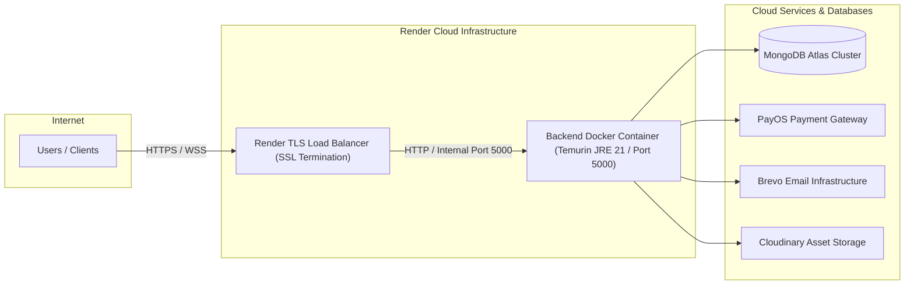

# Production Deployment & Operations Manual

Document Version: 2.0.0
Target Environment: Render Cloud Platform / Docker Container
Production Service Endpoint: `https://mc-voice-training-backend.onrender.com`

---

## 1. Production Architecture Overview

The backend is deployed as a Dockerized container on Render's Web Service infrastructure.



---

## 2. Docker Build & Container Specification

### 2.1 Multi-Stage `Dockerfile`
```dockerfile
# Stage 1: Build JAR package using Maven & OpenJDK 21
FROM maven:3.9.6-eclipse-temurin-21 AS build
WORKDIR /app

# Copy dependency pom.xml first to leverage Docker layer caching
COPY pom.xml .
RUN mvn dependency:go-offline -B

# Copy source files and build production package
COPY src ./src
RUN mvn clean package -DskipTests

# Stage 2: Minimal Runtime Container using Eclipse Temurin 21 JRE
FROM eclipse-temurin:21-jre-alpine
WORKDIR /app

# Create non-root system user for container security hardening
RUN addgroup -S appgroup && adduser -S appuser -G appgroup

# Copy compiled JAR from build stage
COPY --from=build /app/target/*.jar app.jar

# Change ownership to non-root user
RUN chown -R appuser:appgroup /app
USER appuser

# Expose internal container port
EXPOSE 5000

# Set JVM performance parameters (Virtual Threads + Memory Tuning)
ENV JAVA_OPTS="-XX:+UseG1GC -XX:MaxRAMPercentage=75.0 -Dspring.threads.virtual.enabled=true"

# Launch Application
ENTRYPOINT ["sh", "-c", "java $JAVA_OPTS -jar app.jar"]
```

---

## 3. Render Infrastructure Setup (`render.yaml`)

```yaml
services:
  - type: web
    name: mc-voice-training-backend
    env: docker
    region: singapore
    plan: free
    healthCheckPath: /actuator/health
    autoDeploy: true
    envVars:
      - key: PORT
        value: 5000
      - key: SPRING_PROFILES_ACTIVE
        value: prod
      - key: MONGODB_URI
        sync: false
      - key: JWT_SECRET
        sync: false
      - key: PAYOS_CLIENT_ID
        sync: false
      - key: PAYOS_API_KEY
        sync: false
      - key: PAYOS_CHECKSUM_KEY
        sync: false
      - key: BREVO_SMTP_KEY
        sync: false
      - key: CLOUDINARY_CLOUD_NAME
        sync: false
      - key: CLOUDINARY_API_KEY
        sync: false
      - key: CLOUDINARY_API_SECRET
        sync: false
      - key: AI_ANALYZE_URL
        sync: false
      - key: AI_TTS_URL
        sync: false
      - key: ALLOWED_ORIGINS
        sync: false
```

---

## 4. Cold-Start Prevention Automation

Render free tier instances enter sleep mode after 15 minutes of inactivity. First request wake-up takes 30-60 seconds.

### Automated Keep-Alive Ping Cron
To keep the production instance warm, configure a ping script (e.g. via GitHub Actions or Cron-Job.org):

```bash
# Ping health check endpoint every 10 minutes
curl -s https://mc-voice-training-backend.onrender.com/actuator/health > /dev/null
```

---

## 5. Operations, Health Monitoring & Database Backups

### 5.1 System Actuator Monitoring Endpoints
- **Health Check**: `GET /actuator/health` (Returns status `UP`)
- **App Metrics**: `GET /actuator/metrics` (Requires ADMIN credentials)
- **Log Stream**: `GET /api/v1/admin/logs/stream` (SSE Server-Sent Events stream for realtime logs)

### 5.2 MongoDB Atlas Automated Backups
1. **Continuous Cloud Backups**: Configured in MongoDB Atlas under `Backup -> Cloud Backups`.
2. **Point-In-Time Recovery (PITR)**: Enables 7-day continuous restore capabilities.
3. **Manual CLI Dump Script**:
   ```bash
   mongodump --uri="MONGODB_PRODUCTION_URI" --out=./backups/$(date +%Y%m%m_%H%M%S)
   ```
