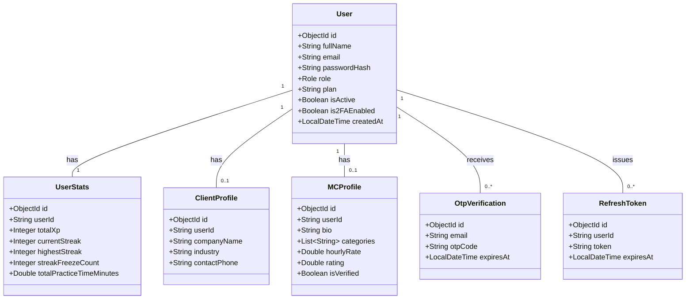
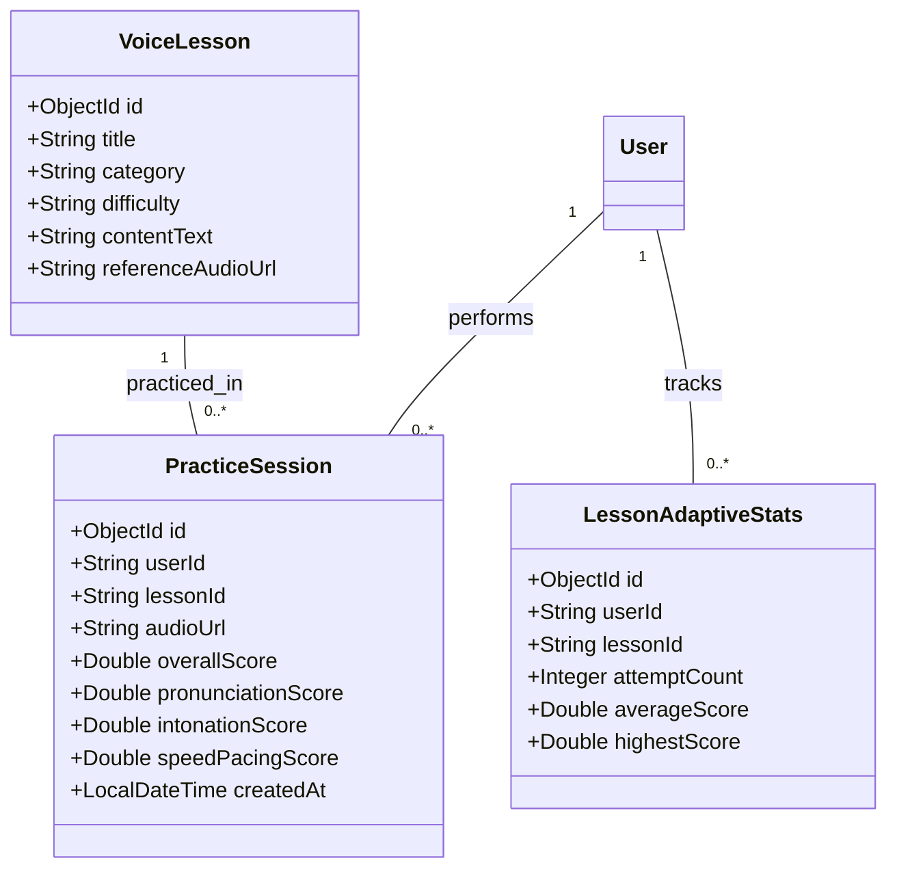
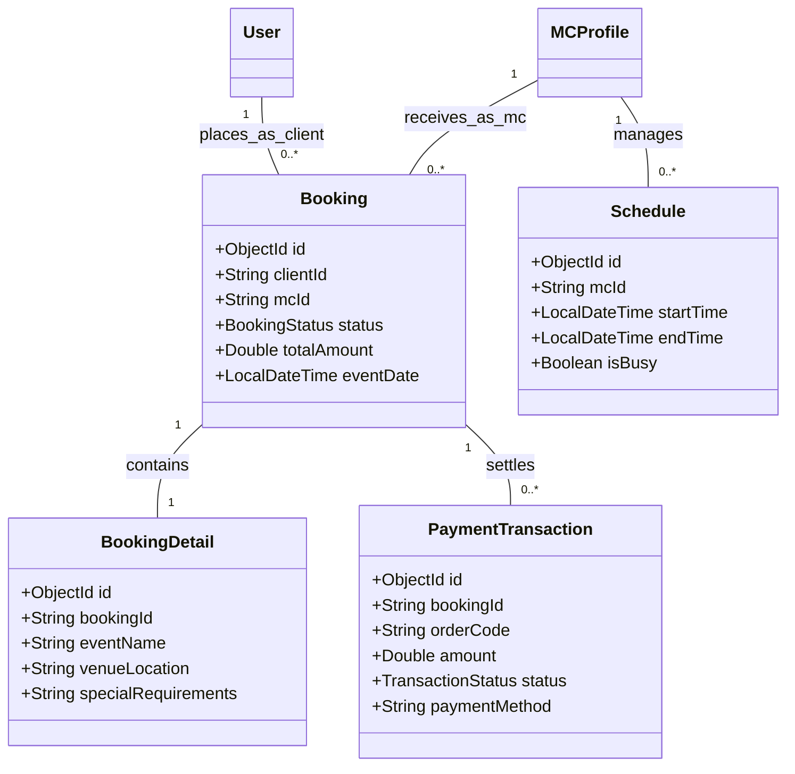

# Architecture Document: Data Model & Entity Relationship Specification

Document Version: 1.0.0
Database Target: MongoDB Atlas (`mchub` database)
Total Collections / Entities: 46 Document Models

---

## 1. Domain Group Overview

The 46 MongoDB collections are organized into 8 functional domain clusters:

1. **User & Identity Domain**: `users`, `client_profiles`, `mc_profiles`, `user_stats`, `otp_verifications`, `refresh_tokens`, `referrals`, `user_highlights`
2. **Voice Training & AI Domain**: `voice_lessons`, `practice_sessions`, `lesson_adaptive_stats`, `guest_voice_usages`, `voice_lesson_search_documents`
3. **Courses & Learning Domain**: `courses`, `course_enrollments`, `reading_guides`, `certificates`
4. **Booking & Hiring Domain**: `bookings`, `booking_details`, `schedules`
5. **Chat & Messaging Domain**: `conversations`, `messages`
6. **Gamification & Community Domain**: `competitions`, `competition_records`, `user_vouchers`, `discount_codes`, `minigame_results`, `social_posts`, `favorites`, `reviews`, `practice_reviews`
7. **Payment & Subscriptions Domain**: `payment_transactions`, `transactions`, `plan_definitions`
8. **Admin & Operational Domain**: `reports`, `audit_logs`, `system_logs`, `system_settings`, `announcements`, `email_campaigns`, `email_templates`, `email_logs`, `cv_documents`, `case_studies`, `search_interests`, `notifications`

---

## 2. Main Entity Relationship Diagrams

### 2.1 Core Identity & User Profile Cluster

### 2.2 Voice Training & Practice Cluster

### 2.3 Booking & Hiring Cluster

---

## 3. Mongo Document Specifications & Indexes

| Collection Name | Primary Key | Key Indexes | Purpose |
|---|---|---|---|
| `users` | `_id` (ObjectId) | `email` (Unique), `role`, `createdAt` | Account credentials & core profile |
| `user_stats` | `_id` (ObjectId) | `userId` (Unique), `totalXp` (Desc) | Leaderboard & gamification stats |
| `mc_profiles` | `_id` (ObjectId) | `userId` (Unique), `categories`, `rating` | MC Directory & discovery search |
| `voice_lessons` | `_id` (ObjectId) | `category`, `difficulty` | Training lesson metadata |
| `practice_sessions` | `_id` (ObjectId) | `userId`, `lessonId`, `createdAt` | Recorded voice scoring history |
| `bookings` | `_id` (ObjectId) | `clientId`, `mcId`, `status`, `eventDate` | Show booking transactions |
| `payment_transactions`| `_id` (ObjectId) | `orderCode` (Unique), `userId`, `status` | PayOS & financial ledger |
| `conversations` | `_id` (ObjectId) | `participantIds` | Chat conversation threads |
| `messages` | `_id` (ObjectId) | `conversationId`, `createdAt` | Real-time chat messages |
| `system_logs` | `_id` (ObjectId) | `level`, `timestamp` | Security & runtime audit logs |
