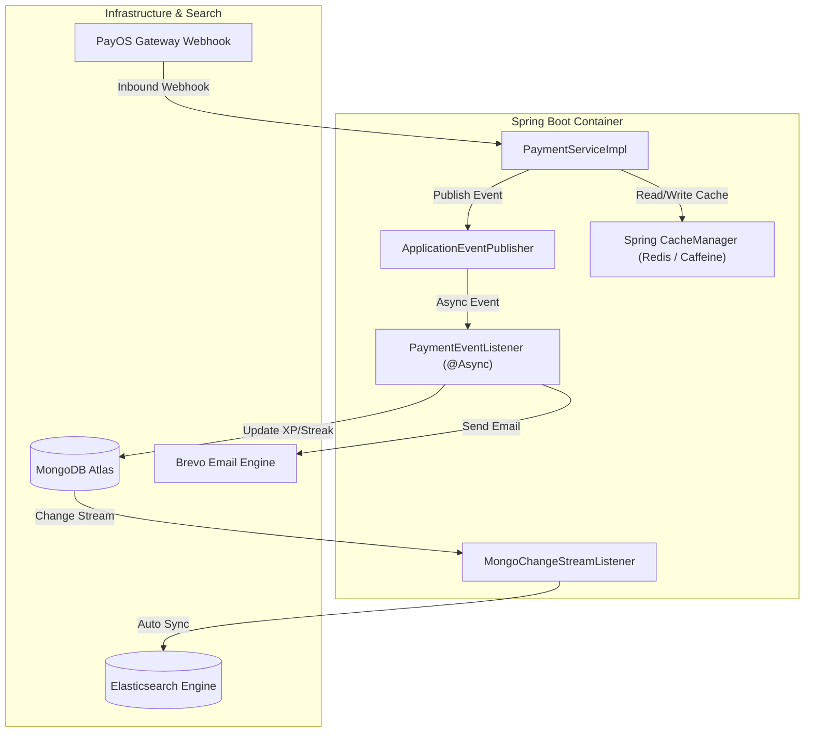

# ARCHITECTURE ENHANCEMENT PROPOSAL

Document Reference: SPEC-ENHANCE-2026-V1  
Target System: MC Voice Training & Booking Platform Backend  

---

## 1. Summary of Proposed Enhancements

This document outlines 5 high-impact architectural enhancements for `MC_Voice_Training_Backend`:

1. **Caching Layer (Spring Cache + Redis / Caffeine)**: Offload DB reads for high-frequency queries.
2. **Event-Driven Architecture (Spring ApplicationEvents)**: Asynchronous decoupling of post-payment and booking side effects.
3. **Automated Search Index Sync (MongoDB Change Streams)**: Event-based synchronization from MongoDB to Elasticsearch.
4. **Constant-Time Security Verification**: Hardened HMAC SHA-256 webhook comparison using `MessageDigest.isEqual`.
5. **SpringDoc OpenAPI 3 Integration**: Auto-generated interactive Swagger documentation.

---

## 2. Component Blueprint

