# CLIENT-MC INTERACTION & COLLABORATIVE SCRIPT SPECIFICATION

Document Reference: SPEC-COLLAB-2026-V1  
Target System: MC Voice Training & Booking Platform Backend  

---

## 1. Feature Roadmap & Architecture Blueprint

```mermaid
graph TD
    subgraph ClientMCInteraction["Client <-> MC Interaction Hub"]
        ChatEngine["STOMP Chat Engine (/ws-chat)"]
        ScriptEngine["Collaborative Script Engine (/ws-script/{bookingId})"]
    end

    subgraph ChatFeatures["Chat Subsystem Enhancements"]
        VoiceNotes["Voice Note Audio Clips"]
        QuoteCard["In-Chat VietQR Quote Card"]
        ScriptAttach["Script File Preview"]
        TypingIndicator["Realtime Typing Presence"]
        QuickReplies["MC Quick Reply Templates"]
        SafetyGuard["Off-Platform Regex Guard"]
    end

    subgraph CollabScriptFeatures["Collaborative Script Features (Google Docs Style)"]
        RealtimeEdit["Realtime Multi-User Editing"]
        LiveCursors["Live Presence Cursors"]
        LineAnnotations["MC Pronunciation Line Annotations"]
        RevisionHistory["Version History Snapshots"]
    end

    ChatEngine --> VoiceNotes
    ChatEngine --> QuoteCard
    ChatEngine --> ScriptAttach
    ChatEngine --> TypingIndicator
    ChatEngine --> QuickReplies
    ChatEngine --> SafetyGuard

    ScriptEngine --> RealtimeEdit
    ScriptEngine --> LiveCursors
    ScriptEngine --> LineAnnotations
    ScriptEngine --> RevisionHistory
```

---

## 2. Catalog of Proposed Features

1. **Real-Time Collaborative Event Script Editor (Google Docs Style)**: Synchronous multi-user script editing over `/ws-script/{bookingId}` with live cursors, line-by-line MC pronunciation annotations, and version snapshots (`script_revisions`).
2. **In-Chat Booking Quote Card**: Structured quote cards rendered inside chat bubbles allowing one-click PayOS VietQR payment execution.
3. **Voice Note Messages**: Cloudinary-backed audio voice recording clips in chat conversations.
4. **Script Attachment Previews**: Rich previews for uploaded event documents (`.pdf`, `.docx`).
5. **Real-Time Typing Indicators**: Live STOMP presence updates for active typing.
6. **MC Quick Reply Templates**: Pre-saved MC response templates managed via CRUD APIs.
7. **Safety & Off-Platform Protection**: Automatic regex detection for phone numbers, bank accounts, and external messaging links to protect transaction integrity.
