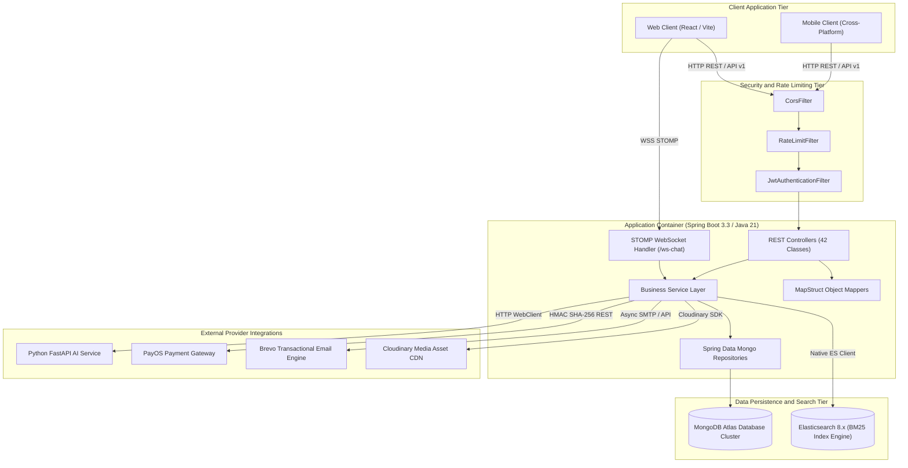
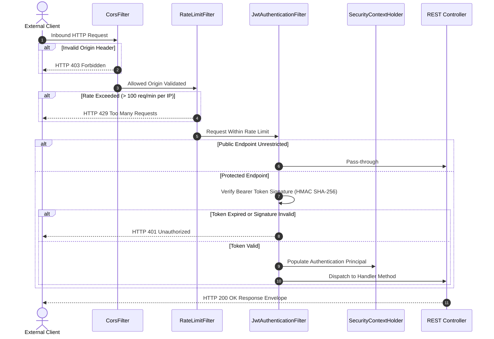

# SOFTWARE ARCHITECTURE SPECIFICATION
## MC Voice Training & Booking Platform Backend

**Document Reference**: SPEC-ARCH-2026-V2  
**Standard Compliance**: IEEE 1016-2009 (Software Architecture Description)  
**Target Environment**: Java 21 LTS / Spring Boot 3.3 / MongoDB Atlas / Elasticsearch 8.x  

---

## 1. System Overview and Architectural Goals

This specification documents the architectural layout, security mechanisms, data structures, and integration interfaces for the MC Voice Training & Booking Platform backend service.

### 1.1 Fundamental Design Objectives
- **Scalability**: The system MUST support concurrent audio evaluation requests through Java 21 Virtual Thread execution (`spring.threads.virtual.enabled=true`).
- **Data Integrity**: Document consistency within MongoDB Atlas SHALL be guaranteed via application-level boundary validation and explicit Mongo indexes.
- **Interoperability**: Inter-service communication with external compute nodes (FastAPI AI Engine, PayOS Gateway, Brevo Email Service, Cloudinary CDN) MUST follow stateless HTTP REST and STOMP WebSocket standards.
- **Security**: Access control SHALL enforce stateless JSON Web Token (JWT) authentication, BCrypt password hashing, and role-based privilege isolation.

---

## 2. High-Level System Architecture

---

## 3. Layered Component Boundaries

### 3.1 Interface Layer (`com.mchub.controllers`)
- **Responsibility**: Accepts incoming HTTP requests, performs preliminary syntax validation (`@Valid`), and serializes domain models into standardized response envelopes.
- **Constraint**: Controllers MUST NOT execute direct business logic or initiate raw database operations unless invoking specialized single-purpose repositories.

### 3.2 Service Layer (`com.mchub.services`)
- **Responsibility**: Encapsulates core business rules, transactional state management, user privilege evaluation, and external API orchestration.
- **Constraint**: Services SHALL handle external network failures gracefully through fallback mechanisms.

### 3.3 Data Access Layer (`com.mchub.repositories`)
- **Responsibility**: Provides data persistence interfaces inheriting from `MongoRepository<T, String>`.
- **Constraint**: Queries involving bulk aggregation MUST utilize native database aggregation pipelines (`@Aggregation`) rather than loading raw entity lists into Java heap memory.

---

## 4. Security Architecture and Request Validation

---

## 5. Requirement Key Terms (RFC 2119)
- **MUST / SHALL**: Absolute requirement of the technical specification.
- **MUST NOT / SHALL NOT**: Absolute prohibition of the technical specification.
- **SHOULD / RECOMMENDED**: Valid reasons may exist to deviate under specific operational conditions.
- **MAY / OPTIONAL**: Truly optional capabilities.
