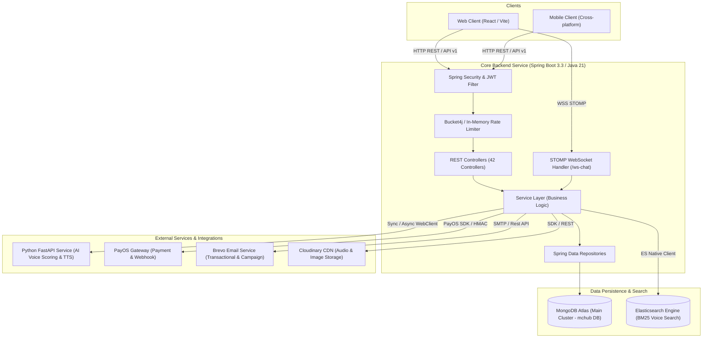
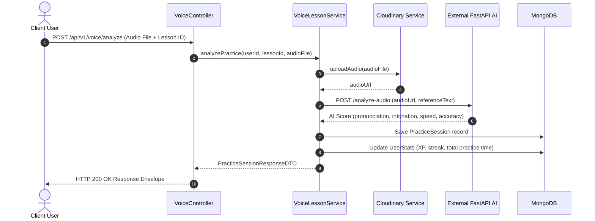
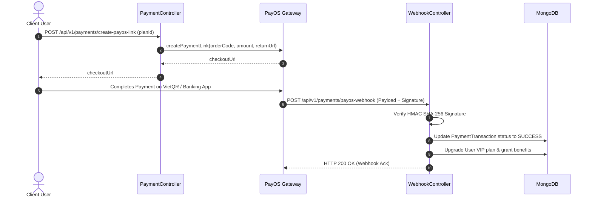

# Architecture Document: MC Hub System Overview

Document Version: 1.0.0
Target System: MC Voice Training & Booking Platform Backend
Technology Stack: Java 21, Spring Boot 3.3.10, MongoDB Atlas, Elasticsearch, PayOS, Brevo, FastAPI AI Engine

---

## 1. System Context & Component Architecture

System Diagram representing external client applications, the core Spring Boot REST API service, persistence layers, and third-party integrations:

---

## 2. Layered Architecture Specifications

The application enforces a 4-tier modular architecture with standardized isolation rules:

### 2.1 Controller Layer (`com.mchub.controllers`)
- Receives HTTP/REST requests and maps path variables, query params, and request bodies.
- Enforces `@Valid` DTO validation annotations.
- Converts Domain Entities to DTOs via MapStruct (`com.mchub.mapper`) or standard response envelope builders.
- Standard Envelope Format:
  - Success: `{ "status": "success", "message": "...", "data": { ... } }`
  - Failure: `{ "status": "fail", "message": "...", "data": null }`

### 2.2 Service Layer (`com.mchub.services`)
- Implements core business logic, transaction boundaries, and state transitions.
- Evaluates authorization rules and user ownership constraints.
- Handles integrations with external HTTP clients (`PayOS`, `Brevo`, `Cloudinary`, `FastAPI AI`).

### 2.3 Repository Layer (`com.mchub.repositories`)
- Extends `MongoRepository<T, String>` for MongoDB persistence.
- Implements native `@Query` annotations and Mongo `@Aggregation` pipelines for high-performance aggregations.
- Handles batch processing (`findAllById`) to avoid N+1 query overhead.

### 2.4 Data Models (`com.mchub.models`)
- MongoDB Documents annotated with `@Document(collection = "...")`.
- Relational mapping handled via ObjectId references or embedded sub-documents.

---

## 3. High-Level Execution Flows

### 3.1 Voice Scoring & Practice Flow

### 3.2 Payment & Subscription Upgrade Flow

---

## 4. Key Quality Attributes & Constraints

1. **Security**: Stateless JWT Authentication, BCrypt password hashing, HMAC SHA-256 webhook signature verification, role-based access control (`ROLE_USER`, `ROLE_MC`, `ROLE_ADMIN`).
2. **Performance**: Virtual Threads (Java 21) for concurrent operations, MongoDB aggregation pipelines, Elasticsearch BM25 text index for sub-millisecond lesson search.
3. **Resilience**: Rate limiting via `RateLimitFilter`, fault-tolerant external API fallbacks, structured system audit logging via `SystemLog`.
