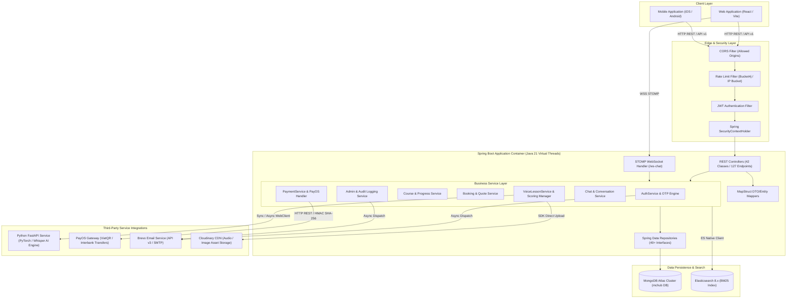
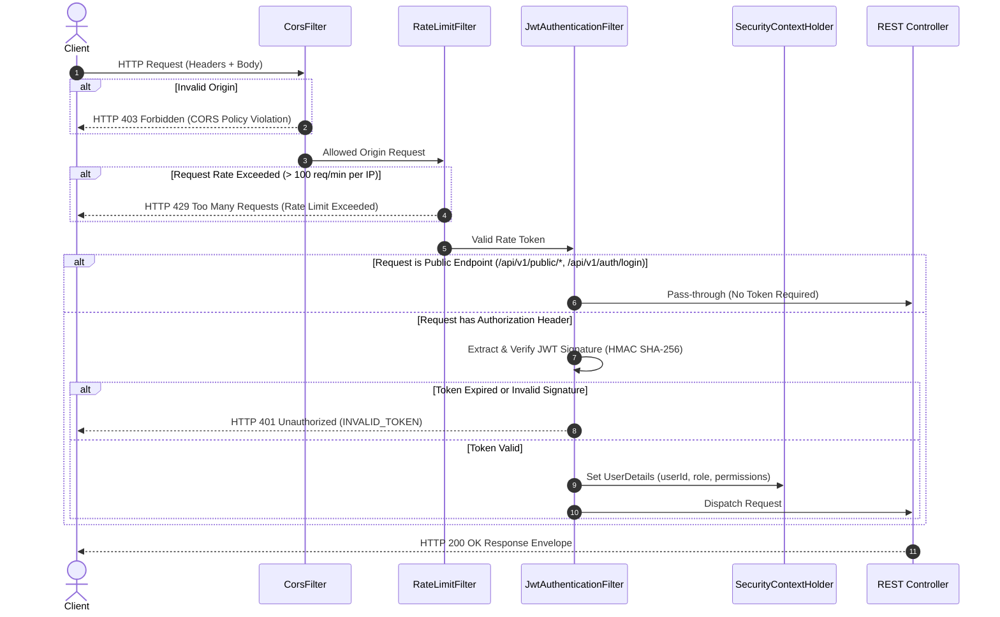

# Architecture Document: System Architecture & Design Specification

Document Version: 2.0.0
Target Platform: MC Voice Training & Booking Platform Backend
Runtime Engine: OpenJDK 21 (Virtual Threads enabled) / Spring Boot 3.3.10

---

## 1. Executive Summary & System Capabilities

The MC Voice Training & Booking Platform Backend is an enterprise-grade RESTful web service engineered for voice evaluation, course delivery, peer review, MC discovery, booking lifecycle management, realtime messaging, and administrative governance.

### Core Architectural Attributes
- **High-Concurrency Processing**: Leverages Java 21 Project Loom Virtual Threads (`spring.threads.virtual.enabled=true`) to eliminate OS thread-blocking bottlenecks during I/O operations.
- **Polyglot Persistence**: Combines MongoDB Atlas (document persistence) with Elasticsearch 8.x (BM25 full-text voice lesson search).
- **Decoupled AI Compute**: Proxies heavy speech scoring and Text-To-Speech (TTS) workloads to a dedicated Python FastAPI service running on specialized GPU/CPU instances.
- **Zero-Trust Security**: Enforces stateless JWT authentication, BCrypt password encryption, role-based authorization (`ROLE_USER`, `ROLE_MC`, `ROLE_ADMIN`), in-memory token bucket rate limiting, and HMAC SHA-256 webhook signature verification.

---

## 2. Global Component & Container Architecture



---

## 3. Spring Security & Request Lifecycle Pipeline

Every inbound HTTP request traverses a multi-stage security pipeline before reaching the target REST Controller:



### Security Pipeline Component Breakdown
1. **CorsFilter**: Reads allowed origins from `ALLOWED_ORIGINS` environment variable. Rejects unauthorized cross-origin requests.
2. **RateLimitFilter**: Uses token bucket algorithm to enforce per-IP rate limiting (100 requests per minute burst limit).
3. **JwtAuthenticationFilter**:
   - Parses `Authorization: Bearer <token>` header.
   - Validates HMAC SHA-256 signature using `JWT_SECRET`.
   - Checks token expiration (`JWT_EXPIRATION_MS`).
   - Populates `UsernamePasswordAuthenticationToken` into `SecurityContextHolder`.

---

## 4. Layered Architecture Rules & Enforcements

```
+-----------------------------------------------------------------------+
|                            REST CONTROLLERS                           |
|  - Input Validation (@Valid)   - URL Mapping (@RequestMapping)        |
|  - Response Envelope Builder   - MapStruct DTO Conversion             |
+-----------------------------------------------------------------------+
                                   |
                                   v
+-----------------------------------------------------------------------+
|                            SERVICE LAYER                              |
|  - Business Rules Execution    - Transaction Boundaries               |
|  - Security & Ownership Check  - Third-Party API Integration          |
+-----------------------------------------------------------------------+
                                   |
                                   v
+-----------------------------------------------------------------------+
|                           REPOSITORY LAYER                            |
|  - Spring Data MongoRepository - Native @Query / @Aggregation         |
|  - Batch Fetching (findAllById) - Index-optimized queries             |
+-----------------------------------------------------------------------+
                                   |
                                   v
+-----------------------------------------------------------------------+
|                           MONGODB ATLAS                               |
|  - 46 Document Collections     - Atomic Operations per Document       |
+-----------------------------------------------------------------------+
```

### Performance Rules for Code Contributors
1. **No `.size()` on Large MongoDB Collections**: Use `MongoRepository.countBy...()` to allow database-side counting.
2. **Aggregation Pipelines over Stream Operations**: Aggregate calculations (`SUM`, `AVG`) must use MongoDB `@Aggregation` pipelines instead of fetching documents into Java Memory.
3. **Batch Fetching**: Prevent N+1 queries in loops. Use `repository.findAllById(listOfIds)` to fetch associated entities in a single batch database operation.
4. **Virtual Thread Execution**: Heavy multi-source analytics endpoints use `CompletableFuture.supplyAsync()` backed by Java 21 Virtual Threads.

---

## 5. System Data Storage & Search Indexing Strategy

### 5.1 MongoDB Atlas Primary Document Store
- Database Name: `mchub`
- Cluster Engine: Atlas Shared / Dedicated Cluster
- Connection Pool Config:
  - Minimum Pool Size: 10 connections
  - Maximum Pool Size: 100 connections
  - Max Idle Time: 30,000 ms

### 5.2 Elasticsearch BM25 Search Engine
- Index Name: `voice_lessons_index`
- Analyzer: Custom Vietnamese Standard Analyzer with lowercase, ASCII folding, and N-gram token filters.
- Search Scoring: Okapi BM25 (`k1=1.2`, `b=0.75`) evaluating title, category, tags, and script content fields.
