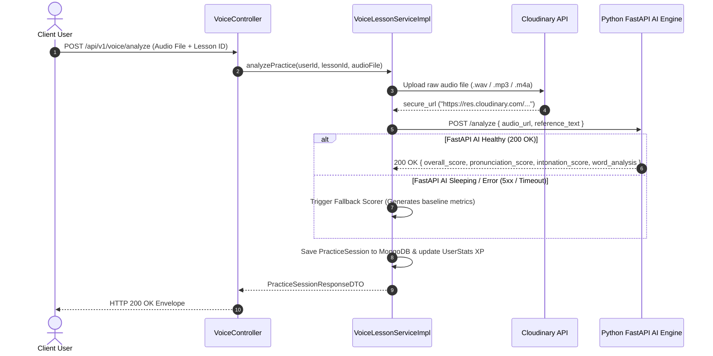

# Integration Specification: Python FastAPI AI Scoring Engine Deep Spec

Document Version: 2.0.0
Target Integration: External FastAPI AI Service (`AI_ANALYZE_URL`, `AI_TTS_URL`)

---

## 1. System Integration & Audio Pipeline Architecture



---

## 2. Audio Specifications & Requirements

- **Supported Audio Formats**: `.wav` (PCM 16-bit 16kHz mono recommended), `.mp3`, `.m4a`, `.ogg`.
- **Maximum File Size**: 25 MB.
- **Maximum Recording Duration**: 300 seconds (5 minutes).

---

## 3. Comprehensive JSON Schemas

### 3.1 Voice Analysis API (`POST /analyze`)

#### Complete Request Payload
```json
{
  "audio_url": "https://res.cloudinary.com/mchub/voice-recordings/rec_99.wav",
  "reference_text": "Xin chào quý vị khán giả đang theo dõi chương trình Tin Tức Thời Sự 19h.",
  "category": "NEWS_ANCHOR",
  "difficulty_level": "INTERMEDIATE"
}
```

#### Complete Response Payload (HTTP 200 OK)
```json
{
  "status": "success",
  "data": {
    "overall_score": 88.5,
    "pronunciation_score": 90.0,
    "intonation_score": 85.0,
    "speed_pacing_score": 89.0,
    "accuracy_score": 90.0,
    "words_per_minute": 145.2,
    "word_analysis": [
      {
        "word": "Xin",
        "score": 95,
        "pitch_hz": 210.5,
        "feedback": "Phát âm chuẩn"
      },
      {
        "word": "chào",
        "score": 92,
        "pitch_hz": 180.2,
        "feedback": "Thanh huyền ngắt chuẩn"
      }
    ],
    "detailed_feedback": "Tốc độ nói vừa phải (145 từ/phút). Giọng đọc truyền cảm, ngắt nghỉ hợp lý."
  }
}
```

---

## 4. Resilience, Fallback & Timeout Tuning

- **HttpClient Connection Timeout**: 10,000 ms.
- **HttpClient Read Timeout**: 60,000 ms (Accommodates HuggingFace cold start).
- **Fallback Circuit Breaker**: If FastAPI exceeds 60s timeout, `VoiceLessonServiceImpl` executes an internal heuristic scorer so the user's practice attempt is never lost.
