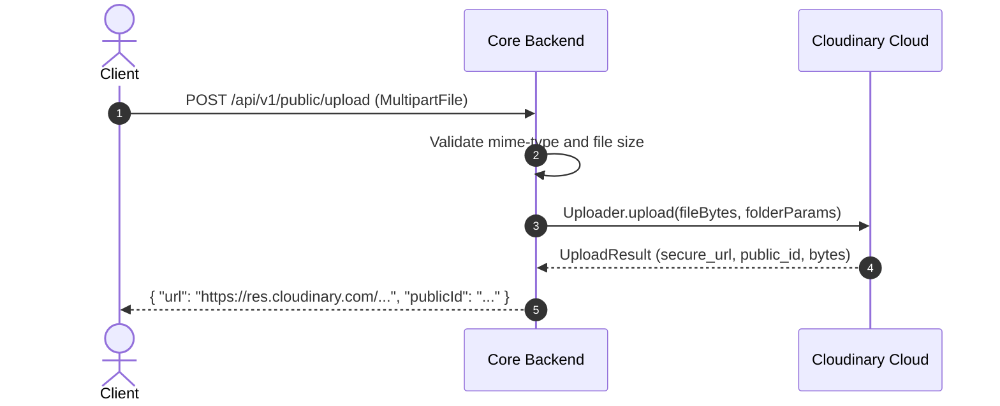

# Integration Specification: Cloudinary Media Storage Pipeline

Document Version: 1.0.0
Target Service: Cloudinary Media Cloud (`https://api.cloudinary.com/v1_1`)

---

## 1. Overview & Credentials

Cloudinary serves as the primary object storage for user avatars, MC voice sample audio clips (`.wav`, `.mp3`), course lesson thumbnails, case study videos, and booking attachment contracts.

### Environment Configuration
- `CLOUDINARY_CLOUD_NAME`: Cloud instance name.
- `CLOUDINARY_API_KEY`: API access key.
- `CLOUDINARY_API_SECRET`: Secret signing key.

---

## 2. Media Upload & Folder Conventions

Uploaded files are isolated into dedicated Cloudinary storage folders:

| Media Type | Folder Path | Allowed Extensions | File Size Limit |
|---|---|---|---|
| User Avatars | `mchub/avatars/` | `.jpg`, `.png`, `.webp` | 5 MB |
| Voice Recordings | `mchub/voice-recordings/` | `.wav`, `.mp3`, `.m4a` | 25 MB |
| Course Videos | `mchub/course-videos/` | `.mp4`, `.webm` | 100 MB |
| Portfolio Files | `mchub/documents/` | `.pdf`, `.docx` | 15 MB |

---

## 3. Direct Signed Upload Pipeline

