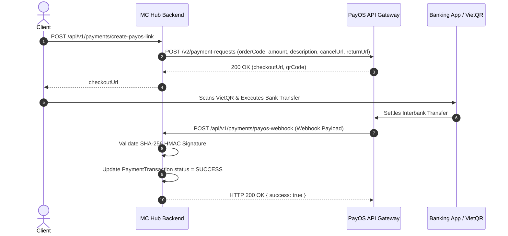

# Integration Specification: PayOS Payment Gateway

Document Version: 1.0.0
Target Integration: PayOS Payment System (`https://api-merchant.payos.vn`)

---

## 1. Overview & Authentication

PayOS handles VietQR payment generation and automated payment callbacks for course enrollments, VIP subscriptions, and MC booking deposits.

### Required Environment Configuration
- `PAYOS_CLIENT_ID`: Public merchant client identifier.
- `PAYOS_API_KEY`: Secret API access key.
- `PAYOS_CHECKSUM_KEY`: Secret key used for SHA-256 HMAC signature verification.

---

## 2. Payment Creation Workflow

---

## 3. Webhook Security & Verification

Every webhook request sent by PayOS includes a `signature` field in the payload.

### Verification Algorithm
1. Extract payload attributes sorted alphabetically: `amount`, `code`, `desc`, `orderCode`, `reference`, `transactionDateTime`.
2. Construct query string format: `amount={amount}&code={code}&desc={desc}&orderCode={orderCode}...`
3. Compute HMAC SHA-256 hash using `PAYOS_CHECKSUM_KEY`.
4. Reject incoming payload if calculated hash does not match `signature`.

---

## 4. Error Handling & Retry Policies

- **Duplicate Webhook Delivery**: Webhook handlers MUST be idempotent. Check `PaymentTransaction.status` before granting user benefits. If status is already `SUCCESS`, respond HTTP 200 immediately without duplicate processing.
- **Signature Failure**: Return HTTP 400 Bad Request envelope with `INVALID_PAYMENT_SIGNATURE`.
