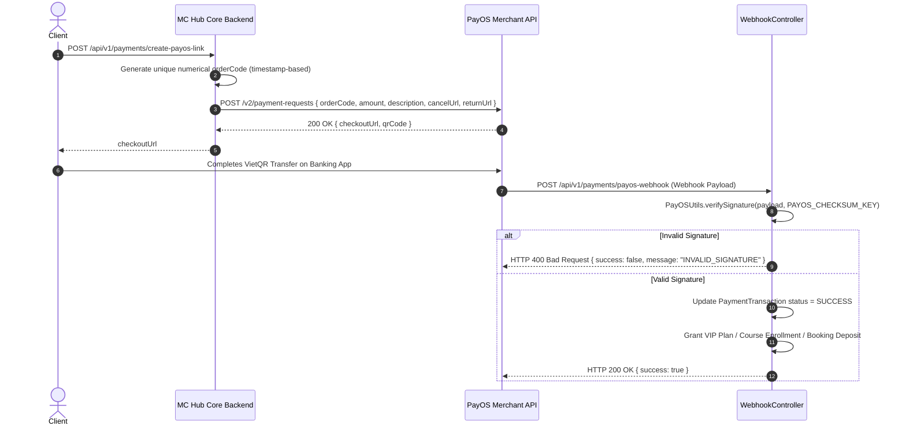

# Integration Specification: PayOS Payment Gateway Deep Spec

Document Version: 2.0.0
Target Integration: PayOS Gateway API (`https://api-merchant.payos.vn`)

---

## 1. Sequence & Signature Verification Workflow



---

## 2. Java HMAC SHA-256 Webhook Verification Implementation Code

```java
package com.mchub.util;

import javax.crypto.Mac;
import javax.crypto.spec.SecretKeySpec;
import java.nio.charset.StandardCharsets;
import java.util.Map;
import java.util.TreeMap;

public class PayOSUtils {

    public static boolean verifySignature(Map<String, Object> dataMap, String incomingSignature, String checksumKey) {
        try {
            // 1. Sort all fields alphabetically using TreeMap
            TreeMap<String, Object> sortedMap = new TreeMap<>(dataMap);
            
            // 2. Build string to sign: key1=val1&key2=val2...
            StringBuilder sb = new StringBuilder();
            sortedMap.forEach((key, val) -> {
                if (!key.equals("signature") && val != null) {
                    if (sb.length() > 0) sb.append("&");
                    sb.append(key).append("=").append(val);
                }
            });

            // 3. Compute HMAC SHA-256 hash
            Mac hmacSha256 = Mac.getInstance("HmacSHA256");
            SecretKeySpec secretKey = new SecretKeySpec(checksumKey.getBytes(StandardCharsets.UTF_8), "HmacSHA256");
            hmacSha256.init(secretKey);
            byte[] hashBytes = hmacSha256.doFinal(sb.toString().getBytes(StandardCharsets.UTF_8));
            
            StringBuilder hexString = new StringBuilder();
            for (byte b : hashBytes) {
                hexString.append(String.format("%02x", b));
            }

            // 4. Compare computed signature with incoming signature
            return hexString.toString().equalsIgnoreCase(incomingSignature);
        } catch (Exception e) {
            return false;
        }
    }
}
```

---

## 3. Webhook Raw Event Payloads

### Sample PayOS Webhook Delivery JSON
```json
{
  "code": "00",
  "desc": "success",
  "data": {
    "orderCode": 1722080001,
    "amount": 299000,
    "description": "Nang cap tai khoan VIP 1 Thang",
    "accountNumber": "123456789",
    "reference": "FT260727998877",
    "transactionDateTime": "2026-07-27 19:15:00",
    "currency": "VND",
    "paymentLinkId": "link_abc123"
  },
  "signature": "a8f3b2c1d4e5f67890123456789abcdef0123456789abcdef0123456789abcdef"
}
```
