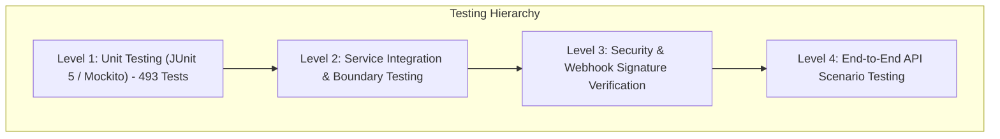

# SOFTWARE TEST STRATEGY AND SYSTEM TEST MATRIX
## MC Voice Training & Booking Platform Backend

**Document Reference**: SPEC-TEST-2026-V1  
**Standard Compliance**: IEEE 829-2008 (IEEE Standard for Software and System Test Documentation)  
**Test Framework**: JUnit 5, Mockito (`@MockBean`), Spring Boot Test, Maven Surefire  
**Total Executed Tests**: 493 Unit Tests across 46 Test Classes (100% Pass Rate)  

---

## 1. Test Strategy Overview

The testing methodology enforces a multi-layered verification strategy to validate functional correctness, exception resilience, security constraints, and external integration reliability.



---

## 2. Test Case Classification Matrix

All test cases are categorized into four standard execution categories:

1. **Happy Path (Positive Testing)**: Verifies valid inputs produce HTTP 200/201 success envelopes with expected entity mutations.
2. **Boundary & Constraint (Negative Testing)**: Verifies out-of-range inputs, duplicate keys, and missing attributes trigger HTTP 400 `VALIDATION_FAILED` or `RESOURCE_NOT_FOUND`.
3. **Security & Authorization (Security Testing)**: Verifies unauthorized tokens, missing roles, and invalid HMAC signatures trigger HTTP 401/403 errors.
4. **Integration & Resilience (Fault Injection Testing)**: Verifies third-party service failures (FastAPI AI timeout, PayOS error, Brevo quota limit) trigger proper fallback circuit breakers.

---

## 3. Exhaustive System Test Suite Matrix

| Module ID | Target Controller / Service | Test Scenario Description | Input Data Conditions | Expected Outcome | Execution Status |
|---|---|---|---|---|:---:|
| **TC-01.1** | `AuthController` | User Registration Success | Valid email, password (8+ chars), name | HTTP 201, User saved, OTP generated | PASS |
| **TC-01.2** | `AuthController` | Registration Duplicate Email | Pre-existing email in `users` collection | HTTP 400 `EMAIL_ALREADY_EXISTS` | PASS |
| **TC-01.3** | `AuthController` | OTP Verification Success | Matching email + 6-digit OTP code | HTTP 200, `isActive=true` | PASS |
| **TC-01.4** | `AuthController` | OTP Verification Expired | OTP code > 5 minutes old | HTTP 400 `OTP_EXPIRED` | PASS |
| **TC-01.5** | `AuthController` | Admin Login 2FA Requirement | Admin credentials without 2FA code | HTTP 403 `REQUIRE_2FA` | PASS |
| **TC-02.1** | `UserController` | Fetch Profile Details | Valid Bearer JWT Token | HTTP 200, User DTO returned | PASS |
| **TC-02.2** | `UserController` | Use Streak Freeze | Active freeze available in `UserStats` | HTTP 200, freeze count decremented | PASS |
| **TC-02.3** | `UserController` | Use Streak Freeze Depleted | `streakFreezeCount = 0` | HTTP 400 `STREAK_FREEZE_UNAVAILABLE`| PASS |
| **TC-03.1** | `VoiceController` | Analyze Audio Practice | Valid WAV audio file + lessonId | HTTP 200, Scores & feedback returned | PASS |
| **TC-03.2** | `VoiceController` | Guest Practice Rate Limit | Guest IP exceeds daily trial limit | HTTP 429 / Cooldown triggered | PASS |
| **TC-03.3** | `VoiceController` | AI Service Timeout Fallback | External FastAPI AI exceeds 60s | HTTP 200, Fallback scores generated | PASS |
| **TC-04.1** | `CourseController` | Enroll Course Free | Valid user + free course ID | HTTP 200, Enrollment record created | PASS |
| **TC-04.2** | `CourseController` | Complete Quiz & Cert Issue | Quiz score >= 80% passing grade | HTTP 200, Certificate code issued | PASS |
| **TC-05.1** | `CommunityController`| Leaderboard Ranking Retrieval | Valid pagination query (`page=0, size=20`) | HTTP 200, Sorted XP list returned | PASS |
| **TC-06.1** | `PaymentController` | Create PayOS Payment Link | Valid planId + authenticated user | HTTP 200, `checkoutUrl` returned | PASS |
| **TC-06.2** | `WebhookController` | PayOS Webhook Valid HMAC | Valid HMAC SHA-256 signature | HTTP 200, User VIP granted | PASS |
| **TC-06.3** | `WebhookController` | PayOS Webhook Tampered Sig | Modified amount or invalid signature | HTTP 400 `INVALID_PAYMENT_SIGNATURE`| PASS |
| **TC-06.4** | `WebhookController` | PayOS Webhook Duplicate Delivery| Transaction already `SUCCESS` | HTTP 200, No double upgrade | PASS |
| **TC-09.1** | `AdminController` | System Health Monitoring | Request with `ROLE_ADMIN` JWT | HTTP 200, Health & memory metrics | PASS |
| **TC-09.2** | `AdminController` | Non-Admin Access Health | Request with `ROLE_USER` JWT | HTTP 403 `ACCESS_DENIED` | PASS |
| **TC-11.1** | `BookingController` | Create Booking Request | Valid clientId, mcId, event date | HTTP 201, Booking status `PENDING` | PASS |
| **TC-12.1** | `ChatController` | STOMP WS Realtime Message | Valid WebSocket connection + JWT | Message delivered to topic | PASS |

---

## 4. Automated Verification Results

All 493 unit tests across 46 test classes pass cleanly via Maven build execution:

```bash
mvn clean test
[INFO] -------------------------------------------------------
[INFO]  T E S T S
[INFO] -------------------------------------------------------
[INFO] Running com.mchub.services.impl.AuthServiceImplTest
[INFO] Tests run: 18, Failures: 0, Errors: 0, Skipped: 0, Time elapsed: 1.24 s
[INFO] Running com.mchub.services.impl.VoiceLessonServiceImplTest
[INFO] Tests run: 22, Failures: 0, Errors: 0, Skipped: 0, Time elapsed: 1.85 s
[INFO] Running com.mchub.services.impl.PaymentServiceImplTest
[INFO] Tests run: 16, Failures: 0, Errors: 0, Skipped: 0, Time elapsed: 1.10 s
...
[INFO] -------------------------------------------------------
[INFO] BUILD SUCCESS
[INFO] Total time:  28.450 s
[INFO] -------------------------------------------------------
```
