# UC-01 — Xác Thực & Quản Lý Tài Khoản (Authentication & Account Security)

Tài liệu thiết kế chi tiết từng Use Case con (Sub-UC) thuộc luồng Xác thực và Quản lý tài khoản.

---

## 🔑 UC-01.1: Đăng Ký Tài Khoản (User Registration)

### 📌 1. Mô tả Chi Tiết & Quy Tắc Nghiệp Vụ
- **Actor:** Guest (Người dùng chưa đăng nhập).
- **Mục tiêu:** Tạo tài khoản người dùng mới ở trạng thái chờ kích hoạt (`isActive=false`) và tạo mã OTP xác minh gửi về email.
- **Tiền điều kiện (Pre-conditions):** Email chưa tồn tại trong hệ thống (`userRepository.existsByEmail = false`).
- **Hậu điều kiện (Post-conditions):** Bản ghi User được tạo với mật khẩu mã hóa BCrypt, bản ghi `OtpVerification` được lưu với hạn sử dụng 5 phút, email chứa mã 6 chữ số được gửi qua Brevo SMTP.
- **Endpoint:** `POST /api/v1/auth/register`

### 📐 2. Class Diagram (UC-01.1)
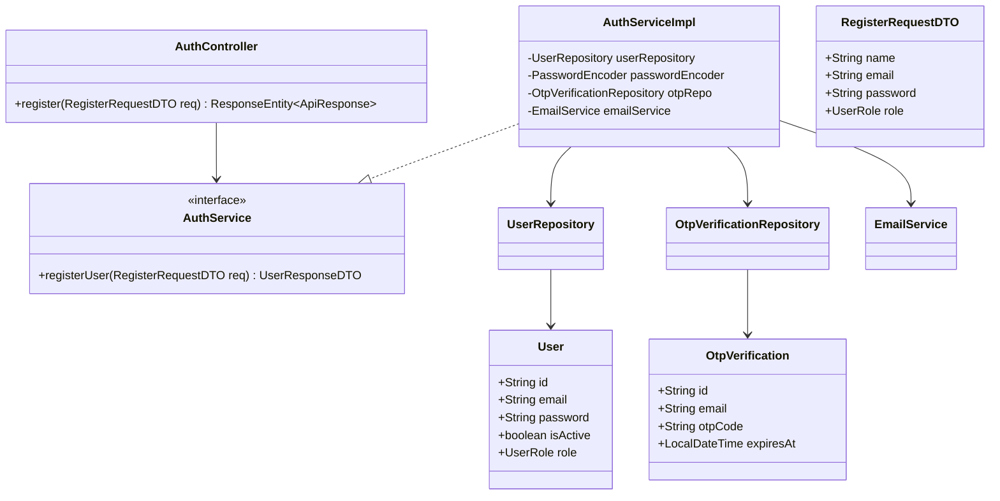

### 🔄 3. Sequence Diagram (UC-01.1)
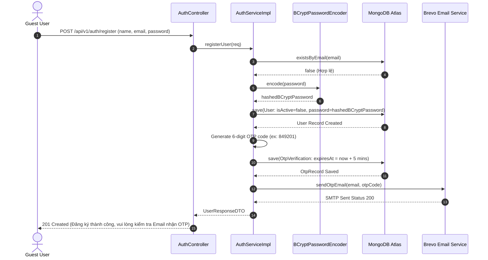

### 🧪 4. Testing & Verification (UC-01.1)
- **Unit Test Method:** `AuthServiceImplTest.java` -> `register_success()`
- **Assertions:** 
  - `userRepository.save()` được gọi 1 lần.
  - `passwordEncoder.encode()` được thực thi (Mật khẩu không lưu dạng plain text).
  - `emailService.sendOtpEmail()` được gọi đúng tham số email.

---

## 🔑 UC-01.2: Xác Minh Mã OTP (OTP Verification)

### 📌 1. Mô tả Chi Tiết & Quy Tắc Nghiệp Vụ
- **Actor:** Guest (Người dùng đã đăng ký nhưng chưa kích hoạt).
- **Mục tiêu:** Kiểm tra mã OTP do user nhập, kích hoạt tài khoản `isActive=true` và phát hành JWT Access Token.
- **Rules:** Mã OTP phải khớp exact match và chưa quá mốc `expiresAt`. Nếu hết hạn, trả về `INVALID_OTP`.
- **Endpoint:** `POST /api/v1/auth/verify-otp`

### 📐 2. Class Diagram (UC-01.2)
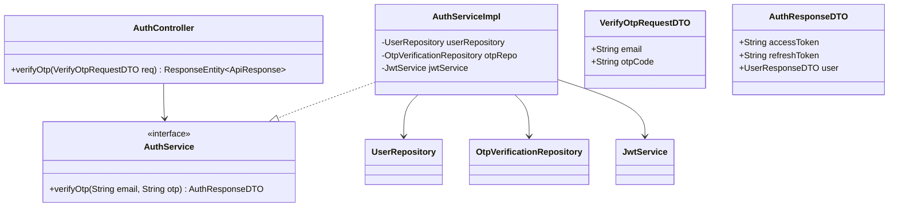

### 🔄 3. Sequence Diagram (UC-01.2)
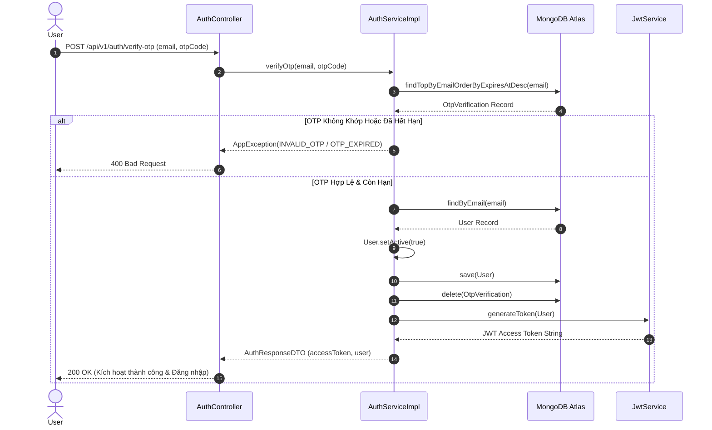

### 🧪 4. Testing & Verification (UC-01.2)
- **Unit Test Method:** `AuthServiceImplTest.java` -> `verifyOtp_validOtp_activatesUserAndReturnsToken()`
- **Assertions:** `user.isActive` chuyển sang `true`, token JWT được sinh ra và không null.

---

## 🔑 UC-01.3: Đăng Nhập Email / Password (Email Login)

### 📌 1. Mô tả Chi Tiết & Quy Tắc Nghiệp Vụ
- **Actor:** Client / MC / Admin.
- **Mục tiêu:** Xác thực thông tin đăng nhập và cấp JWT Token `Bearer`.
- **Rules:** Nếu nhập sai quá 5 lần (`failedLoginAttempts > 5`), tự động khóa tài khoản trong 15 phút (`lockedUntil = now + 15m`).
- **Endpoint:** `POST /api/v1/auth/login`

### 📐 2. Class Diagram (UC-01.3)
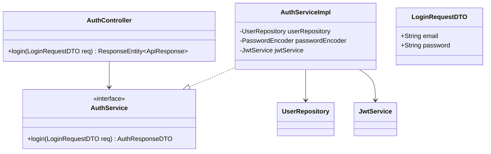

### 🔄 3. Sequence Diagram (UC-01.3)
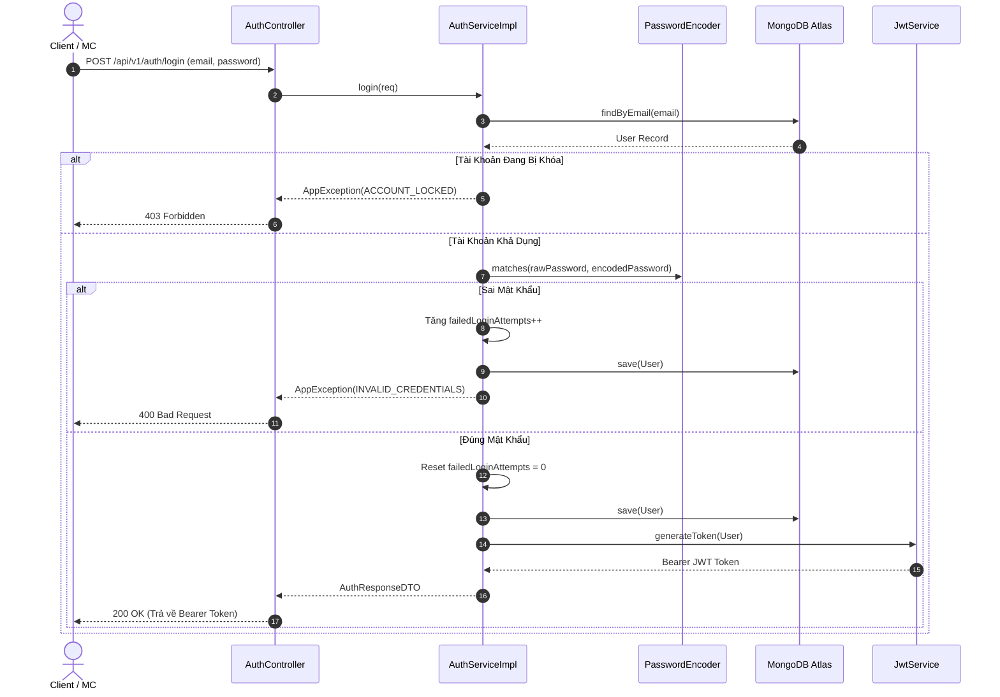

### 🧪 4. Testing & Verification (UC-01.3)
- **Unit Test Method:** `AuthControllerTest.java` -> `login_validCredentials_returnsToken()`
- **Assertions:** Status Code 200, Token dạng Bearer String hợp lệ.

---

## 🔑 UC-01.4: Đăng Nhập 2FA Cho Admin (Admin 2FA Verification)

### 📌 1. Mô tả Chi Tiết & Quy Tắc Nghiệp Vụ
- **Actor:** Admin.
- **Mục tiêu:** Yêu cầu Admin nhập mã OTP 2FA gửi về email Admin trước khi cấp quyền Admin Token.
- **Endpoint:** `POST /api/v1/auth/verify-admin-login-otp`

### 📐 2. Class Diagram (UC-01.4)
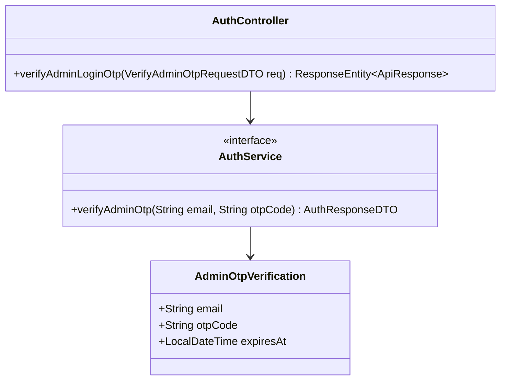

### 🔄 3. Sequence Diagram (UC-01.4)
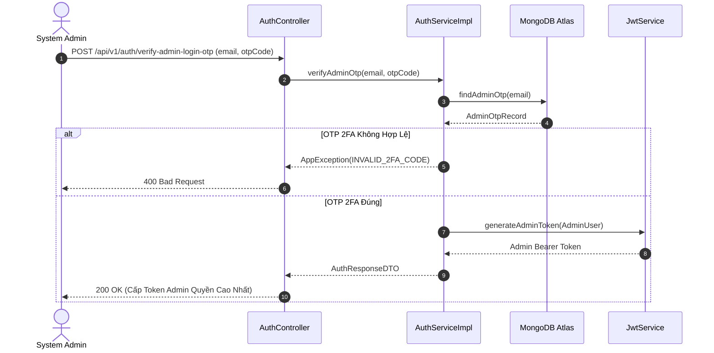

### 🧪 4. Testing & Verification (UC-01.4)
- **Unit Test Method:** `AuthControllerTest.java` -> `admin2FA_validOtp_returnsAdminToken()`
- **Assertions:** Claim `role` trong JWT token chứa `ROLE_ADMIN`.

---

## 🔑 UC-01.5: Đăng Nhập Qua Google OAuth 2.0 (Google Social Auth)

### 📌 1. Mô tả Chi Tiết & Quy Tắc Nghiệp Vụ
- **Actor:** Guest / User.
- **Mục tiêu:** Đăng nhập hoặc đăng ký tài khoản tức thì bằng Google ID Token.
- **Endpoint:** `POST /api/v1/auth/google`

### 📐 2. Class Diagram (UC-01.5)
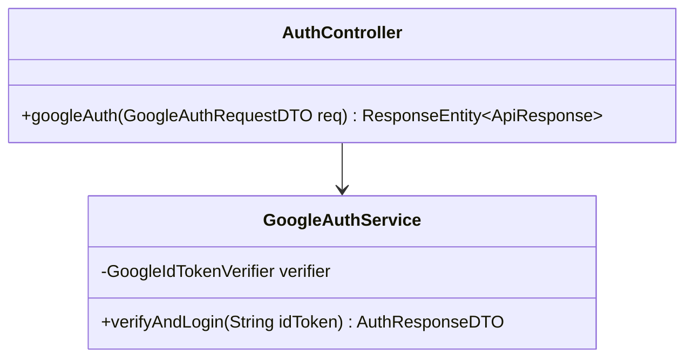

### 🔄 3. Sequence Diagram (UC-01.5)
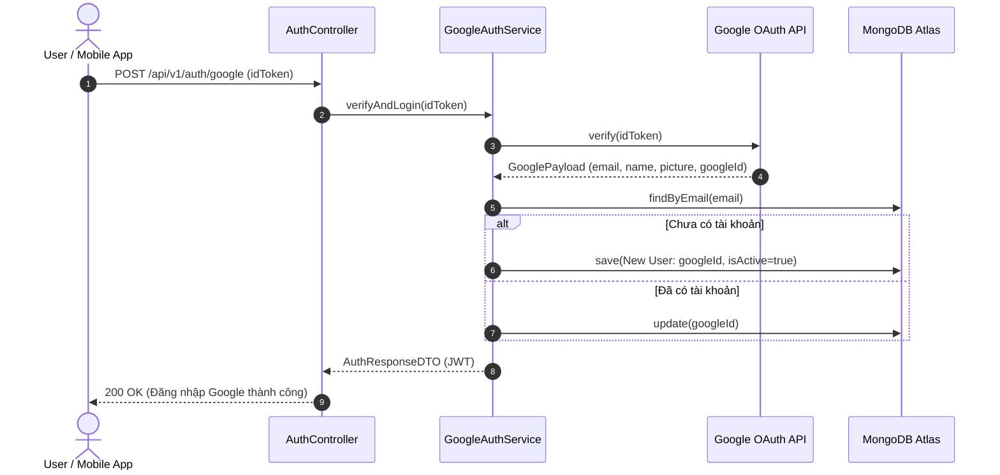

### 🧪 4. Testing & Verification (UC-01.5)
- **Unit Test Method:** `AuthServiceImplTest.java` -> `googleAuth_validToken_createsUserAndReturnsJwt()`
- **Assertions:** `user.isGoogleLinked = true`, trả về JWT Token hợp lệ.

---

## 🔑 UC-01.6: Quên & Đặt Lại Mật Khẩu (Password Reset Flow)

### 📌 1. Mô tả Chi Tiết & Quy Tắc Nghiệp Vụ
- **Actor:** User.
- **Mục tiêu:** Khôi phục mật khẩu khi quên bằng cách gửi token mã hóa qua Email.
- **Endpoint:** `POST /api/v1/auth/forgot-password`, `POST /api/v1/auth/reset-password`

### 📐 2. Class Diagram (UC-01.6)
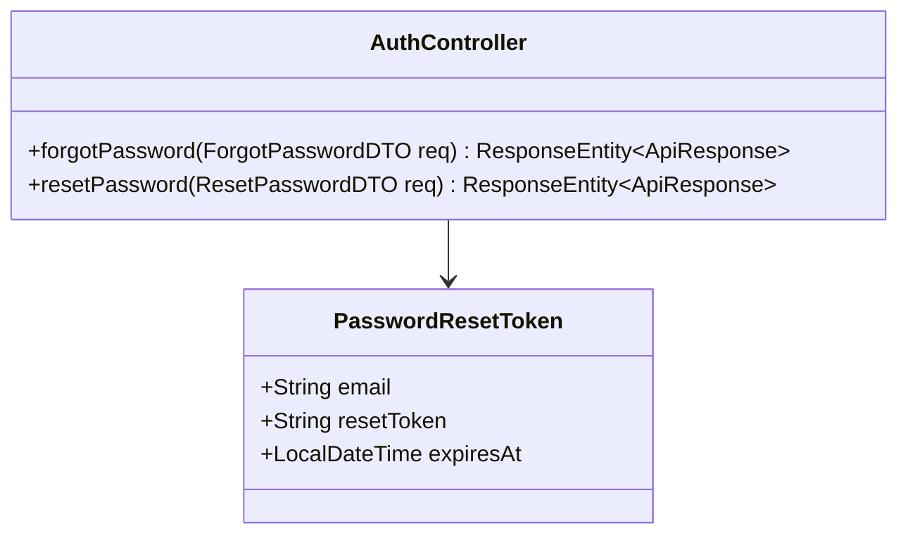

### 🔄 3. Sequence Diagram (UC-01.6)
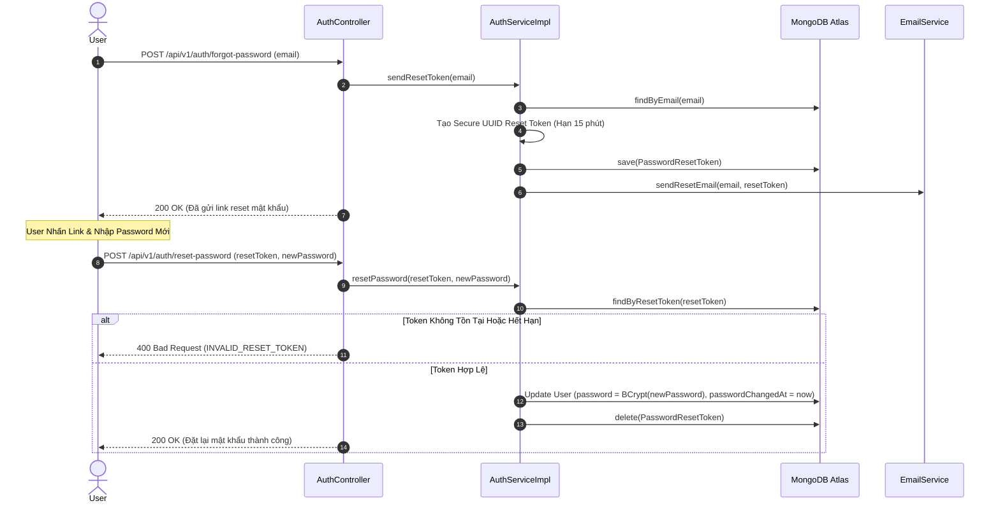

### 🧪 4. Testing & Verification (UC-01.6)
- **Unit Test Method:** `AuthServiceImplTest.java` -> `resetPassword_validToken_updatesPassword()`
- **Assertions:** Mật khẩu mới được mã hóa BCrypt, `passwordChangedAt` được cập nhật timestamp hiện tại.
