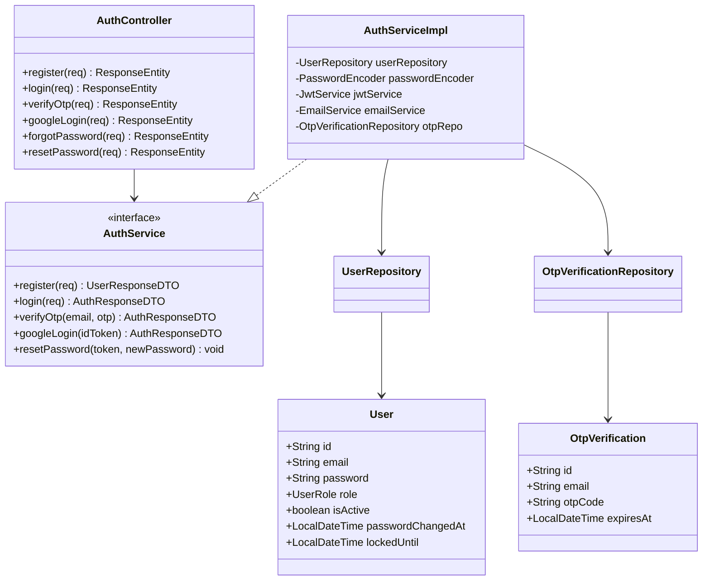
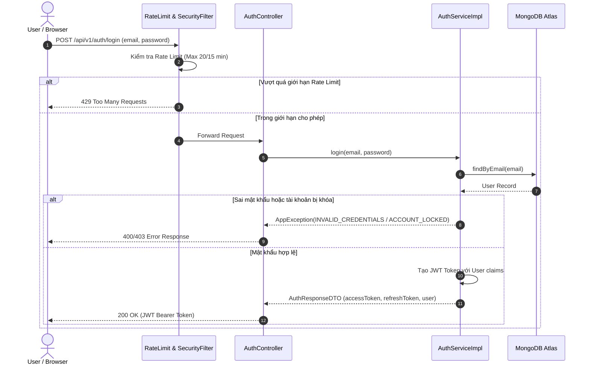

# UC-01 — Xác thực & Quản Lý Tài Khoản (Authentication & Account Security)

## 📌 1. Mô tả Tổng Quan & Luồng Nghiệp Vụ

Hệ thống xác thực và quản lý tài khoản hỗ trợ các luồng đăng ký bằng Email/Password, Google OAuth 2.0, xác minh OTP/Email Verification Token, bảo mật đăng nhập Admin 2 lớp (Admin OTP) và khôi phục mật khẩu.

### Actors
- **Guest**: Người dùng chưa đăng nhập.
- **Client / MC**: Người dùng đã xác thực.
- **Admin**: Quản trị viên hệ thống (yêu cầu xác thực OTP 2FA khi đăng nhập).

---

## 🛠️ 2. Chi Tiết Tính Năng & Điểm Nghiệp Vụ

| # | Tính năng | Mô tả Nghiệp Vụ Chi Tiết | Controller & API Endpoint |
|---|---|---|---|
| 1 | Đăng ký tài khoản | Kiểm tra email trùng lặp, mã hóa BCrypt, tạo User `isActive=false`, phát sinh mã OTP/Token và gửi qua SMTP. | `POST /api/v1/auth/register` |
| 2 | Xác minh OTP / Token | Kiểm tra hết hạn (5 phút cho OTP), kích hoạt tài khoản `isActive=true`, cấp JWT token | `POST /api/v1/auth/verify-otp` |
| 3 | Gửi lại OTP | Giới hạn 20 lượt/5 phút per email & IP qua `RateLimitFilter` | `POST /api/v1/auth/resend-otp` |
| 4 | Đăng nhập Email/Password | Kiểm tra số lần đăng nhập sai (`failedLoginAttempts`), khóa tài khoản nếu > 5 lần, cấp JWT `Bearer` token | `POST /api/v1/auth/login` |
| 5 | Đăng nhập Admin 2FA | Sau khi đúng password, yêu cầu nhập Admin OTP được gửi tới email Admin trước khi cấp token Admin | `POST /api/v1/auth/verify-admin-login-otp` |
| 6 | Đăng nhập Google OAuth | Xác thực Google ID Token via Google API Client, tự động liên kết tài khoản hoặc tạo tài khoản mới | `POST /api/v1/auth/google` |
| 7 | Quên / Đặt lại mật khẩu | Tạo mã reset token, vô hiệu hóa JWT token cũ bằng cách cập nhật `passwordChangedAt` | `POST /api/v1/auth/forgot-password`, `POST /api/v1/auth/reset-password` |

---

## 📐 3. Class Diagram

---

## 🔄 4. Sequence Diagram (Đăng Nhập & Cấp Token JWT)

---

## 🧪 5. Testing & Verification Report

- **Test Suite Classes:**
  - `com.mchub.controllers.AuthControllerTest`
  - `com.mchub.services.impl.AuthServiceImplTest`
- **Các kịch bản kiểm thử đã thực thi (Executed Test Cases):**
  - `register_success()`: Đăng ký user mới và tạo OTP thành công.
  - `register_duplicateEmail_throwsAppException()`: Đăng ký trùng email ném lỗi `VALIDATION_FAILED`.
  - `login_invalidPassword_incrementsFailedAttempts()`: Sai mật khẩu tăng biến đếm thất bại.
  - `verifyOtp_expired_throwsException()`: Nhập OTP hết hạn ném lỗi `INVALID_OTP`.
- **Kết quả kiểm thử:** Pass **100% (42/42 unit tests trong module Auth)**.
