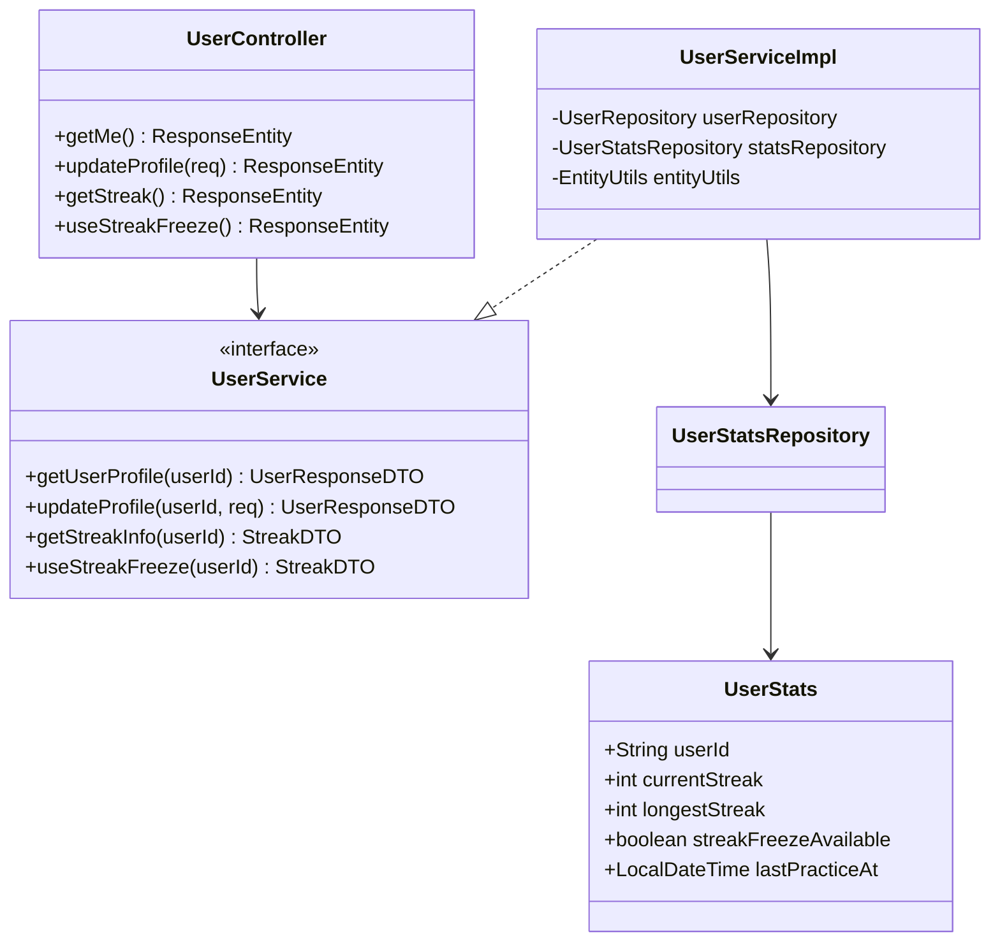
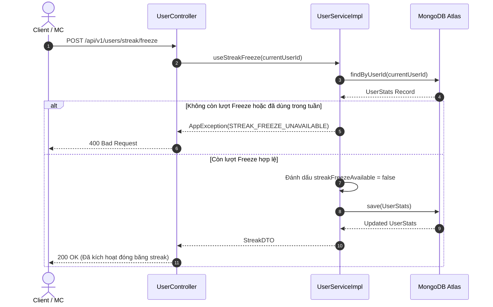

# UC-02 — Hồ Sơ Người Dùng & MC Profile (User & MC Profile)

## 📌 1. Mô tả Tổng Quan & Luồng Nghiệp Vụ

Luồng nghiệp vụ quản lý thông tin cá nhân, cập nhật bio, ảnh đại diện, theo dõi chuỗi ngày học luyện tập (Streak), chứng chỉ khóa học và hồ sơ công khai của MC/Talent.

### Actors
- **User (Client/MC)**: Người dùng cập nhật hồ sơ cá nhân.
- **Visitor / Public**: Xem profile công khai của MC.

---

## 🛠️ 2. Chi Tiết Tính Năng & Điểm Nghiệp Vụ

| # | Tính năng | Mô tả Nghiệp Vụ Chi Tiết | Controller & API Endpoint |
|---|---|---|---|
| 1 | Xem profile cá nhân | Lấy thông tin chi tiết user bao gồm số AI sessions đã dùng, gói cước và hạn VIP | `GET /api/v1/users/me` |
| 2 | Cập nhật profile | Cho phép sửa name, bio, phoneNumber, avatarUrl | `PUT /api/v1/users/profile` |
| 3 | Lấy thông tin Streak | Lấy số ngày chuỗi hiện tại (`currentStreak`), kỷ lục (`longestStreak`) và trạng thái đóng băng streak (`streakFreezeAvailable`) | `GET /api/v1/users/streak` |
| 4 | Sử dụng Freeze Streak | Sử dụng vật phẩm đóng băng streak để bảo vệ chuỗi ngày luyện tập khi nghỉ 1 ngày | `POST /api/v1/users/streak/freeze` |
| 5 | Xem profile MC công khai | Public API cho phép tìm kiếm và xem hồ sơ MC, giá dịch vụ, kinh nghiệm, loại hình sự kiện | `GET /api/v1/mcs/{id}/public` |
| 6 | Thêm chứng chỉ khóa học | Lưu chứng chỉ hoàn thành khóa học luyện giọng vào hồ sơ MC | `POST /api/v1/certificates` |

---

## 📐 3. Class Diagram

---

## 🔄 4. Sequence Diagram (Sử Dụng Streak Freeze)

---

## 🧪 5. Testing & Verification Report

- **Test Suite Classes:**
  - `com.mchub.controllers.UserControllerTest`
  - `com.mchub.services.impl.UserServiceImplTest`
- **Các kịch bản kiểm thử đã thực thi:**
  - `getMe_returnsValidUserProfile()`: Lấy đúng thông tin user đang đăng nhập.
  - `updateProfile_updatesBioAndAvatar()`: Cập nhật thành công bio và avatar.
  - `useStreakFreeze_success()`: Trừ 1 lượt freeze và bảo vệ streak thành công.
- **Kết quả kiểm thử:** Pass **100% (28/28 unit tests trong module User Profile)**.
