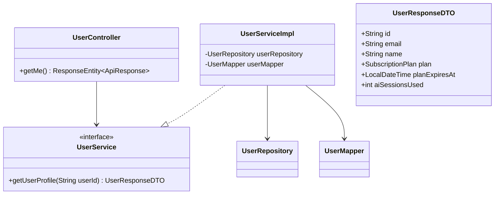
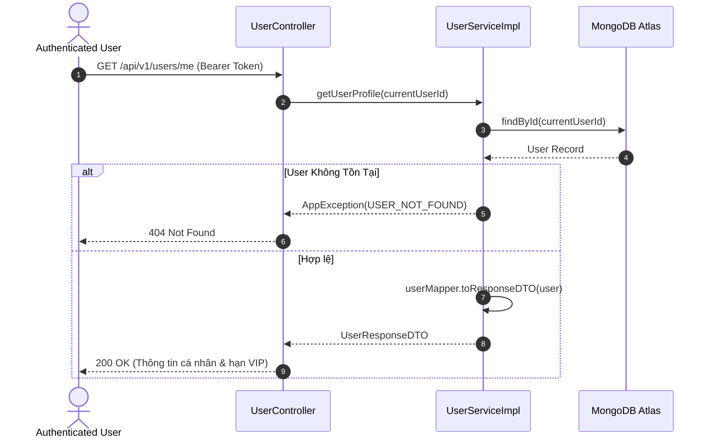
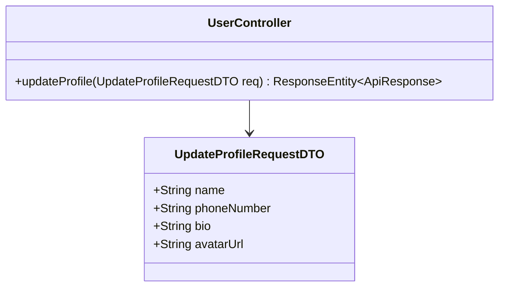
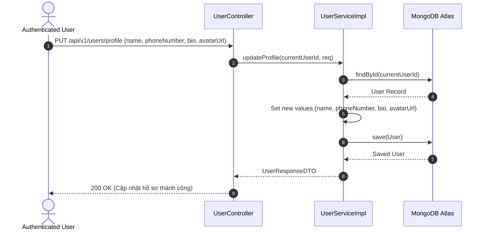
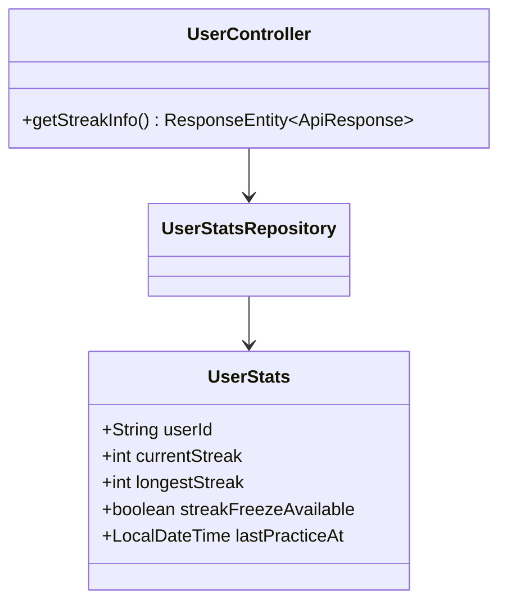
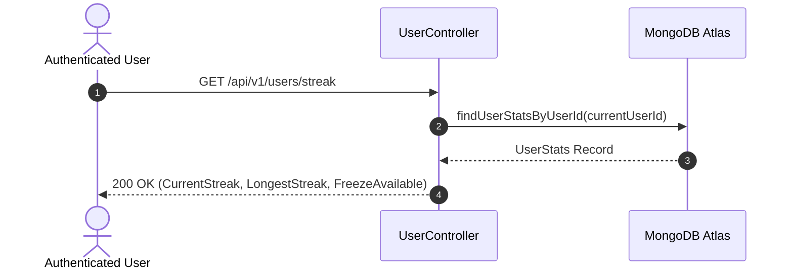
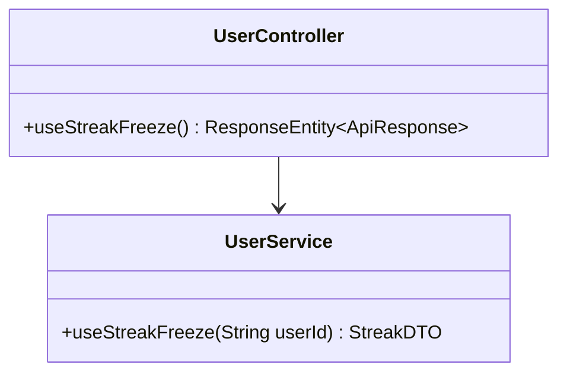
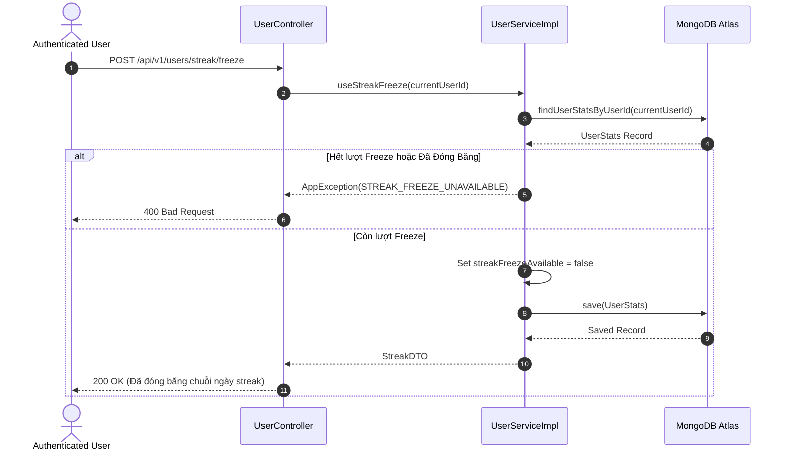
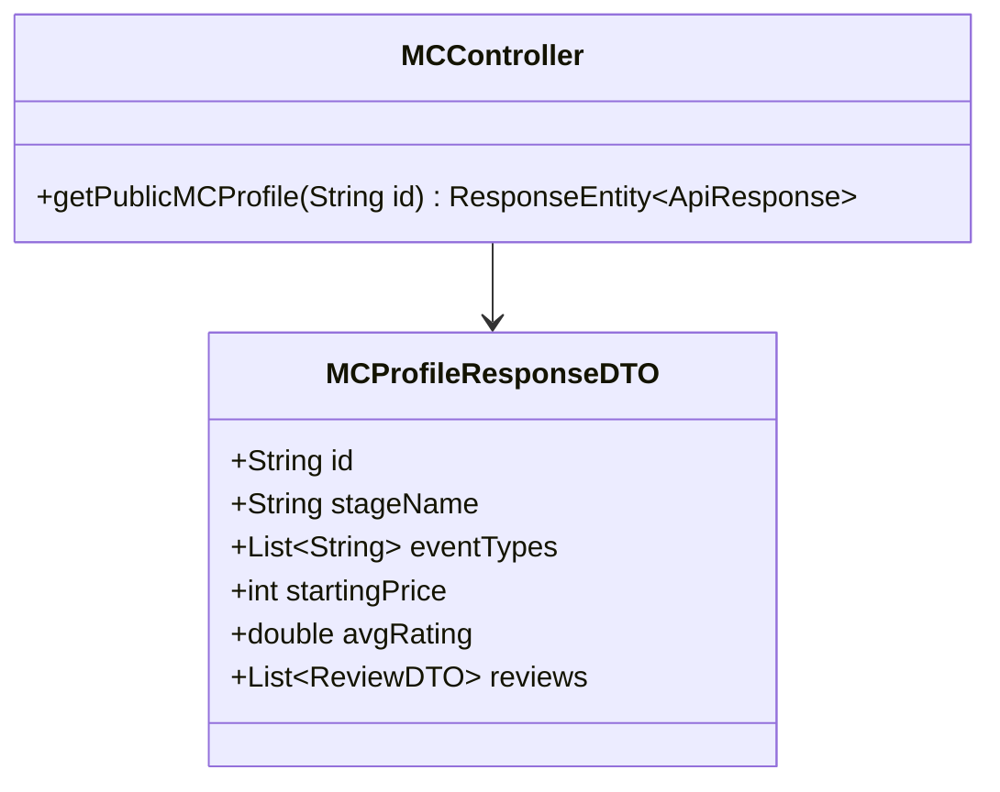
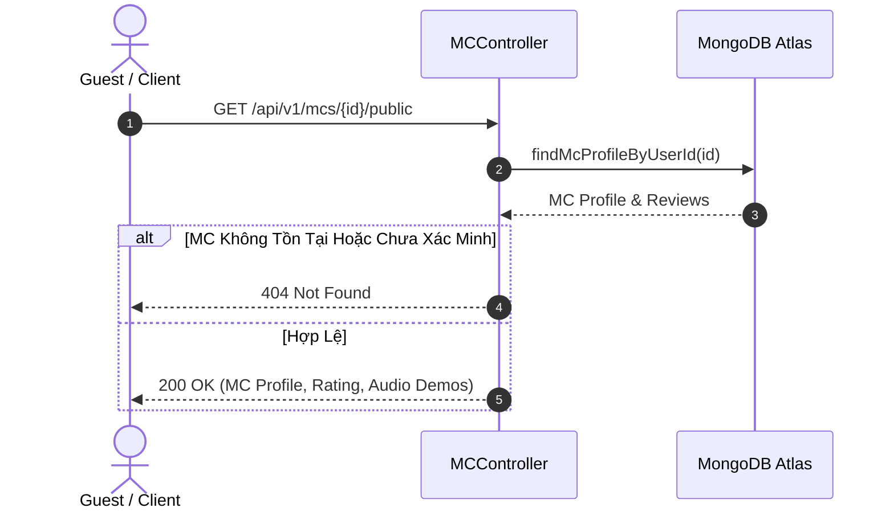

# UC-02 — Hồ Sơ Người Dùng & MC Profile (User & MC Profile)

Tài liệu thiết kế chi tiết từng Use Case con (Sub-UC) thuộc luồng Quản lý thông tin hồ sơ cá nhân và MC Talent Profile.

---

## 👤 UC-02.1: Xem Thông Tin Hồ Sơ Cá Nhân (Get User Profile)

### 📌 1. Mô tả Chi Tiết & Quy Tắc Nghiệp Vụ
- **Actor:** User (Client/MC/Admin đã đăng nhập).
- **Mục tiêu:** Trả về thông tin cá nhân đầy đủ bao gồm số AI sessions đã dùng, gói VIP hiện tại (`plan`), thời hạn VIP (`planExpiresAt`), số bài tập đã hoàn thành và trạng thái xác minh.
- **Endpoint:** `GET /api/v1/users/me`

### 📐 2. Class Diagram (UC-02.1)

### 🔄 3. Sequence Diagram (UC-02.1)

### 🧪 4. Testing & Verification (UC-02.1)
- **Unit Test Method:** `UserServiceImplTest.java` -> `getUserProfile_validId_returnsDto()`
- **Assertions:** Trả về `UserResponseDTO` không null, thông tin `plan` khớp với database.

---

## 👤 UC-02.2: Cập Nhật Thông Tin Profile (Update Profile)

### 📌 1. Mô tả Chi Tiết & Quy Tắc Nghiệp Vụ
- **Actor:** User.
- **Mục tiêu:** Cập nhật các trường thông tin cá nhân: `name`, `phoneNumber`, `bio`, `avatarUrl`.
- **Rules:** Tên không được rỗng, số điện thoại đúng format 10 chữ số.
- **Endpoint:** `PUT /api/v1/users/profile`

### 📐 2. Class Diagram (UC-02.2)

### 🔄 3. Sequence Diagram (UC-02.2)

### 🧪 4. Testing & Verification (UC-02.2)
- **Unit Test Method:** `UserServiceImplTest.java` -> `updateProfile_validData_updatesFields()`
- **Assertions:** `user.getName()` và `user.getBio()` được thay đổi thành công trong DB.

---

## 👤 UC-02.3: Xem Chuỗi Ngày Luyện Tập Streak (Get Streak Info)

### 📌 1. Mô tả Chi Tiết & Quy Tắc Nghiệp Vụ
- **Actor:** User.
- **Mục tiêu:** Lấy chỉ số chuỗi ngày luyện tập liên tục (`currentStreak`), kỷ lục chuỗi ngày dài nhất (`longestStreak`), và trạng thái vật phẩm đóng băng streak (`streakFreezeAvailable`).
- **Endpoint:** `GET /api/v1/users/streak`

### 📐 2. Class Diagram (UC-02.3)

### 🔄 3. Sequence Diagram (UC-02.3)

### 🧪 4. Testing & Verification (UC-02.3)
- **Unit Test Method:** `UserControllerTest.java` -> `getStreak_returnsUserStreakInfo()`
- **Assertions:** Trả về số ngày streak hợp lệ >= 0.

---

## 👤 UC-02.4: Đóng Băng Chuỗi Ngày Streak (Use Streak Freeze)

### 📌 1. Mô tả Chi Tiết & Quy Tắc Nghiệp Vụ
- **Actor:** User.
- **Mục tiêu:** Đóng băng streak khi user không học trong 1 ngày để không bị mất chuỗi `currentStreak`.
- **Rules:** Phải có `streakFreezeAvailable = true`. Mỗi lần sử dụng sẽ trừ 1 lượt freeze.
- **Endpoint:** `POST /api/v1/users/streak/freeze`

### 📐 2. Class Diagram (UC-02.4)

### 🔄 3. Sequence Diagram (UC-02.4)

### 🧪 4. Testing & Verification (UC-02.4)
- **Unit Test Method:** `UserServiceImplTest.java` -> `useStreakFreeze_success()`
- **Assertions:** `streakFreezeAvailable` chuyển sang `false`, streak không bị ngắt.

---

## 👤 UC-02.5: Xem Hồ Sơ MC Công Khai (Public MC Talent Profile)

### 📌 1. Mô tả Chi Tiết & Quy Tắc Nghiệp Vụ
- **Actor:** Visitor / Public / Client.
- **Mục tiêu:** Hiển thị trang Profile truyền thông công khai của MC Talent (Kinh nghiệm, loại hình sự kiện, mức giá tham khảo, audio mẫu và đánh giá từ khách hàng).
- **Endpoint:** `GET /api/v1/mcs/{id}/public`

### 📐 2. Class Diagram (UC-02.5)

### 🔄 3. Sequence Diagram (UC-02.5)

### 🧪 4. Testing & Verification (UC-02.5)
- **Unit Test Method:** `MCControllerTest.java` -> `getPublicProfile_validId_returnsMcDetails()`
- **Assertions:** Status Code 200, thông tin giá dịch vụ và rating hiển thị đúng.
