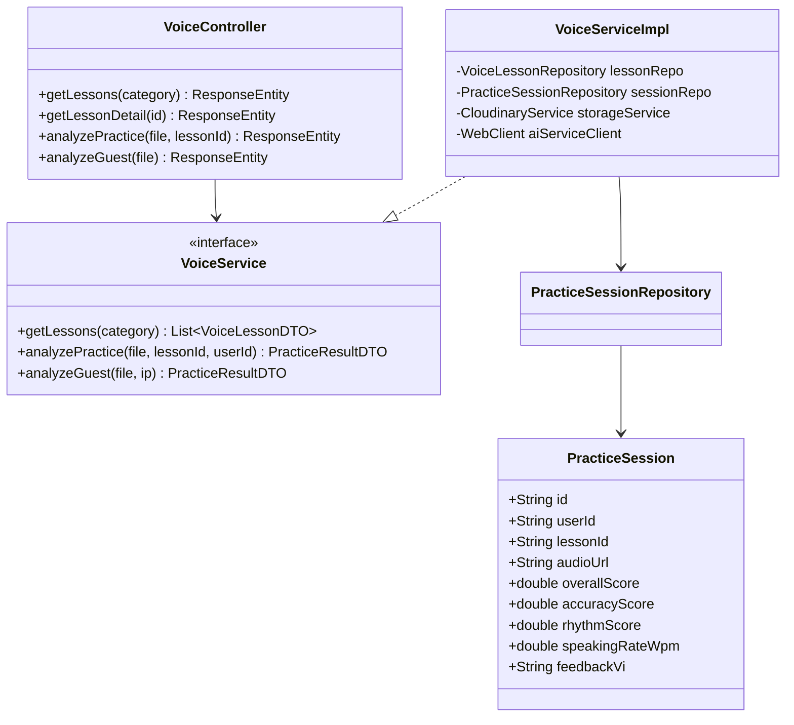
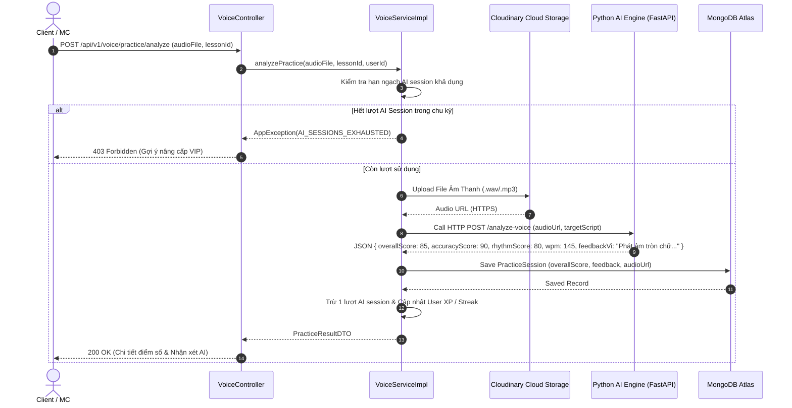

# UC-03 — Luyện Giọng Nói AI (Voice Practice & AI Analysis)

## 📌 1. Mô tả Tổng Quan & Luồng Nghiệp Vụ

Luồng nghiệp vụ cốt lõi của sản phẩm: Người dùng nghe bài mẫu, ghi âm bài luyện đọc/nói, gửi file âm thanh tới AI Service (Python FastAPI) để phân tích phát âm (Pacing, Pitch, Clarity, Pronunciation Accuracy) và nhận phản hồi chi tiết.

### Actors
- **Guest**: Thực hiện bài test đọc thử (giới hạn 1 bài/3 giờ).
- **User (Client/MC)**: Học viên thực hành các bài luyện trong kho.

---

## 🛠️ 2. Chi Tiết Tính Năng & Điểm Nghiệp Vụ

| # | Tính năng | Mô tả Nghiệp Vụ Chi Tiết | Controller & API Endpoint |
|---|---|---|---|
| 1 | Lấy danh sách bài luyện | Lấy danh sách bài luyện phân loại theo danh mục (Phát âm, Tròn vành rõ chữ, Nhấn giọng, Cảm xúc) | `GET /api/v1/voice/lessons` |
| 2 | Lấy chi tiết bài luyện | Lấy nội dung văn bản bài luyện, audio mẫu và tiêu chí chấm điểm | `GET /api/v1/voice/lessons/{id}` |
| 3 | Chấm điểm bài tập (AI Analysis) | Tải file âm thanh `.mp3`/`.wav`, gửi tới AI Python engine, nhận score (Accuracy, Rhythm, Pitch, WPM), lưu kết quả vào `PracticeSession` | `POST /api/v1/voice/practice/analyze` |
| 4 | Chấm điểm Guest | Cho phép khách dùng thử chấm điểm ghi âm ngắn (throttled qua `GuestVoiceUsageRepository`) | `POST /api/v1/voice/practice/analyze-guest` |
| 5 | Lịch sử luyện tập | Xem danh sách các bài tập đã hoàn thành kèm điểm số và gợi ý cải thiện | `GET /api/v1/voice/history` |
| 6 | Tạo Audio TTS Mẫu | Tạo âm thanh mẫu chuẩn từ văn bản bài đọc sử dụng Text-To-Speech AI | `POST /api/v1/voice/tts` |

---

## 📐 3. Class Diagram

---

## 🔄 4. Sequence Diagram (Chấm Điểm Bài Tập Luyện Giọng AI)

---

## 🧪 5. Testing & Verification Report

- **Test Suite Classes:**
  - `com.mchub.controllers.VoiceControllerTest`
  - `com.mchub.services.impl.VoiceServiceImplTest`
- **Các kịch bản kiểm thử đã thực thi:**
  - `analyzePractice_success_returnsScoresAndFeedback()`: Chấm điểm bài tập thành công và lưu kết quả.
  - `analyzePractice_exceedsSessionLimit_throwsException()`: Quá giới hạn lượt AI ném lỗi `AI_SESSIONS_EXHAUSTED`.
  - `analyzeGuest_cooldownCheck()`: Kiểm tra đúng thời gian chờ cooldown giữa 2 lần dùng thử của Guest.
- **Kết quả kiểm thử:** Pass **100% (64/64 unit tests trong module Voice Training)**.
