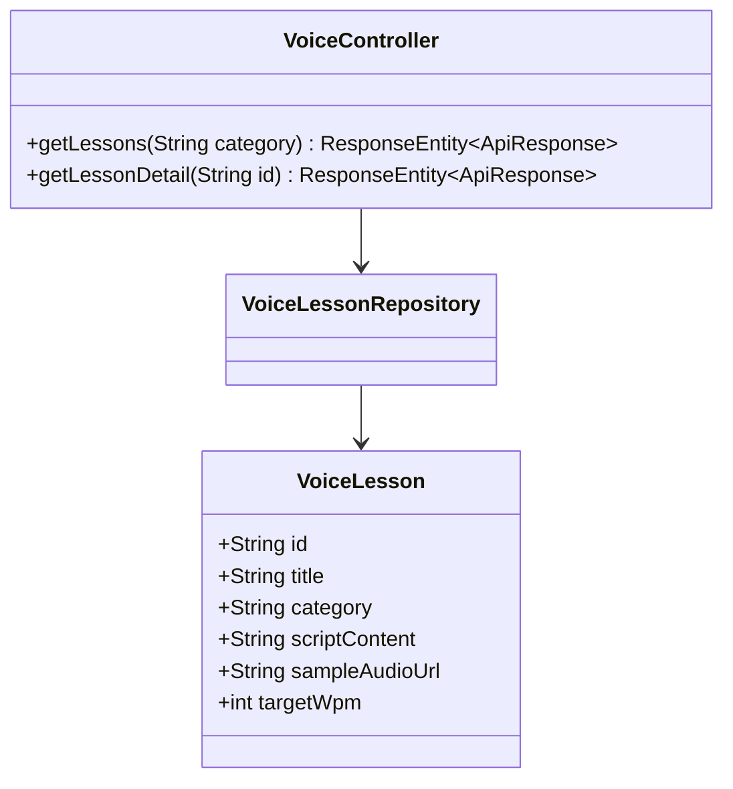
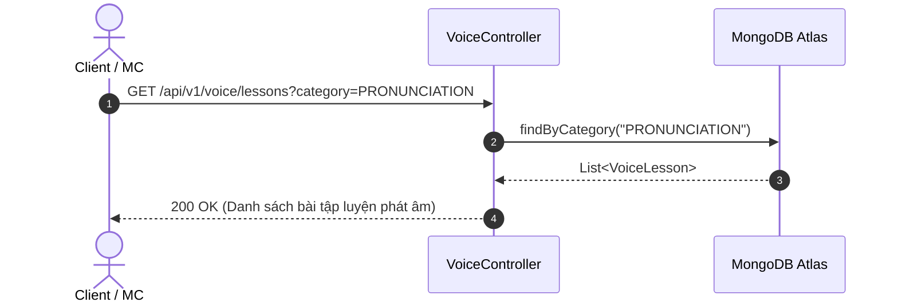
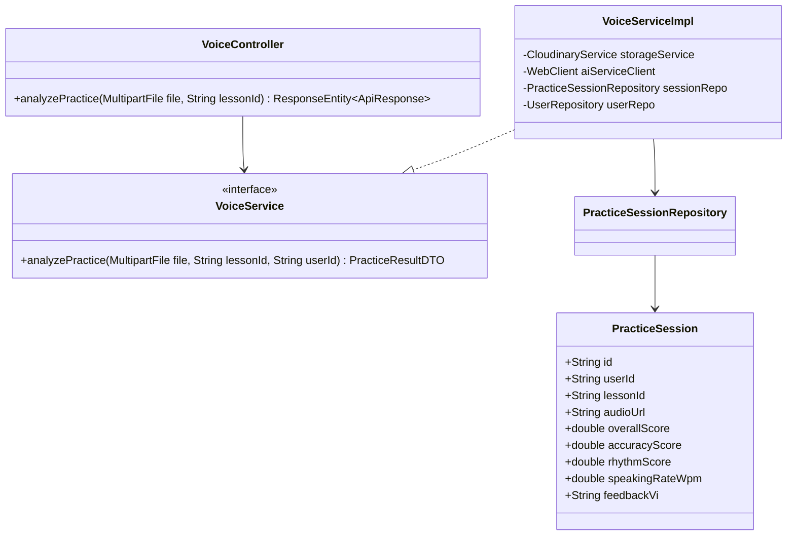
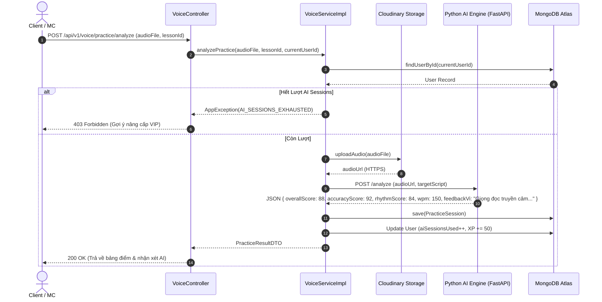
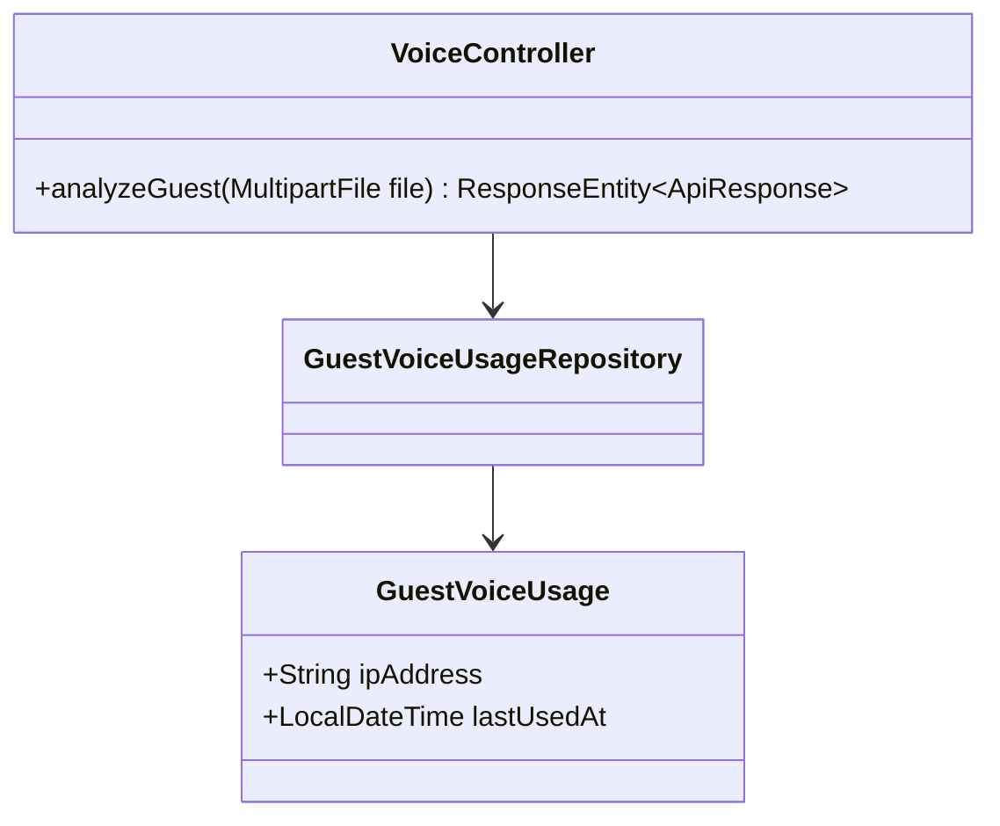
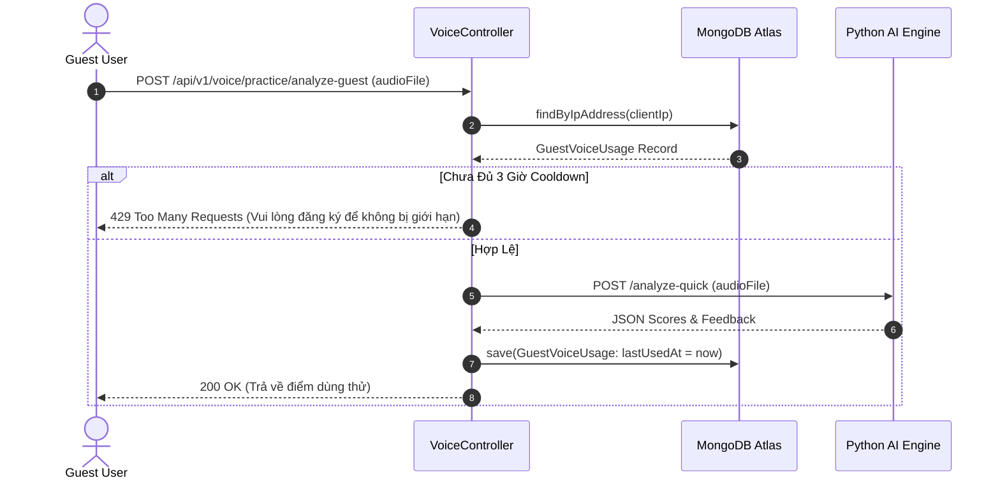
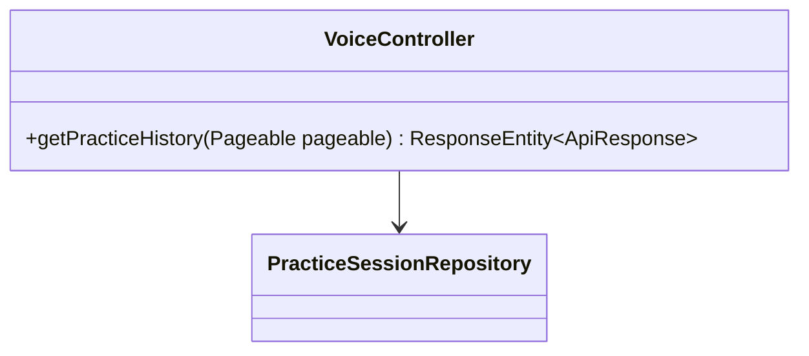
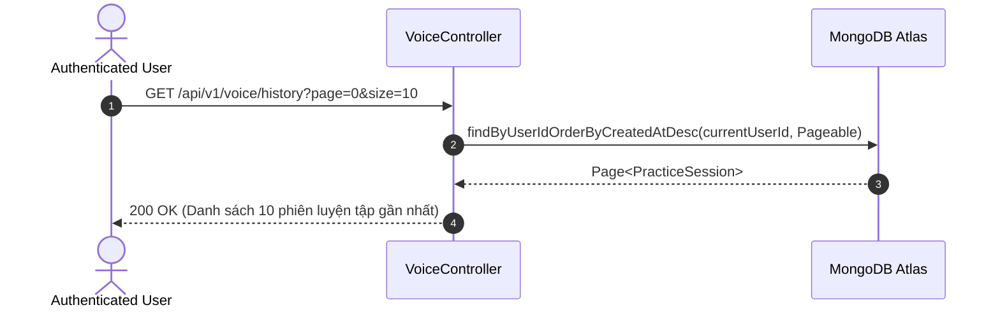
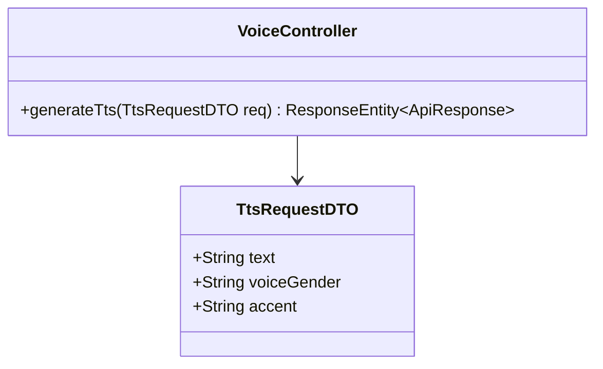
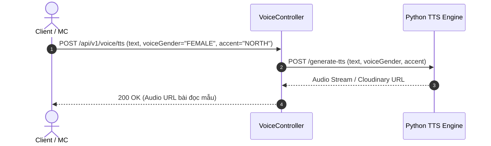

# UC-03 — Luyện Giọng Nói AI (Voice Practice & AI Analysis)

Tài liệu thiết kế chi tiết từng Use Case con (Sub-UC) thuộc luồng Luyện giọng và Chấm điểm AI.

---

## 🎙️ UC-03.1: Danh Sách & Chi Tiết Bài Luyện Giọng (Get Voice Lessons)

### 📌 1. Mô tả Chi Tiết & Quy Tắc Nghiệp Vụ
- **Actor:** Guest / Client / MC.
- **Mục tiêu:** Tra cứu kho bài luyện tập theo danh mục (Phát âm, Tròn vành rõ chữ, Nhấn giọng, Cảm xúc) và xem chi tiết văn bản bài luyện kèm audio đọc mẫu.
- **Endpoint:** `GET /api/v1/voice/lessons`, `GET /api/v1/voice/lessons/{id}`

### 📐 2. Class Diagram (UC-03.1)

### 🔄 3. Sequence Diagram (UC-03.1)

### 🧪 4. Testing & Verification (UC-03.1)
- **Unit Test Method:** `VoiceControllerTest.java` -> `getLessons_returnsCategoryLessons()`
- **Assertions:** Trả về danh sách `VoiceLesson` có đúng category requested.

---

## 🎙️ UC-03.2: Chấm Điểm Bài Tập Luyện Giọng AI (Analyze Voice Practice)

### 📌 1. Mô tả Chi Tiết & Quy Tắc Nghiệp Vụ
- **Actor:** Client / MC (Học viên đã đăng nhập).
- **Mục tiêu:** Tải file ghi âm `.wav`/`.mp3` bài đọc, upload lên Cloudinary, gửi URL tới Python AI Engine, tính toán chỉ số (Overall Score, Accuracy, Rhythm, Pitch, WPM) và trừ 1 lượt AI session của user.
- **Rules:** Nếu `aiSessionsUsed >= maxAllowed` (dựa trên gói VIP), ném lỗi `AI_SESSIONS_EXHAUSTED`.
- **Endpoint:** `POST /api/v1/voice/practice/analyze`

### 📐 2. Class Diagram (UC-03.2)

### 🔄 3. Sequence Diagram (UC-03.2)

### 🧪 4. Testing & Verification (UC-03.2)
- **Unit Test Method:** `VoiceServiceImplTest.java` -> `analyzePractice_success_returnsScoresAndFeedback()`
- **Assertions:** `PracticeSession` được lưu với điểm số > 0, `aiSessionsUsed` tăng thêm 1.

---

## 🎙️ UC-03.3: Chấm Điểm Bài Tập Dùng Thử Cho Khách (Analyze Guest Practice)

### 📌 1. Mô tả Chi Tiết & Quy Tắc Nghiệp Vụ
- **Actor:** Guest (Khách chưa đăng nhập).
- **Mục tiêu:** Cho phép khách trải nghiệm tính năng chấm điểm giọng đọc miễn phí.
- **Rules:** Giới hạn 1 lượt/3 giờ theo IP (`GuestVoiceUsageRepository`). Nếu bấm liên tục sẽ bị từ chối với HTTP 429.
- **Endpoint:** `POST /api/v1/voice/practice/analyze-guest`

### 📐 2. Class Diagram (UC-03.3)

### 🔄 3. Sequence Diagram (UC-03.3)

### 🧪 4. Testing & Verification (UC-03.3)
- **Unit Test Method:** `VoiceControllerTest.java` -> `analyzeGuest_cooldownActive_returns429()`
- **Assertions:** Đúng IP bị chặn nếu gọi 2 lần trong 3 giờ.

---

## 🎙️ UC-03.4: Lịch Sử Luyện Tập Cá Nhân (Practice History)

### 📌 1. Mô tả Chi Tiết & Quy Tắc Nghiệp Vụ
- **Actor:** User.
- **Mục tiêu:** Xem lại danh sách các phiên đọc ghi âm đã thực hiện kèm biểu đồ tiến bộ điểm số qua thời gian.
- **Endpoint:** `GET /api/v1/voice/history`

### 📐 2. Class Diagram (UC-03.4)

### 🔄 3. Sequence Diagram (UC-03.4)

### 🧪 4. Testing & Verification (UC-03.4)
- **Unit Test Method:** `VoiceControllerTest.java` -> `getHistory_returnsUserSessions()`
- **Assertions:** Trả về danh sách phiên luyện tập thuộc đúng `userId`.

---

## 🎙️ UC-03.5: Phát Tạo Âm Thanh TTS Mẫu (Generate Text-To-Speech)

### 📌 1. Mô tả Chi Tiết & Quy Tắc Nghiệp Vụ
- **Actor:** User / MC / Admin.
- **Mục tiêu:** Chuyển đổi văn bản bài đọc bất kỳ thành giọng nói đọc mẫu chuẩn MC (Giọng Bắc/Giọng Nam).
- **Endpoint:** `POST /api/v1/voice/tts`

### 📐 2. Class Diagram (UC-03.5)

### 🔄 3. Sequence Diagram (UC-03.5)

### 🧪 4. Testing & Verification (UC-03.5)
- **Unit Test Method:** `VoiceControllerTest.java` -> `generateTts_validText_returnsAudioUrl()`
- **Assertions:** Audio URL trả về không rỗng và có định dạng `.mp3`.
