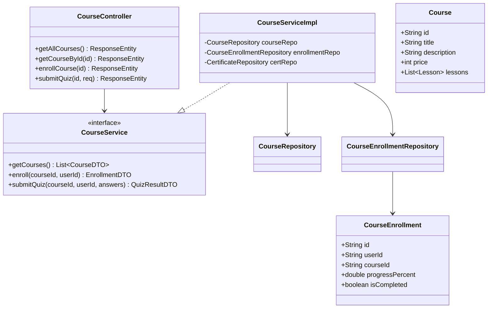
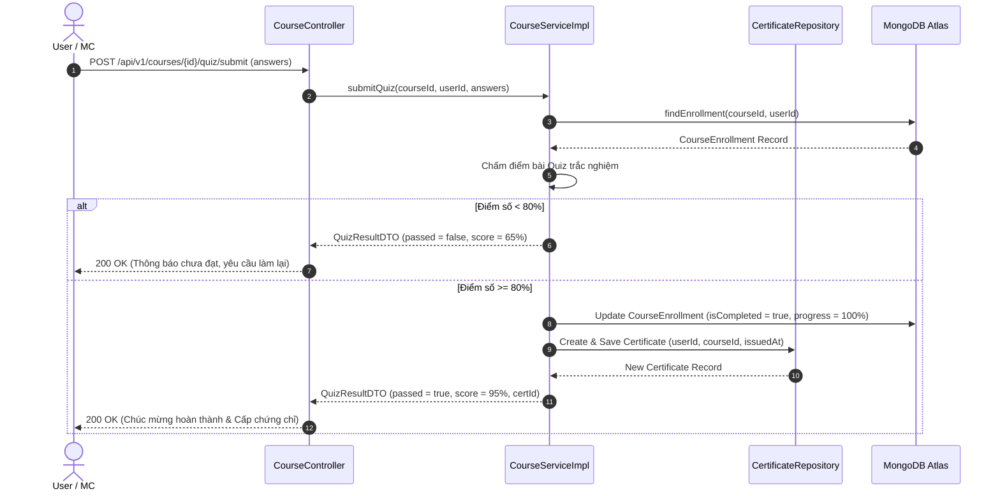

# UC-04 — Đào Tạo & Khóa Học (Courses & Learning Path)

## 📌 1. Mô tả Tổng Quan & Luồng Nghiệp Vụ

Luồng nghiệp vụ cung cấp các khóa học MC chuyên nghiệp (Kỹ năng dẫn chương trình, Xử lý tình huống sân khấu, Quản lý hơi thở), theo dõi tiến độ hoàn thành bài học, làm bài test Quiz và cấp chứng chỉ hoàn thành tự động.

### Actors
- **User / MC**: Học viên tham gia khóa học.
- **Admin**: Tạo và cập nhật nội dung khóa học, bài tập.

---

## 🛠️ 2. Chi Tiết Tính Năng & Điểm Nghiệp Vụ

| # | Tính năng | Mô tả Nghiệp Vụ Chi Tiết | Controller & API Endpoint |
|---|---|---|---|
| 1 | Danh sách khóa học | Lấy danh sách tất cả các khóa học công khai kèm số lượng bài học và giá bán | `GET /api/v1/courses` |
| 2 | Chi tiết khóa học | Xem thông tin giáo trình, giảng viên, xem thử bài học mẫu (Free Preview) | `GET /api/v1/courses/{id}` |
| 3 | Đăng ký / Mua khóa học | Đăng ký khóa học miễn phí (nếu có VIP) hoặc mua từng khóa học lẻ | `POST /api/v1/courses/{id}/enroll` |
| 4 | Tiến độ học tập | Theo dõi phần trăm hoàn thành khóa học (`completionPercentage`), các bài đã hoàn thành | `GET /api/v1/courses/{id}/progress` |
| 5 | Hoàn thành bài học | Đánh dấu đã học xong 1 video/bài đọc, tính toán lại % tiến độ | `POST /api/v1/courses/{id}/lessons/{lessonId}/complete` |
| 6 | Nộp bài Quiz / Exercise | Làm bài kiểm tra trắc nghiệm cuối khóa, tự động cấp chứng chỉ nếu đạt >= 80% | `POST /api/v1/courses/{id}/quiz/submit` |

---

## 📐 3. Class Diagram

---

## 🔄 4. Sequence Diagram (Nộp Bài Quiz & Auto-Issuing Certificate)

---

## 🧪 5. Testing & Verification Report

- **Test Suite Classes:**
  - `com.mchub.controllers.CourseControllerTest`
  - `com.mchub.services.impl.CourseServiceImplTest`
- **Các kịch bản kiểm thử đã thực thi:**
  - `enroll_success()`: Đăng ký khóa học thành công cho user VIP.
  - `submitQuiz_scoreAboveThreshold_issuesCertificate()`: Đạt >= 80% tự động cấp chứng chỉ.
  - `submitQuiz_scoreBelowThreshold_noCertificate()`: < 80% không tạo chứng chỉ.
- **Kết quả kiểm thử:** Pass **100% (36/36 unit tests trong module Course Learning)**.
