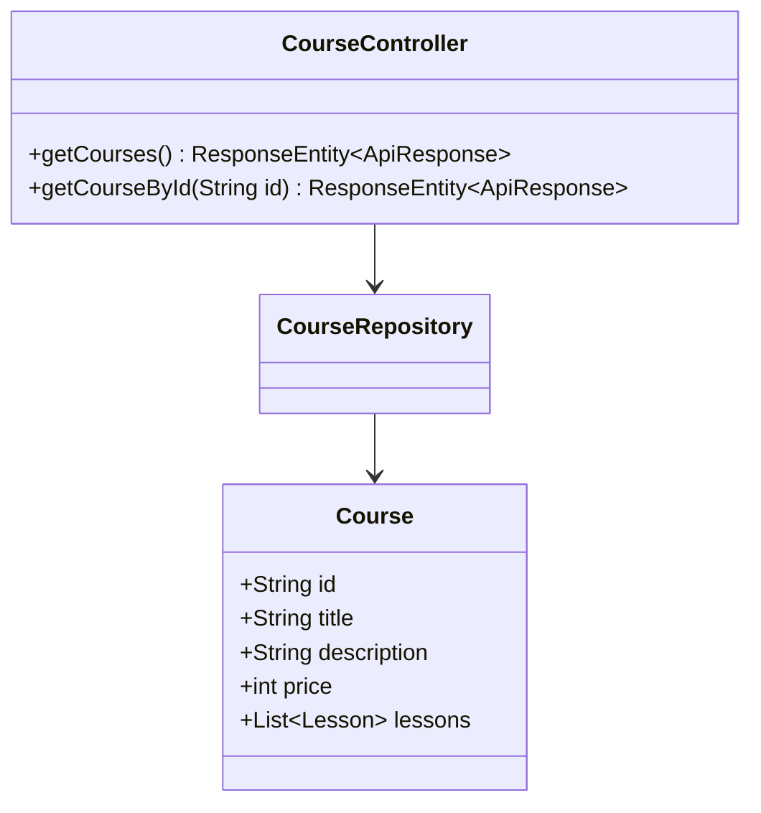
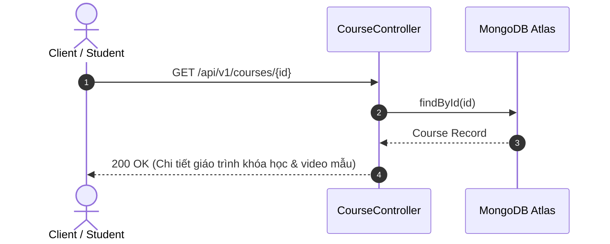
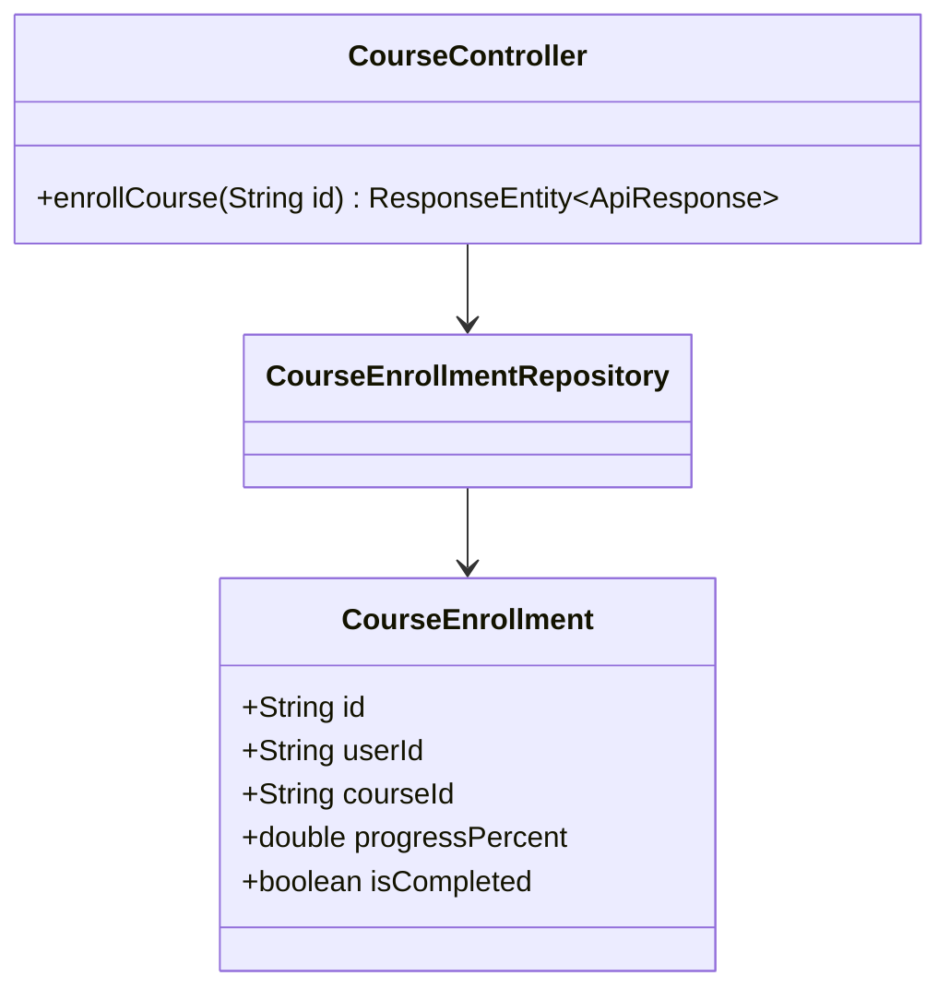
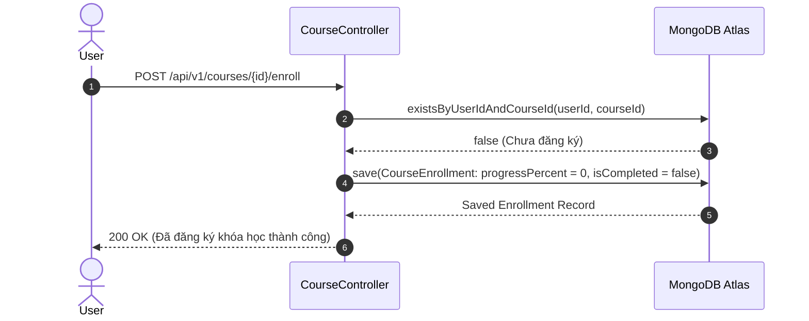
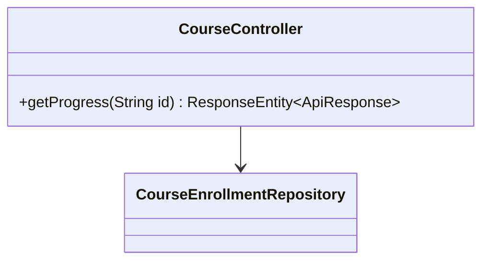
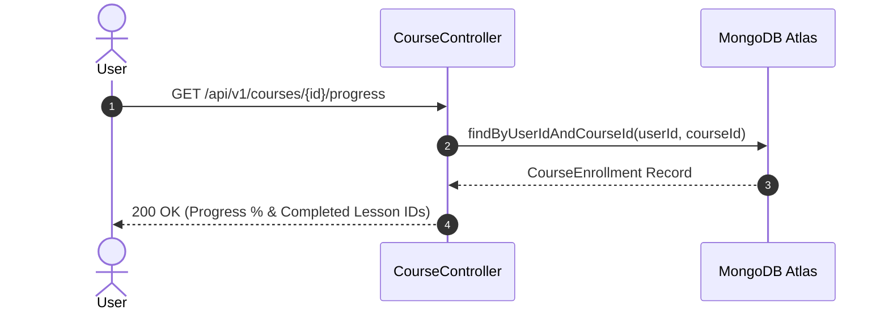
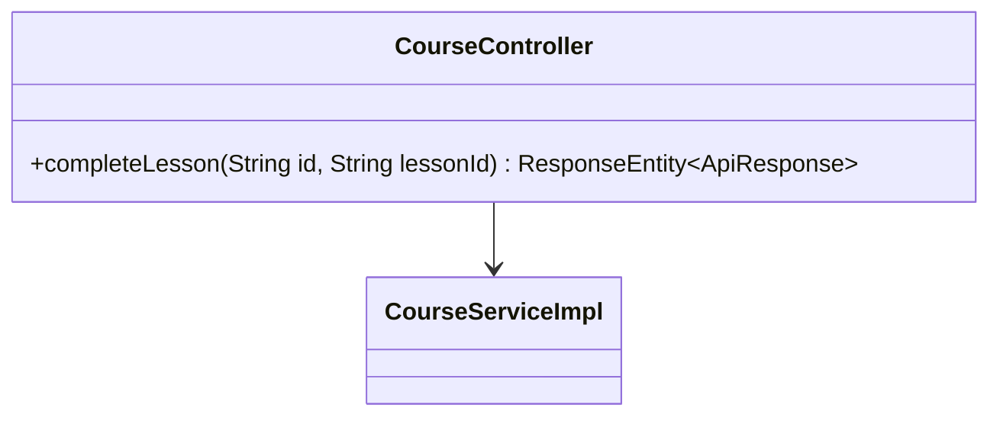
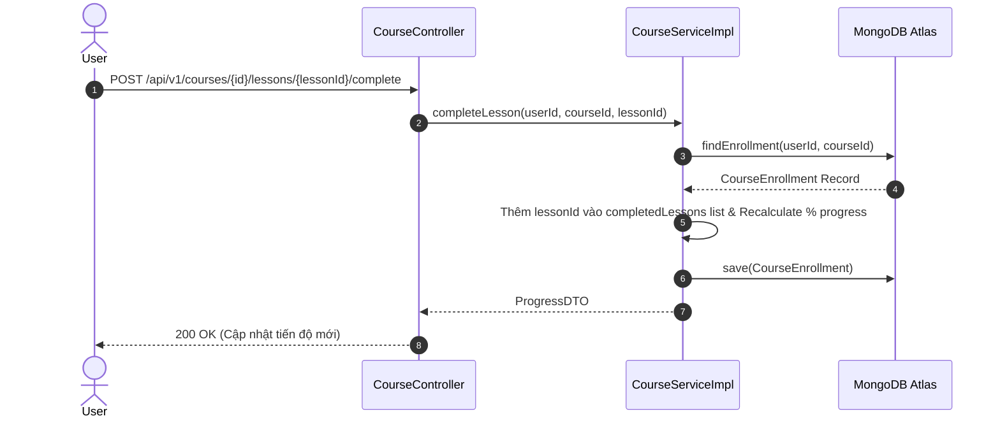
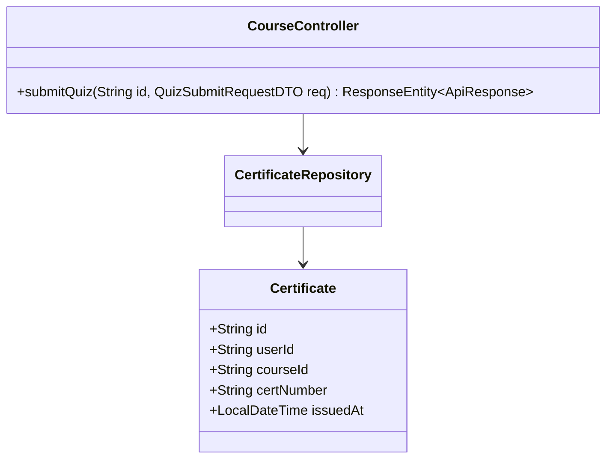
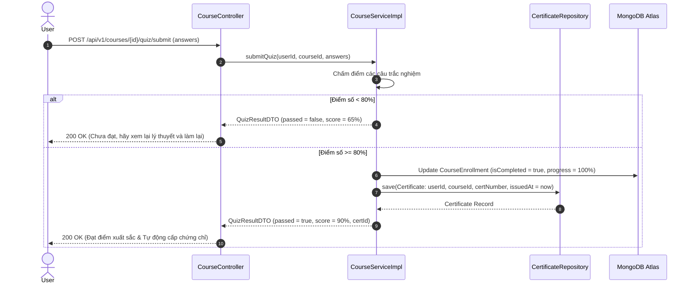

# UC-04 — Đào Tạo & Khóa Học (Courses & Learning Path)

Tài liệu thiết kế chi tiết từng Use Case con (Sub-UC) thuộc luồng Đào tạo, Khóa học và Cấp chứng chỉ.

---

## 📚 UC-04.1: Danh Sách & Chi Tiết Khóa Học (Get Courses & Details)

### 📌 1. Mô tả Chi Tiết & Quy Tắc Nghiệp Vụ
- **Actor:** Guest / User.
- **Mục tiêu:** Tra cứu danh sách các khóa học đào tạo kỹ năng MC, xem giáo trình, giảng viên phụ trách và danh sách bài học dùng thử (Free Preview).
- **Endpoint:** `GET /api/v1/courses`, `GET /api/v1/courses/{id}`

### 📐 2. Class Diagram (UC-04.1)

### 🔄 3. Sequence Diagram (UC-04.1)

### 🧪 4. Testing & Verification (UC-04.1)
- **Unit Test Method:** `CourseControllerTest.java` -> `getCourseById_validId_returnsCourse()`
- **Assertions:** Trả về đối tượng `Course` có đúng `id`.

---

## 📚 UC-04.2: Đăng Ký & Mua Khóa Học (Enroll Course)

### 📌 1. Mô tả Chi Tiết & Quy Tắc Nghiệp Vụ
- **Actor:** User.
- **Mục tiêu:** Đăng ký khóa học (miễn phí cho VIP hoặc mua khóa lẻ). Tạo bản ghi `CourseEnrollment`.
- **Endpoint:** `POST /api/v1/courses/{id}/enroll`

### 📐 2. Class Diagram (UC-04.2)

### 🔄 3. Sequence Diagram (UC-04.2)

### 🧪 4. Testing & Verification (UC-04.2)
- **Unit Test Method:** `CourseServiceImplTest.java` -> `enroll_success()`
- **Assertions:** Bản ghi `CourseEnrollment` được khởi tạo với tiến độ `0%`.

---

## 📚 UC-04.3: Theo Dõi Tiến Độ Học Tập (Course Progress)

### 📌 1. Mô tả Chi Tiết & Quy Tắc Nghiệp Vụ
- **Actor:** User.
- **Mục tiêu:** Lấy phần trăm hoàn thành khóa học (`progressPercent`), danh sách bài đã học và vị trí bài học tiếp theo.
- **Endpoint:** `GET /api/v1/courses/{id}/progress`

### 📐 2. Class Diagram (UC-04.3)

### 🔄 3. Sequence Diagram (UC-04.3)

### 🧪 4. Testing & Verification (UC-04.3)
- **Unit Test Method:** `CourseControllerTest.java` -> `getProgress_returnsCurrentProgress()`
- **Assertions:** Phần trăm tiến độ khớp với số bài học đã xong.

---

## 📚 UC-04.4: Hoàn Thành Bài Học Video (Complete Lesson)

### 📌 1. Mô tả Chi Tiết & Quy Tắc Nghiệp Vụ
- **Actor:** User.
- **Mục tiêu:** Đánh dấu hoàn thành 1 bài học nhỏ trong khóa học, tự động tính toán lại % tổng tiến độ khóa học.
- **Endpoint:** `POST /api/v1/courses/{id}/lessons/{lessonId}/complete`

### 📐 2. Class Diagram (UC-04.4)

### 🔄 3. Sequence Diagram (UC-04.4)

### 🧪 4. Testing & Verification (UC-04.4)
- **Unit Test Method:** `CourseServiceImplTest.java` -> `completeLesson_updatesProgressPercent()`
- **Assertions:** Số lượng bài hoàn thành tăng 1, tiến độ % được cộng thêm.

---

## 📚 UC-04.5: Nộp Bài Quiz & Auto Certificate (Submit Quiz & Auto Cert)

### 📌 1. Mô tả Chi Tiết & Quy Tắc Nghiệp Vụ
- **Actor:** User.
- **Mục tiêu:** Nộp bài trắc nghiệm kiểm tra cuối khóa. Nếu điểm đạt >= 80%, tự động cấp chứng chỉ hoàn thành khóa học vào kho `Certificate`.
- **Endpoint:** `POST /api/v1/courses/{id}/quiz/submit`

### 📐 2. Class Diagram (UC-04.5)

### 🔄 3. Sequence Diagram (UC-04.5)

### 🧪 4. Testing & Verification (UC-04.5)
- **Unit Test Method:** `CourseServiceImplTest.java` -> `submitQuiz_passed_createsCertificate()`
- **Assertions:** Tạo chứng chỉ mới khi điểm >= 80, gán đúng `courseId` và `userId`.
