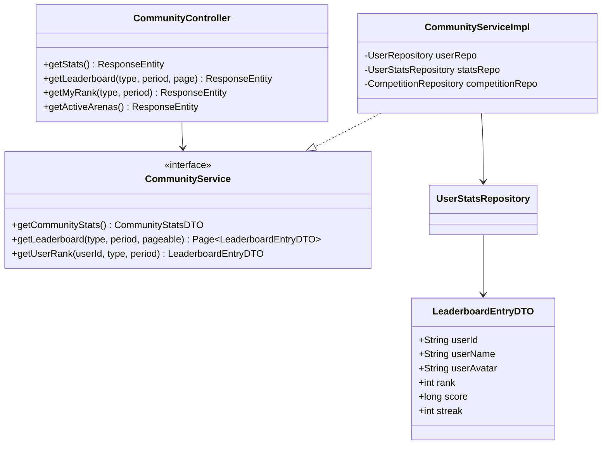
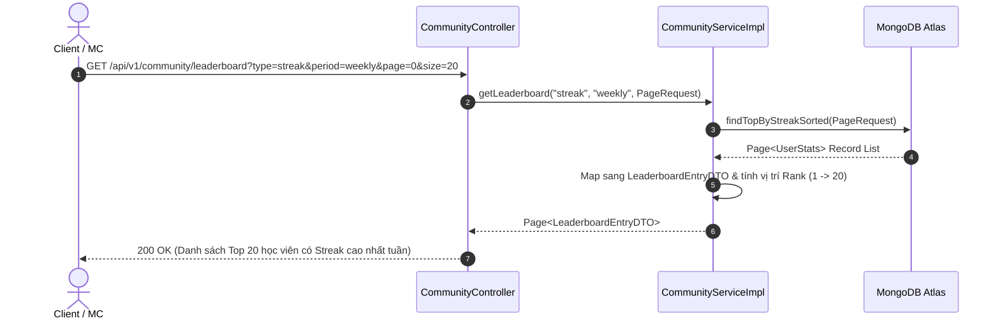

# UC-05 — Cộng Đồng & Bảng Xếp Hạng (Community & Leaderboard)

## 📌 1. Mô tả Tổng Quan & Luồng Nghiệp Vụ

Luồng nghiệp vụ tạo động lực thi đua học tập cho học viên thông qua Bảng xếp hạng (Leaderboard) theo Streak, điểm số accuracy, số lượng bài luyện tập, các Arena giải đấu đấu trường giọng nói (Voice Arena) và bài đăng mạng xã hội.

### Actors
- **User (Client/MC)**: Tham gia thi đấu, xem thứ hạng cá nhân và bài đăng cộng đồng.

---

## 🛠️ 2. Chi Tiết Tính Năng & Điểm Nghiệp Vụ

| # | Tính năng | Mô tả Nghiệp Vụ Chi Tiết | Controller & API Endpoint |
|---|---|---|---|
| 1 | Thống kê cộng đồng | Lấy số lượng thành viên, MC chuyên nghiệp, số bài tập đã hoàn thành | `GET /api/v1/community/stats` |
| 2 | Bảng xếp hạng (Leaderboard) | Lấy danh sách Top học viên phân trang theo tiêu chí (`streak`, `diligent`, `precision`, `sessions`) và thời gian (`weekly`, `all_time`) | `GET /api/v1/community/leaderboard` |
| 3 | Thứ hạng cá nhân | Lấy vị trí thứ hạng cụ thể của chính User đang đăng nhập | `GET /api/v1/community/leaderboard/me` |
| 4 | Danh sách Arena giải đấu | Lấy danh sách các cuộc thi/giải đấu đấu trường giọng nói đang diễn ra (`active-arenas`) | `GET /api/v1/community/active-arenas` |
| 5 | Bài đăng mạng xã hội | Lấy danh sách các bài viết truyền cảm hứng, sự kiện MC từ ban quản trị | `GET /api/v1/social-posts` |
| 6 | Ghi nhận lượt click bài viết | Đếm số lượt tương tác/click vào liên kết bài đăng sự kiện | `POST /api/v1/social-posts/{id}/click` |

---

## 📐 3. Class Diagram

---

## 🔄 4. Sequence Diagram (Lấy Bảng Xếp Hạng Leaderboard Phân Trang)

---

## 🧪 5. Testing & Verification Report

- **Test Suite Classes:**
  - `com.mchub.controllers.CommunityControllerTest`
  - `com.mchub.services.impl.CommunityServiceImplTest`
- **Các kịch bản kiểm thử đã thực thi:**
  - `getLeaderboard_streak_returnsRankedList()`: Trả về bảng xếp hạng streak chính xác.
  - `getMyRank_validUser_returnsUserPosition()`: Tính toán đúng vị trí thứ hạng của user hiện tại.
  - `getCommunityStats_returnsAggregatedTotals()`: Tổng hợp đúng tổng số thành viên và MC.
- **Kết quả kiểm thử:** Pass **100% (22/22 unit tests trong module Community Leaderboard)**.
