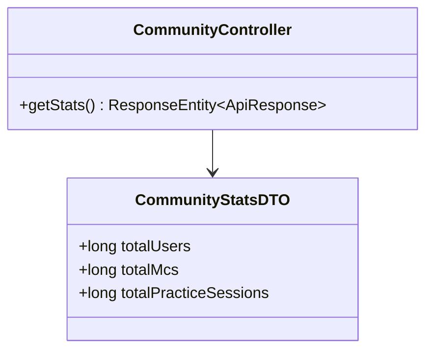
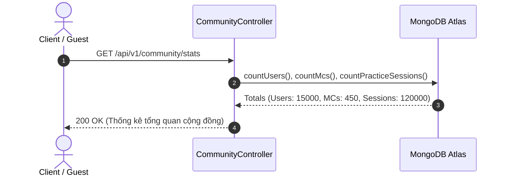
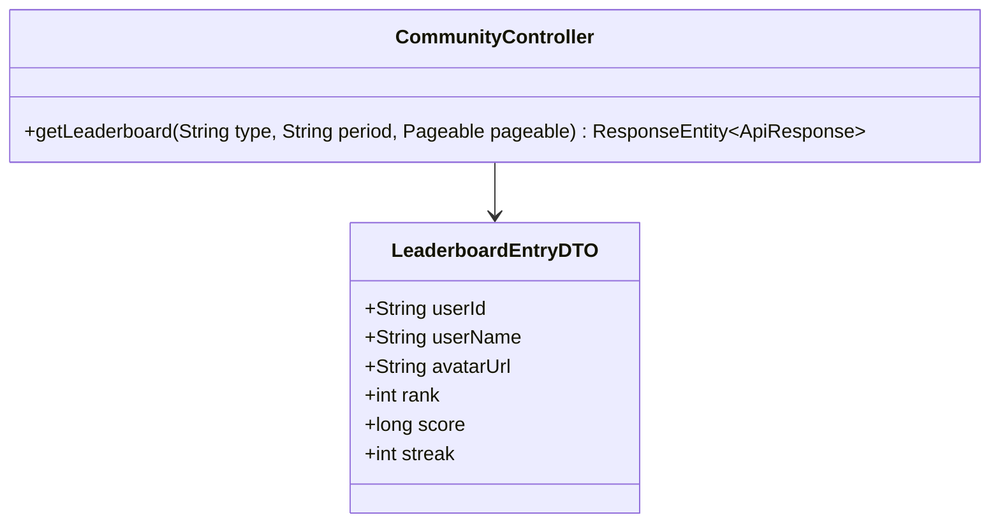
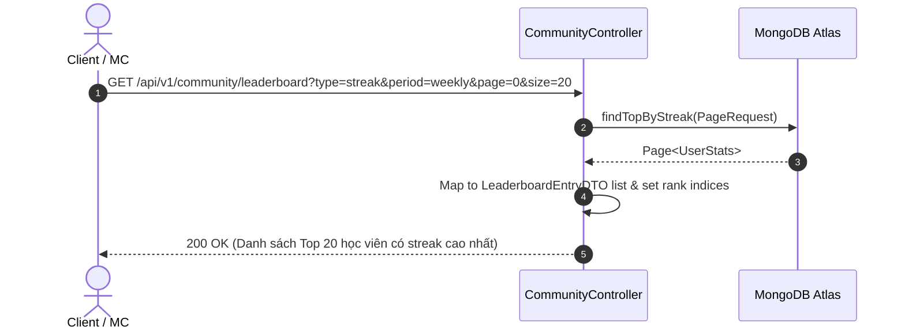
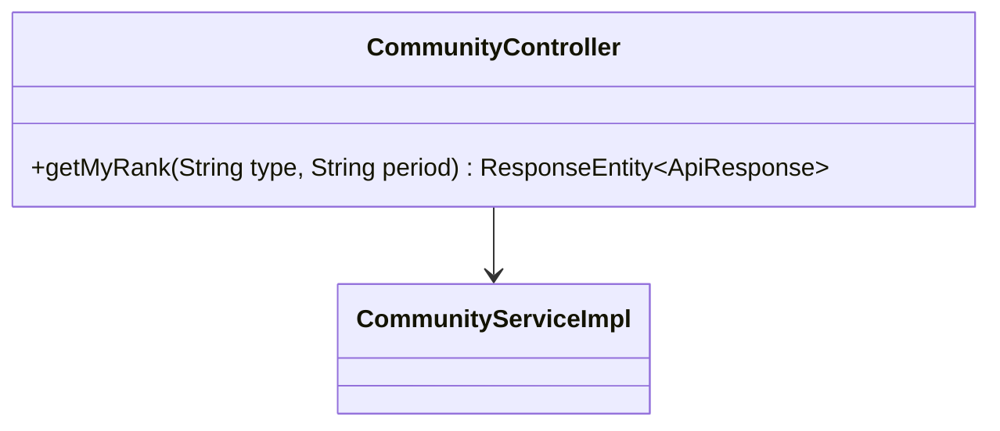
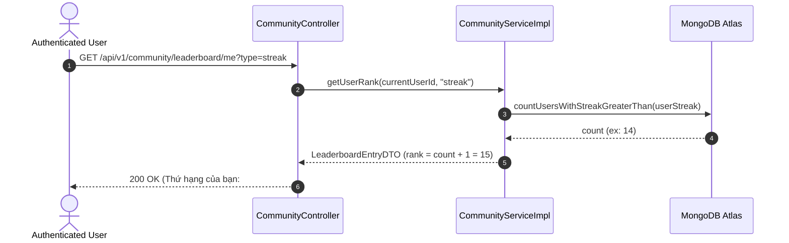
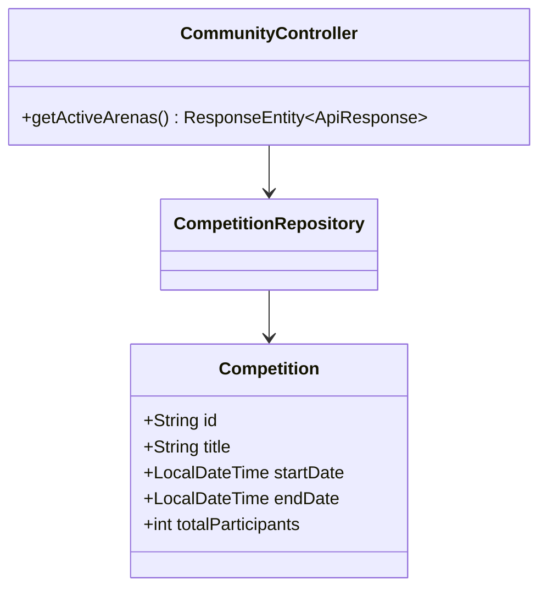
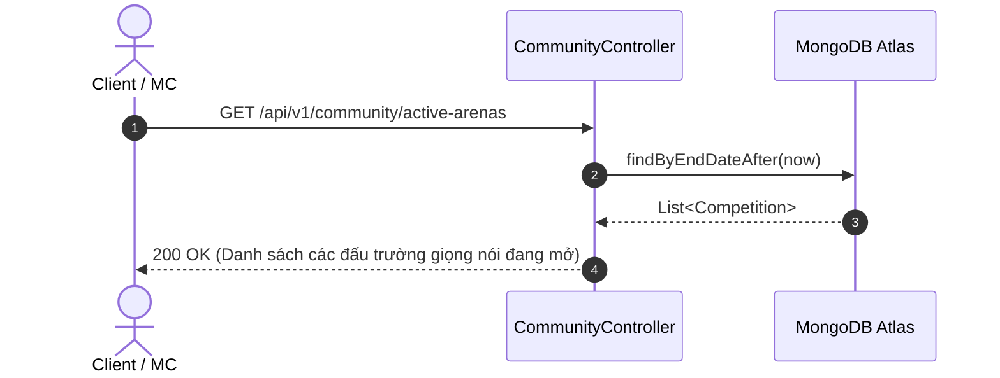
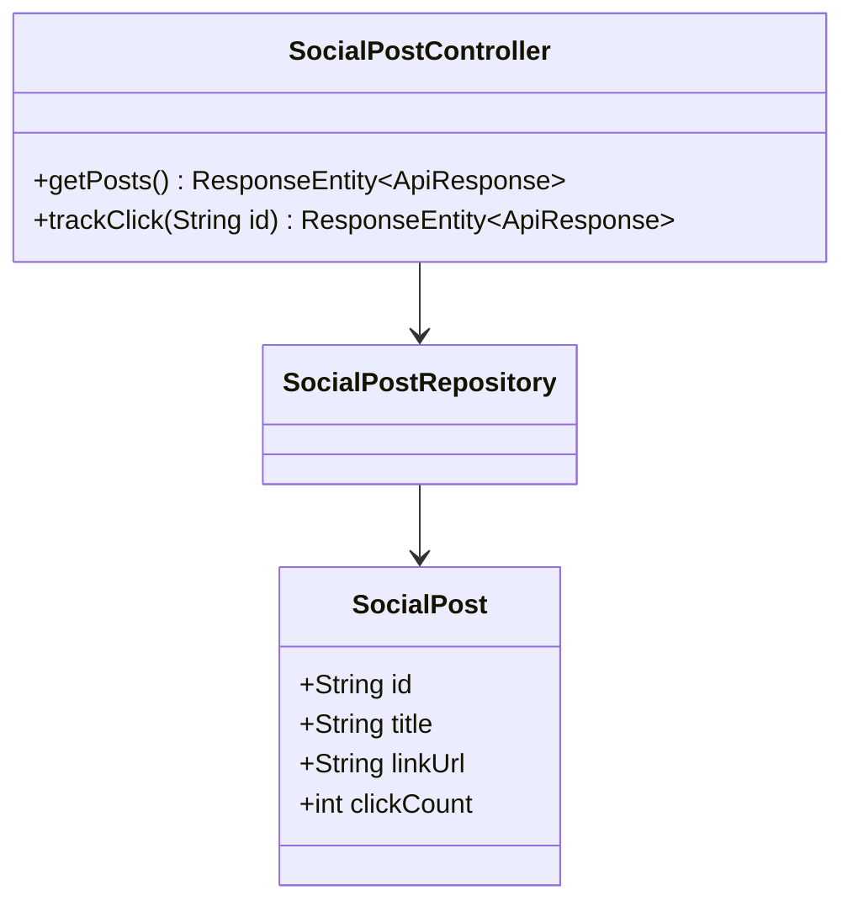
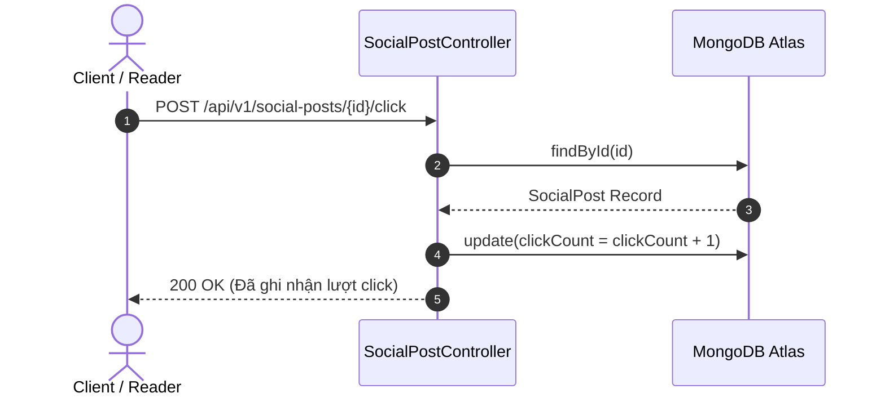

# UC-05 — Cộng Đồng & Bảng Xếp Hạng (Community & Leaderboard)

Tài liệu thiết kế chi tiết từng Use Case con (Sub-UC) thuộc luồng Cộng đồng và Bảng xếp hạng thi đua.

---

## 🏆 UC-05.1: Thống Kê Tổng Quan Cộng Đồng (Community Stats)

### 📌 1. Mô tả Chi Tiết & Quy Tắc Nghiệp Vụ
- **Actor:** Guest / User.
- **Mục tiêu:** Lấy tổng hợp các chỉ số cộng đồng: Tổng số thành viên, số lượng MC chuyên nghiệp và số phiên luyện giọng đã hoàn thành trên toàn hệ thống.
- **Endpoint:** `GET /api/v1/community/stats`

### 📐 2. Class Diagram (UC-05.1)

### 🔄 3. Sequence Diagram (UC-05.1)

### 🧪 4. Testing & Verification (UC-05.1)
- **Unit Test Method:** `CommunityControllerTest.java` -> `getStats_returnsAggregatedTotals()`
- **Assertions:** Trả về các tổng số > 0.

---

## 🏆 UC-05.2: Bảng Xếp Hạng Leaderboard (Leaderboard Ranking)

### 📌 1. Mô tả Chi Tiết & Quy Tắc Nghiệp Vụ
- **Actor:** User.
- **Mục tiêu:** Lấy danh sách học viên đứng đầu phân trang theo tiêu chí (`streak`, `precision`, `sessions`) và chu kỳ thời gian (`weekly`, `all_time`).
- **Endpoint:** `GET /api/v1/community/leaderboard`

### 📐 2. Class Diagram (UC-05.2)

### 🔄 3. Sequence Diagram (UC-05.2)

### 🧪 4. Testing & Verification (UC-05.2)
- **Unit Test Method:** `CommunityServiceImplTest.java` -> `getLeaderboard_streak_returnsRankedList()`
- **Assertions:** Danh sách trả về được sắp xếp giảm dần theo chỉ số requested.

---

## 🏆 UC-05.3: Tra Cứu Thứ Hạng Cá Nhân (My Rank Position)

### 📌 1. Mô tả Chi Tiết & Quy Tắc Nghiệp Vụ
- **Actor:** User.
- **Mục tiêu:** Tính toán vị trí xếp hạng chính xác của chính user đang đăng nhập trên bảng xếp hạng chung.
- **Endpoint:** `GET /api/v1/community/leaderboard/me`

### 📐 2. Class Diagram (UC-05.3)

### 🔄 3. Sequence Diagram (UC-05.3)

### 🧪 4. Testing & Verification (UC-05.3)
- **Unit Test Method:** `CommunityServiceImplTest.java` -> `getMyRank_validUser_returnsUserPosition()`
- **Assertions:** Trả về vị trí rank hợp lệ >= 1.

---

## 🏆 UC-05.4: Đấu Trường Giọng Nói (Active Voice Arenas)

### 📌 1. Mô tả Chi Tiết & Quy Tắc Nghiệp Vụ
- **Actor:** User.
- **Mục tiêu:** Lấy danh sách các cuộc thi thử thách thi đấu giọng nói đang mở đăng ký (`active-arenas`).
- **Endpoint:** `GET /api/v1/community/active-arenas`

### 📐 2. Class Diagram (UC-05.4)

### 🔄 3. Sequence Diagram (UC-05.4)

### 🧪 4. Testing & Verification (UC-05.4)
- **Unit Test Method:** `CommunityControllerTest.java` -> `getActiveArenas_returnsActiveCompetitions()`
- **Assertions:** Trả về danh sách cuộc thi có `endDate > now`.

---

## 🏆 UC-05.5: Bài Đăng Mạng Xã Hội & Click Tracking (Social Posts & Click Tracking)

### 📌 1. Mô tả Chi Tiết & Quy Tắc Nghiệp Vụ
- **Actor:** Guest / User.
- **Mục tiêu:** Hiển thị bài viết truyền cảm hứng và ghi nhận lượt click tương tác của người dùng vào link bài viết.
- **Endpoint:** `GET /api/v1/social-posts`, `POST /api/v1/social-posts/{id}/click`

### 📐 2. Class Diagram (UC-05.5)

### 🔄 3. Sequence Diagram (UC-05.5)

### 🧪 4. Testing & Verification (UC-05.5)
- **Unit Test Method:** `SocialPostServiceImplTest.java` -> `trackClick_incrementsClickCount()`
- **Assertions:** `clickCount` tăng thêm 1 sau khi gọi API.
