# UC-06 — Gói Cước & Thanh Toán (Payment & Subscriptions)

Tài liệu thiết kế chi tiết từng Use Case con (Sub-UC) thuộc luồng Thanh toán và Quản lý Gói cước VIP.

---

## 💳 UC-06.1: Xem Danh Sách Gói Cước VIP (Get VIP Subscription Plans)

### 📌 1. Mô tả Chi Tiết & Quy Tắc Nghiệp Vụ
- **Actor:** Guest / User.
- **Mục tiêu:** Tra cứu bảng giá các gói VIP (`BASIC`, `FULL`, `ANNUAL`), số lượt AI sessions đi kèm và các chương trình khuyến mãi giảm giá active (`FlashDeals`).
- **Endpoint:** `GET /api/v1/payment/plans`

### 📐 2. Class Diagram (UC-06.1)
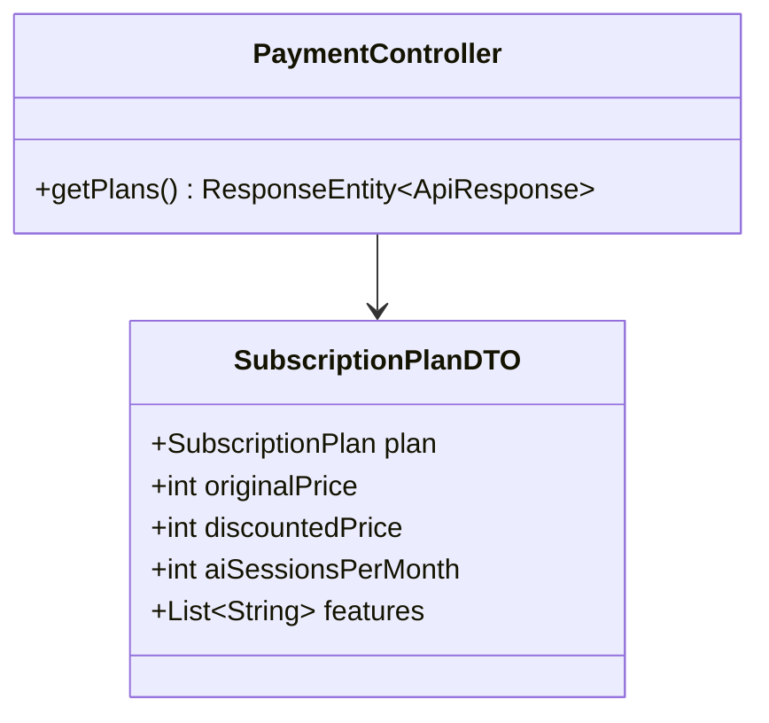

### 🔄 3. Sequence Diagram (UC-06.1)
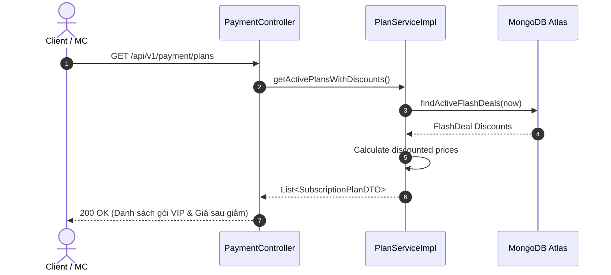

### 🧪 4. Testing & Verification (UC-06.1)
- **Unit Test Method:** `PlanServiceTest.java` -> `getPlans_returnsPlansWithActiveDiscounts()`
- **Assertions:** Trả về đủ 3 gói VIP, giá giảm được tính chính xác theo % FlashDeal.

---

## 💳 UC-06.2: Tạo Đơn Hàng & Link Thanh Toán PayOS (Create PayOS Order)

### 📌 1. Mô tả Chi Tiết & Quy Tắc Nghiệp Vụ
- **Actor:** User.
- **Mục tiêu:** Tạo bản ghi `PaymentTransaction` ở trạng thái `PENDING`, gọi PayOS REST API sinh QR Code và trả về `checkoutUrl`.
- **Endpoint:** `POST /api/v1/payment/create-order`

### 📐 2. Class Diagram (UC-06.2)
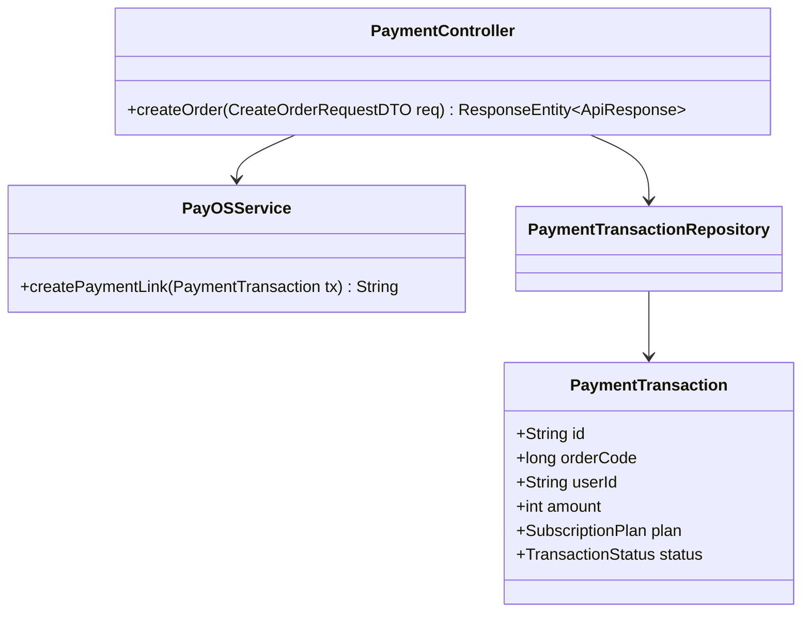

### 🔄 3. Sequence Diagram (UC-06.2)
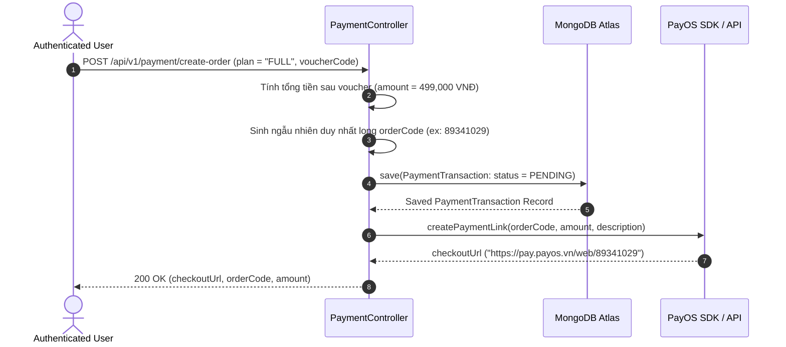

### 🧪 4. Testing & Verification (UC-06.2)
- **Unit Test Method:** `PayOSServiceTest.java` -> `createPaymentLink_validTx_returnsUrl()`
- **Assertions:** `orderCode` > 0, `checkoutUrl` chứa tiền tố `https://pay.payos.vn`.

---

## 💳 UC-06.3: Xử Lý Webhook Thanh Toán PayOS (PayOS Webhook Handler)

### 📌 1. Mô tả Chi Tiết & Quy Tắc Nghiệp Vụ
- **Actor:** PayOS Gateway System.
- **Mục tiêu:** Tự động nhận kết quả thanh toán thành công, xác minh chữ ký bảo mật HMAC-SHA256, chuyển trạng thái đơn sang `PAID`, nâng cấp `User.plan` và cấp thêm lượt AI session cho người dùng.
- **Rules:** Nếu chữ ký `x-payos-signature` không khớp, từ chối với HTTP 400 Bad Request.
- **Endpoint:** `POST /api/v1/payment/webhook`

### 📐 2. Class Diagram (UC-06.3)
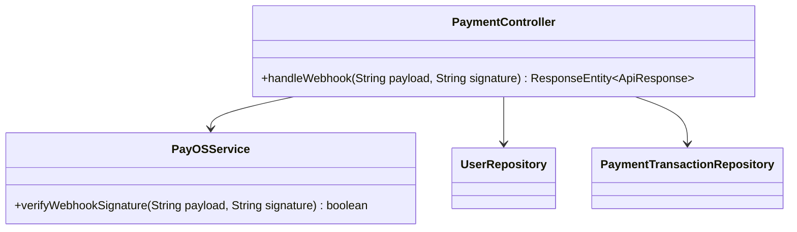

### 🔄 3. Sequence Diagram (UC-06.3)
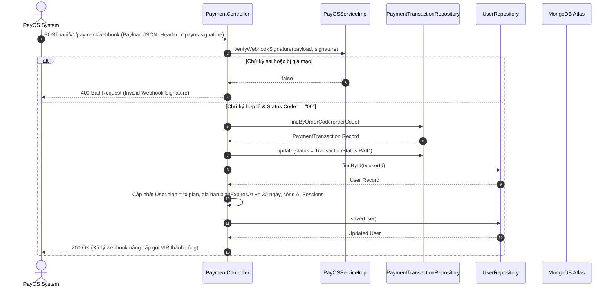

### 🧪 4. Testing & Verification (UC-06.3)
- **Unit Test Method:** `PayOSServiceTest.java` -> `verifyWebhookSignature_valid_returnsTrue()`
- **Assertions:** Xác minh đúng chữ ký HMAC-SHA256, `User.plan` được nâng cấp chính xác.

---

## 💳 UC-06.4: Tra Cứu Trạng Thái Đơn Hàng (Order Status Check)

### 📌 1. Mô tả Chi Tiết & Quy Tắc Nghiệp Vụ
- **Actor:** User.
- **Mục tiêu:** Polling trạng thái đơn hàng khi đang ở màn hình quét mã QR thanh toán để tự động chuyển hướng khi thành công.
- **Endpoint:** `GET /api/v1/payment/order/{orderCode}`

### 📐 2. Class Diagram (UC-06.4)
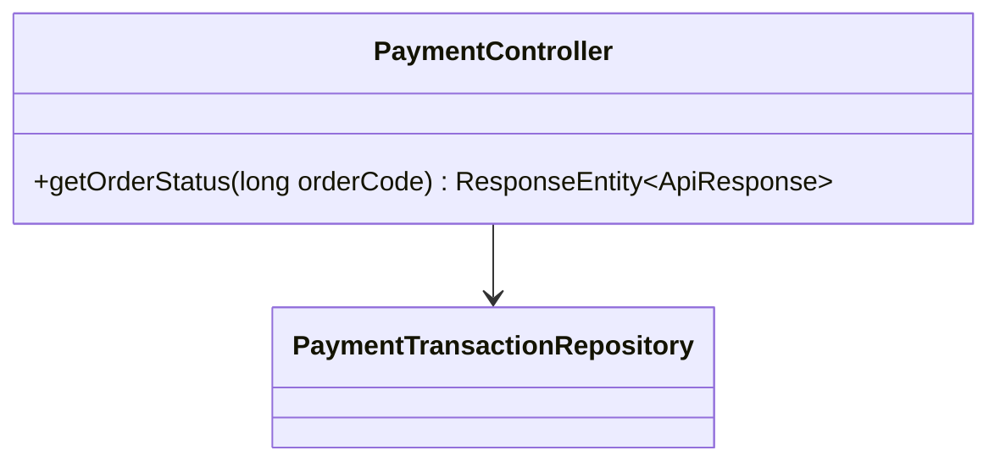

### 🔄 3. Sequence Diagram (UC-06.4)
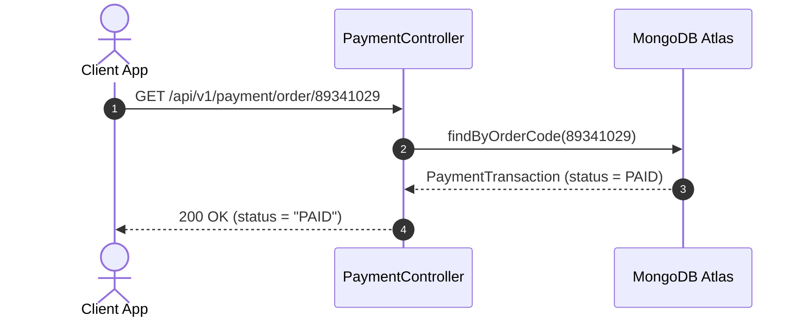

### 🧪 4. Testing & Verification (UC-06.4)
- **Unit Test Method:** `PaymentControllerTest.java` -> `getOrderStatus_returnsTransactionStatus()`
- **Assertions:** Trả về trạng thái `PAID` hoặc `PENDING`.

---

## 💳 UC-06.5: Áp Dụng Mã Giảm Giá Voucher (Apply Discount Voucher)

### 📌 1. Mô tả Chi Tiết & Quy Tắc Nghiệp Vụ
- **Actor:** User.
- **Mục tiêu:** Kiểm tra mã giảm giá (Voucher), tính toán số tiền được giảm trước khi bấm thanh toán.
- **Endpoint:** `POST /api/v1/payment/apply-voucher`

### 📐 2. Class Diagram (UC-06.5)
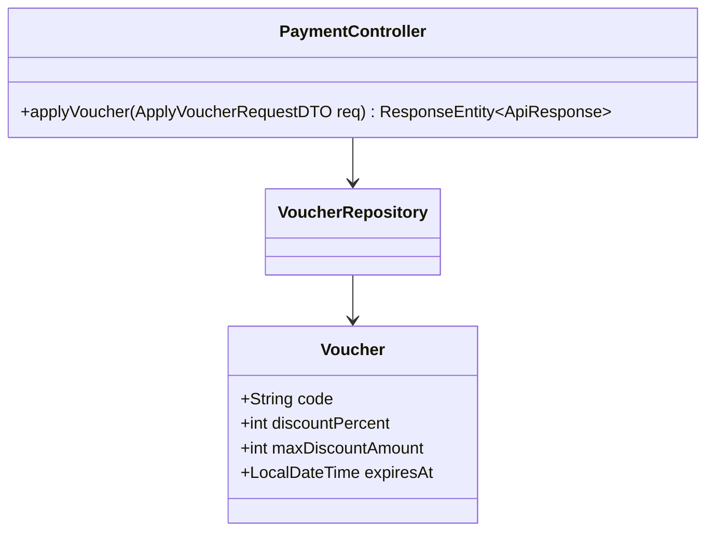

### 🔄 3. Sequence Diagram (UC-06.5)
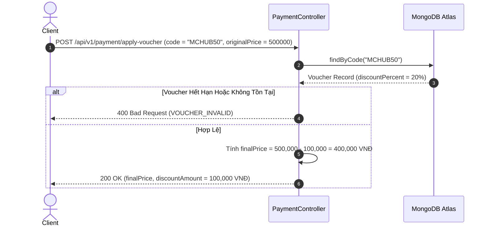

### 🧪 4. Testing & Verification (UC-06.5)
- **Unit Test Method:** `PlanServiceTest.java` -> `applyDiscount_validCode_calculatesDiscount()`
- **Assertions:** Số tiền giảm không vượt quá `maxDiscountAmount`.

---

## 💳 UC-06.6: Lịch Sử Thanh Toán Cá Nhân (Payment History)

### 📌 1. Mô tả Chi Tiết & Quy Tắc Nghiệp Vụ
- **Actor:** User.
- **Mục tiêu:** Xem danh sách các hóa đơn/giao dịch nâng cấp gói cước cá nhân đã thực hiện.
- **Endpoint:** `GET /api/v1/payment/history`

### 📐 2. Class Diagram (UC-06.6)
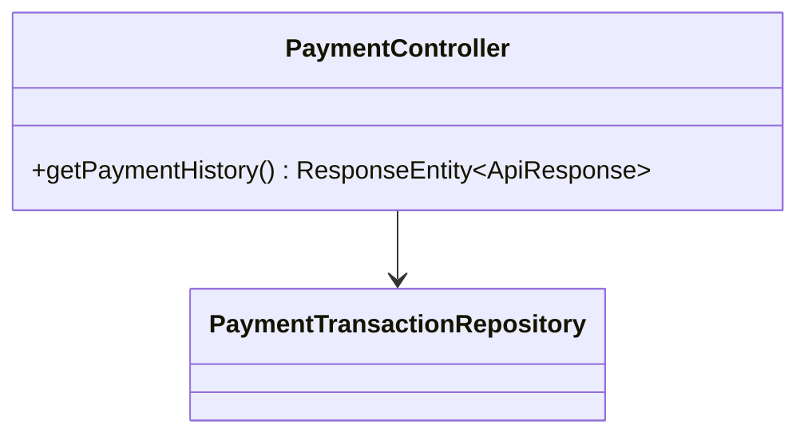

### 🔄 3. Sequence Diagram (UC-06.6)
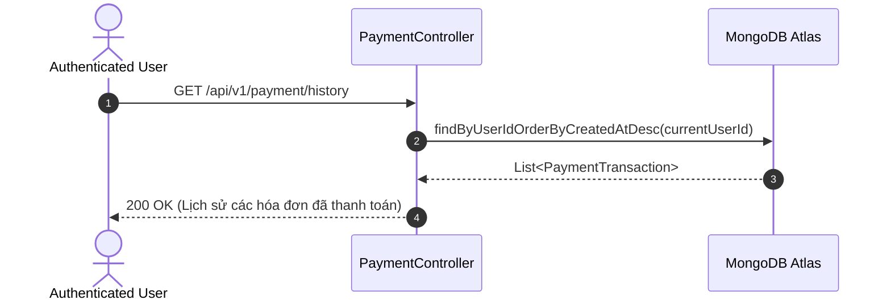

### 🧪 4. Testing & Verification (UC-06.6)
- **Unit Test Method:** `PaymentControllerTest.java` -> `getHistory_returnsUserTransactions()`
- **Assertions:** Danh sách trả về chỉ chứa giao dịch của `currentUserId`.
