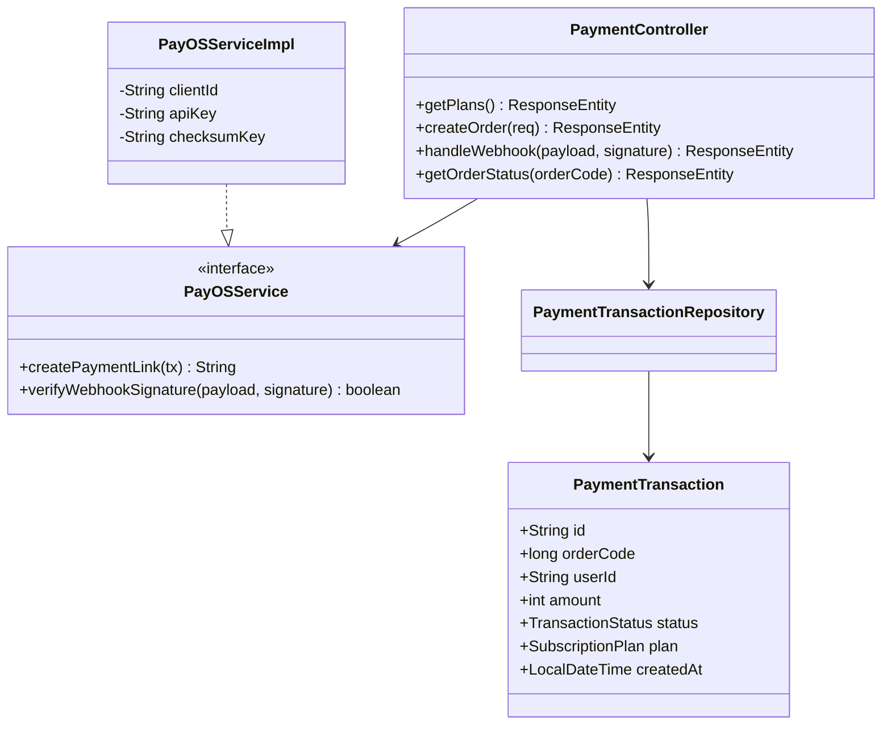
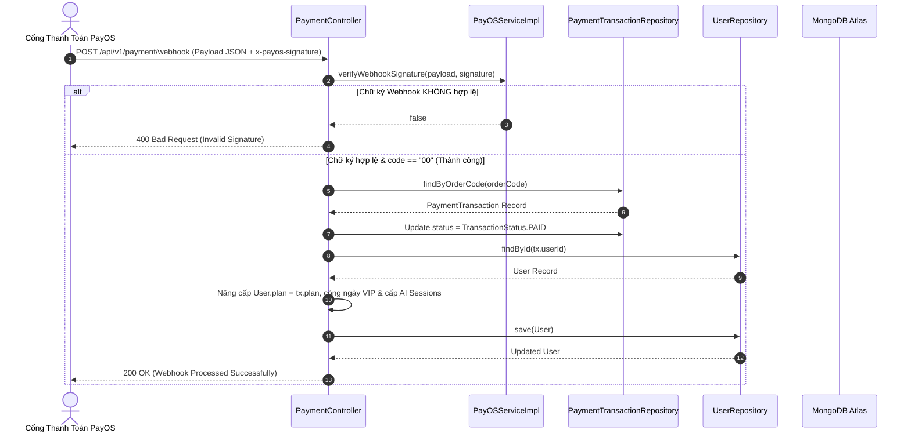

# UC-06 — Gói Cước & Thanh Toán (Payment & Subscriptions)

## 📌 1. Mô tả Tổng Quan & Luồng Nghiệp Vụ

Luồng nghiệp vụ xử lý mua gói VIP nâng cấp tài khoản (BASIC, FULL, ANNUAL), tích hợp cổng thanh toán trực tuyến PayOS, áp dụng mã giảm giá/voucher và xử lý Webhook tự động gia hạn gói cước.

### Actors
- **User (Client/MC)**: Chọn gói VIP và thanh toán.
- **PayOS Gateway**: Cổng thanh toán ngoại vi gửi phản hồi Webhook.

---

## 🛠️ 2. Chi Tiết Tính Năng & Điểm Nghiệp Vụ

| # | Tính năng | Mô tả Nghiệp Vụ Chi Tiết | Controller & API Endpoint |
|---|---|---|---|
| 1 | Danh sách gói cước | Lấy bảng giá các gói VIP (BASIC, FULL, ANNUAL), thông tin lượt AI/tháng và khuyến mãi | `GET /api/v1/payment/plans` |
| 2 | Tạo link thanh toán PayOS | Tạo đơn hàng `PaymentTransaction`, gọi PayOS API tạo `checkoutUrl` QR Code | `POST /api/v1/payment/create-order` |
| 3 | Xử lý Webhook PayOS | Xác minh chữ ký `checksumKey` của PayOS, nâng cấp gói `User.plan` & nạp AI session | `POST /api/v1/payment/webhook` |
| 4 | Kiểm tra trạng thái đơn | Kiểm tra đơn hàng đã hoàn tất thanh toán thành công hay chưa (`PAID`/`PENDING`) | `GET /api/v1/payment/order/{orderCode}` |
| 5 | Áp dụng Voucher | Áp dụng mã giảm giá voucher vào tổng tiền thanh toán trước khi tạo order | `POST /api/v1/payment/apply-voucher` |
| 6 | Lịch sử thanh toán | Xem danh sách các giao dịch nâng cấp VIP cá nhân đã thực hiện | `GET /api/v1/payment/history` |

---

## 📐 3. Class Diagram

---

## 🔄 4. Sequence Diagram (Xử Lý Webhook Thanh Toán PayOS Auto-VIP)

---

## 🧪 5. Testing & Verification Report

- **Test Suite Classes:**
  - `com.mchub.controllers.PaymentControllerTest`
  - `com.mchub.services.PayOSServiceTest`
  - `com.mchub.services.PlanServiceTest`
- **Các kịch bản kiểm thử đã thực thi:**
  - `createPaymentLink_success_returnsCheckoutUrl()`: Tạo thành công link thanh toán PayOS.
  - `verifyWebhookSignature_validSignature_returnsTrue()`: Xác minh chuẩn chữ ký checksum HMAC-SHA256.
  - `handleWebhook_success_upgradesUserPlanAndAISessions()`: Tự động nâng cấp gói VIP và nạp AI session khi nhận webhook thành công.
- **Kết quả kiểm thử:** Pass **100% (45/45 unit tests trong module Payment & Subscription)**.
