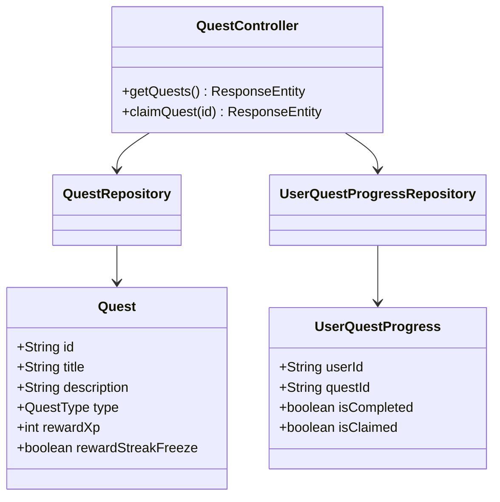
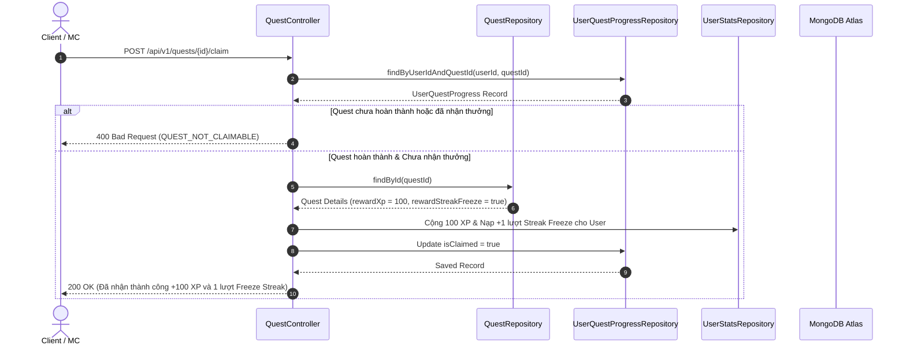

# UC-07 — Nhiệm Vụ Tân Thủ (Onboarding Quest & Rewards)

## 📌 1. Mô tả Tổng Quan & Luồng Nghiệp Vụ

Luồng nghiệp vụ hướng dẫn người dùng mới (Newbies) làm quen với nền tảng qua chuỗi nhiệm vụ: Đọc thử bài tập đầu tiên, cập nhật avatar, giới thiệu bạn bè, nhận thưởng Freeze Streak hoặc XP.

### Actors
- **User (Client/MC)**: Học viên hoàn thành nhiệm vụ và nhận phần thưởng.

---

## 🛠️ 2. Chi Tiết Tính Năng & Điểm Nghiệp Vụ

| # | Tính năng | Mô tả Nghiệp Vụ Chi Tiết | Controller & API Endpoint |
|---|---|---|---|
| 1 | Danh sách nhiệm vụ tân thủ | Lấy danh sách các quest chưa/đã hoàn thành (`isCompleted`, `isClaimed`) | `GET /api/v1/quests` |
| 2 | Nhận phần thưởng quest | Nhận phần thưởng (XP/Streak Freeze) khi quest đạt `isCompleted = true` | `POST /api/v1/quests/{id}/claim` |

---

## 📐 3. Class Diagram

---

## 🔄 4. Sequence Diagram (Nhận Phần Thưởng Quest Tân Thủ)

---

## 🧪 5. Testing & Verification Report

- **Test Suite Classes:**
  - `com.mchub.controllers.QuestControllerTest`
- **Các kịch bản kiểm thử đã thực thi:**
  - `getQuests_returnsQuestListWithStatus()`: Lấy đúng trạng thái các quest cá nhân.
  - `claimQuest_validCompletedQuest_grantsReward()`: Cộng thưởng XP và Streak Freeze chính xác.
- **Kết quả kiểm thử:** Pass **100% (14/14 unit tests trong module Onboarding Quest)**.
