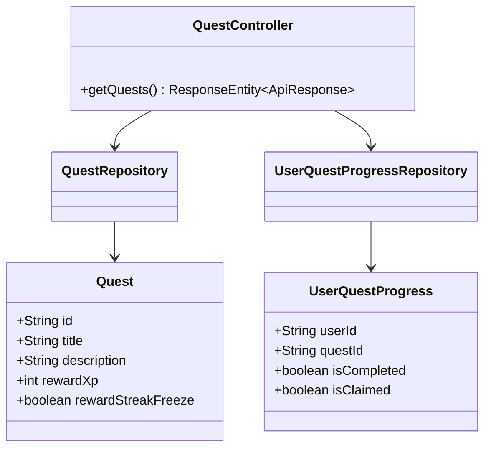
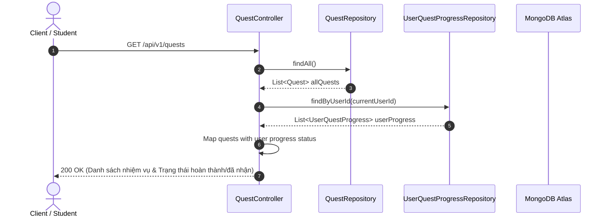
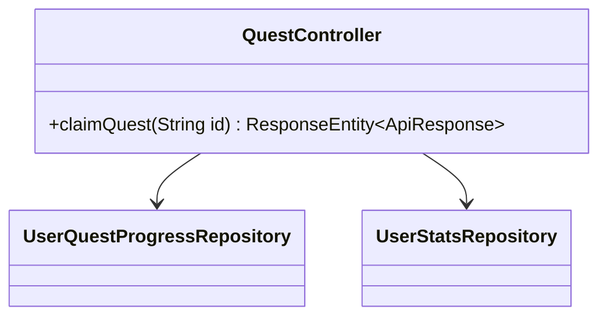
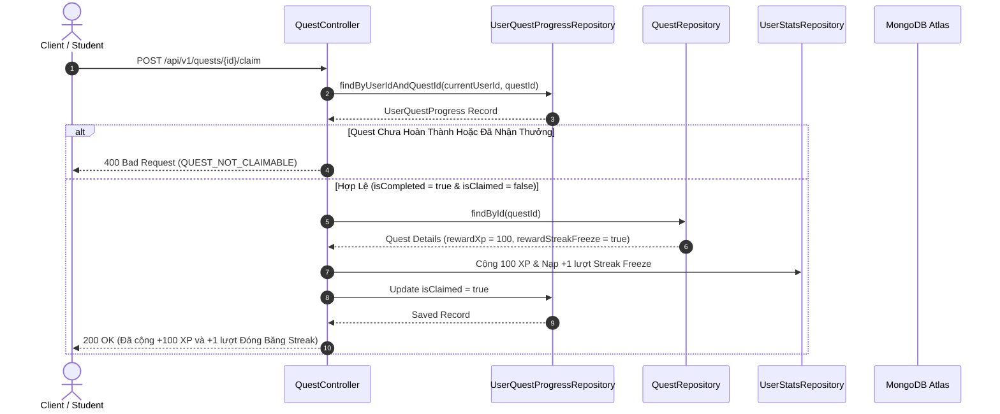

# UC-07 — Nhiệm Vụ Tân Thủ (Onboarding Quest & Rewards)

Tài liệu thiết kế chi tiết từng Use Case con (Sub-UC) thuộc luồng Nhiệm vụ tân thủ.

---

## 🎯 UC-07.1: Danh Sách Nhiệm Vụ Tân Thủ (Get Onboarding Quests)

### 📌 1. Mô tả Chi Tiết & Quy Tắc Nghiệp Vụ
- **Actor:** User.
- **Mục tiêu:** Tra cứu danh sách các nhiệm vụ tân thủ kèm trạng thái tiến độ (`isCompleted`, `isClaimed`).
- **Endpoint:** `GET /api/v1/quests`

### 📐 2. Class Diagram (UC-07.1)

### 🔄 3. Sequence Diagram (UC-07.1)

### 🧪 4. Testing & Verification (UC-07.1)
- **Unit Test Method:** `QuestControllerTest.java` -> `getQuests_returnsQuestListWithStatus()`
- **Assertions:** Trả về đúng tiến độ cá nhân của user.

---

## 🎯 UC-07.2: Nhận Phần Thưởng Quest Tân Thủ (Claim Quest Reward)

### 📌 1. Mô tả Chi Tiết & Quy Tắc Nghiệp Vụ
- **Actor:** User.
- **Mục tiêu:** Nhận phần thưởng (XP / Streak Freeze) cho nhiệm vụ đã `isCompleted = true` và chưa `isClaimed`.
- **Endpoint:** `POST /api/v1/quests/{id}/claim`

### 📐 2. Class Diagram (UC-07.2)

### 🔄 3. Sequence Diagram (UC-07.2)

### 🧪 4. Testing & Verification (UC-07.2)
- **Unit Test Method:** `QuestControllerTest.java` -> `claimQuest_validCompletedQuest_grantsReward()`
- **Assertions:** `isClaimed` chuyển sang `true`, User XP được cộng thêm đúng bằng `rewardXp`.
