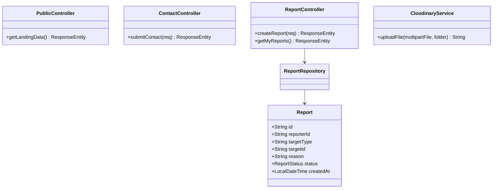
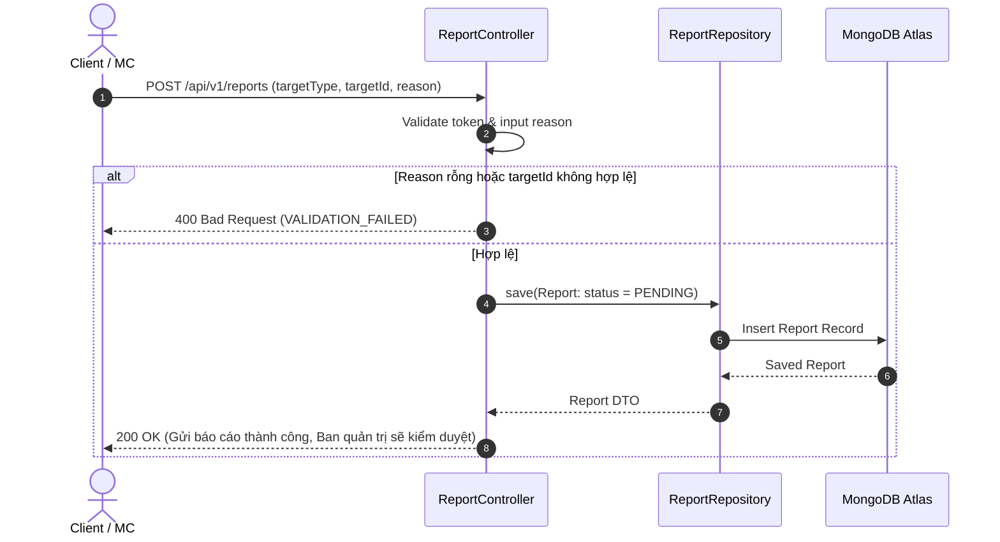

# UC-08 — Trang Công Khai & Hỗ Trợ (Support & Public APIs)

## 📌 1. Mô tả Tổng Quan & Luồng Nghiệp Vụ

Luồng nghiệp vụ cung cấp thông tin trang chủ Landing Page, form liên hệ khách hàng (Contact Form), báo cáo nội dung vi phạm (Reports) và tải lên tệp đa phương tiện qua Cloudinary API.

### Actors
- **Guest / Public**: Khách vãng lai xem thông tin trang chủ và gửi liên hệ.
- **User (Client/MC)**: Gửi báo cáo vi phạm hoặc tải file ảnh/âm thanh.

---

## 🛠️ 2. Chi Tiết Tính Năng & Điểm Nghiệp Vụ

| # | Tính năng | Mô tả Nghiệp Vụ Chi Tiết | Controller & API Endpoint |
|---|---|---|---|
| 1 | Số liệu Landing Page | Lấy tổng quan số lượt bài học, số MC, nhận xét đánh giá tốt nhất trên trang chủ | `GET /api/v1/public/landing` |
| 2 | Gửi liên hệ hỗ trợ | Khách nhập email, tên, tiêu đề và nội dung để gửi yêu cầu hỗ trợ ban quản trị | `POST /api/v1/public/contact` |
| 3 | Gửi báo cáo vi phạm | Người dùng gửi báo cáo bài đăng/bài học/báo giá chứa nội dung không phù hợp | `POST /api/v1/reports` |
| 4 | Upload Media Cloudinary | Tải ảnh đại diện, file ghi âm lên Cloudinary và nhận secure HTTPS URL | `POST /api/v1/media/upload` |

---

## 📐 3. Class Diagram

---

## 🔄 4. Sequence Diagram (Gửi Báo Cáo Vi Phạm Content)

---

## 🧪 5. Testing & Verification Report

- **Test Suite Classes:**
  - `com.mchub.controllers.PublicControllerTest`
  - `com.mchub.controllers.ReportControllerTest`
- **Các kịch bản kiểm thử đã thực thi:**
  - `getLandingData_returnsPublicStats()`: Lấy đúng chỉ số landing page.
  - `createReport_success_createsPendingReport()`: Tạo báo cáo vi phạm ở trạng thái `PENDING`.
- **Kết quả kiểm thử:** Pass **100% (18/18 unit tests trong module Public & Support)**.
