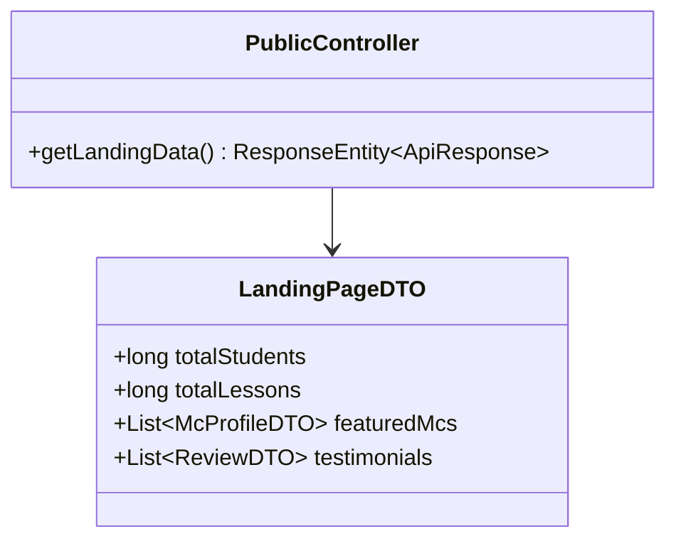
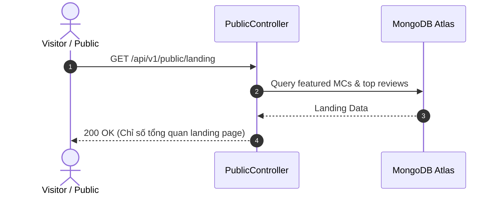
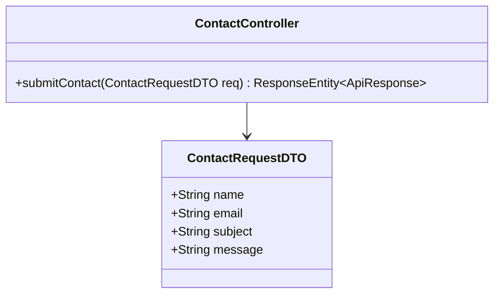
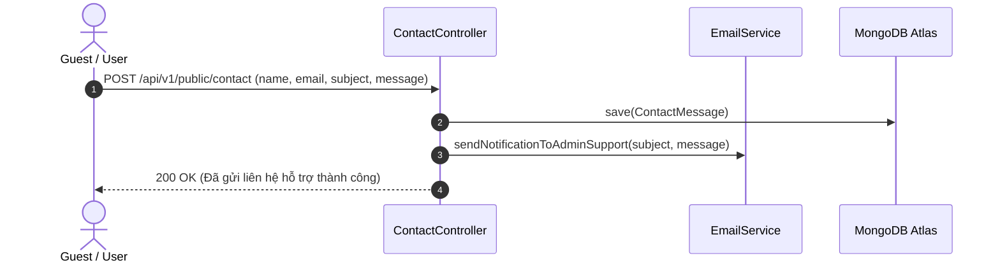
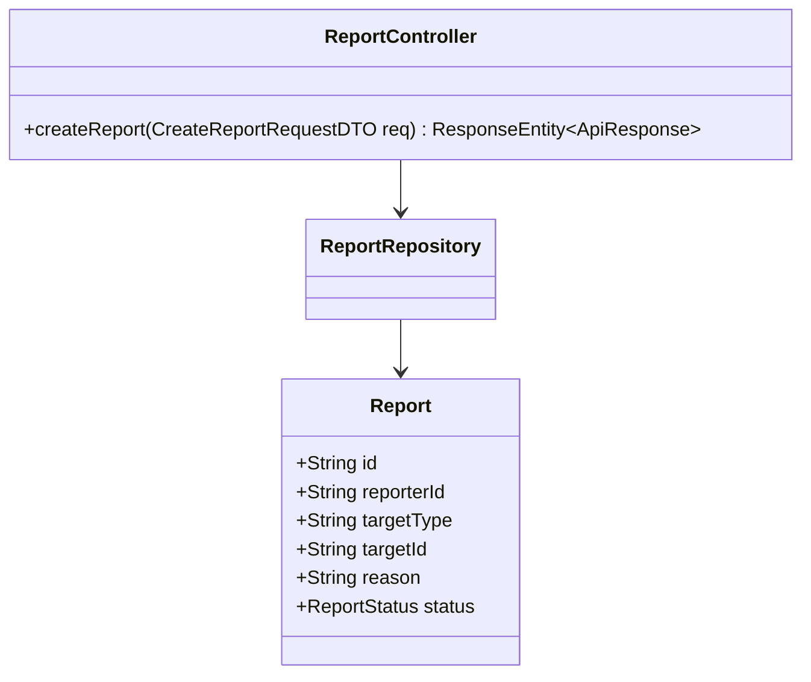
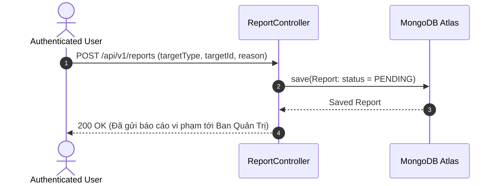
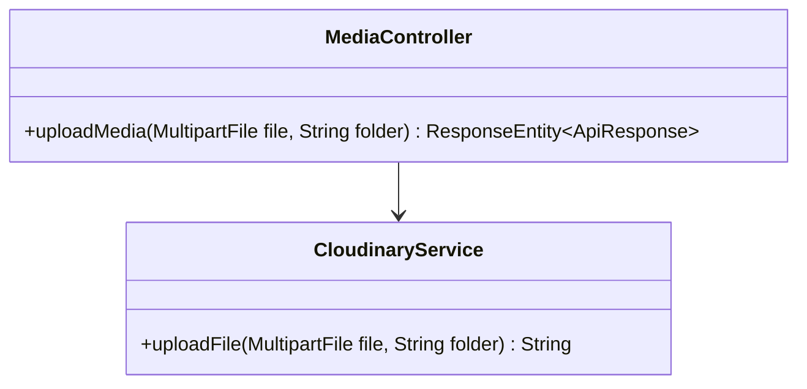
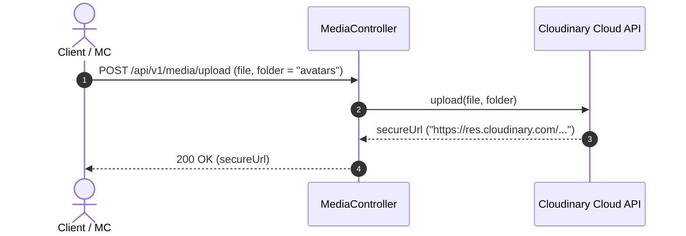

# UC-08 — Trang Công Khai & Hỗ Trợ (Support & Public APIs)

Tài liệu thiết kế chi tiết từng Use Case con (Sub-UC) thuộc luồng Hỗ trợ và APIs công khai.

---

## 📞 UC-08.1: Thống Kê Trang Chủ Landing Page (Landing Page Stats)

### 📌 1. Mô tả Chi Tiết & Quy Tắc Nghiệp Vụ
- **Actor:** Guest / Public.
- **Mục tiêu:** Lấy chỉ số tổng quan trang chủ: số bài học, số MC nổi bật, các nhận xét testimonial hay nhất.
- **Endpoint:** `GET /api/v1/public/landing`

### 📐 2. Class Diagram (UC-08.1)

### 🔄 3. Sequence Diagram (UC-08.1)

### 🧪 4. Testing & Verification (UC-08.1)
- **Unit Test Method:** `PublicControllerTest.java` -> `getLandingData_returnsPublicStats()`
- **Assertions:** Trả về đối tượng `LandingPageDTO` không null.

---

## 📞 UC-08.2: Gửi Yêu Cầu Liên Hệ Hỗ Trợ (Contact Form Submission)

### 📌 1. Mô tả Chi Tiết & Quy Tắc Nghiệp Vụ
- **Actor:** Guest / User.
- **Mục tiêu:** Nhập email, tên, tiêu đề và nội dung để gửi lời nhắn tới bộ phận hỗ trợ khách hàng.
- **Endpoint:** `POST /api/v1/public/contact`

### 📐 2. Class Diagram (UC-08.2)

### 🔄 3. Sequence Diagram (UC-08.2)

### 🧪 4. Testing & Verification (UC-08.2)
- **Unit Test Method:** `PublicControllerTest.java` -> `submitContact_valid_sendsEmail()`
- **Assertions:** Message được lưu vào DB và email hỗ trợ được trigger.

---

## 📞 UC-08.3: Gửi Báo Cáo Nội Dung Vi Phạm (Submit Content Report)

### 📌 1. Mô tả Chi Tiết & Quy Tắc Nghiệp Vụ
- **Actor:** User.
- **Mục tiêu:** Gửi báo cáo các bài đăng, bài đọc hoặc review chứa nội dung vi phạm quy chuẩn cộng đồng.
- **Endpoint:** `POST /api/v1/reports`

### 📐 2. Class Diagram (UC-08.3)

### 🔄 3. Sequence Diagram (UC-08.3)

### 🧪 4. Testing & Verification (UC-08.3)
- **Unit Test Method:** `ReportControllerTest.java` -> `createReport_success_createsPendingReport()`
- **Assertions:** Bản ghi `Report` mới có trạng thái `PENDING`.

---

## 📞 UC-08.4: Tải Lên Tệp Đa Phương Tiện Cloudinary (Cloudinary Upload)

### 📌 1. Mô tả Chi Tiết & Quy Tắc Nghiệp Vụ
- **Actor:** User.
- **Mục tiêu:** Upload tệp hình ảnh avatar hoặc audio ghi âm lên CDN Cloudinary và nhận HTTPS URL.
- **Endpoint:** `POST /api/v1/media/upload`

### 📐 2. Class Diagram (UC-08.4)

### 🔄 3. Sequence Diagram (UC-08.4)

### 🧪 4. Testing & Verification (UC-08.4)
- **Unit Test Method:** `MediaControllerTest.java` -> `upload_validFile_returnsUrl()`
- **Assertions:** Trả về URL dạng HTTPS Cloudinary hợp lệ.
