# UC-09 — Quản Trị Hệ Thống & Kiểm Duyệt (Admin Dashboard & System Health)

Tài liệu thiết kế chi tiết từng Use Case con (Sub-UC) thuộc luồng Quản trị hệ thống, Giám sát và Kiểm duyệt.

---

## 🛠️ UC-09.1: Giám Sát Sức Khỏe Hệ Thống Realtime (System Health Monitoring)

### 📌 1. Mô tả Chi Tiết & Quy Tắc Nghiệp Vụ
- **Actor:** Admin.
- **Mục tiêu:** Đo đạc và hiển thị các chỉ số hiệu năng realtime: JVM Heap/Non-heap RAM MB & %, Active Virtual Threads, Peak Threads, System Uptime hours, MongoDB ping response status.
- **Endpoint:** `GET /api/v1/admin/system/health`

### 📐 2. Class Diagram (UC-09.1)
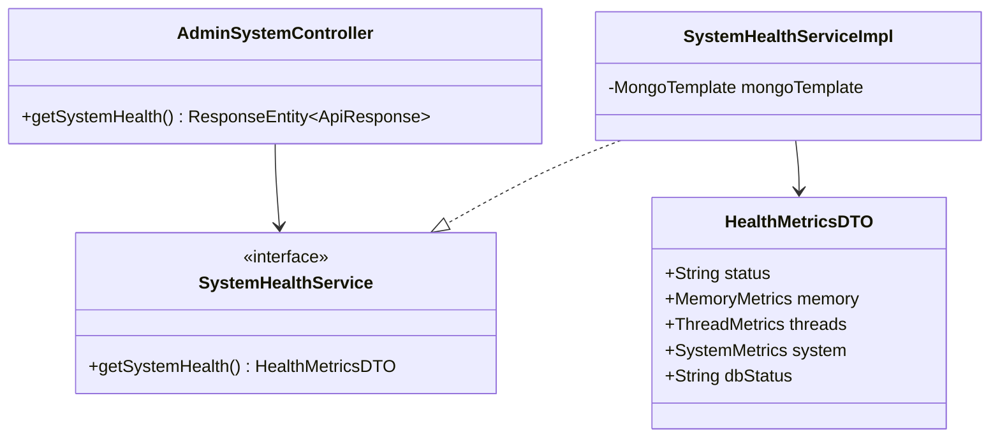

### 🔄 3. Sequence Diagram (UC-09.1)
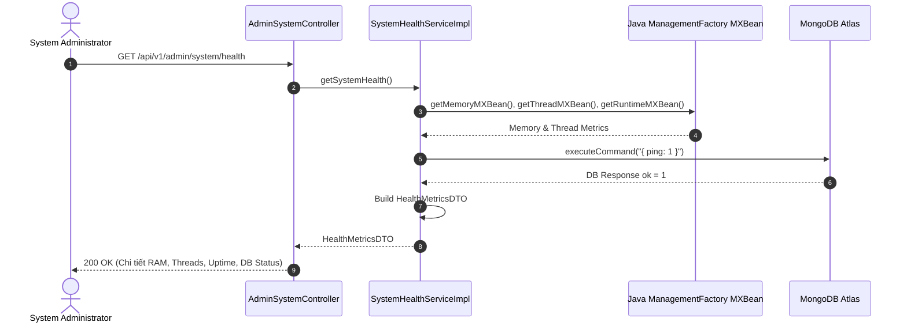

### 🧪 4. Testing & Verification (UC-09.1)
- **Unit Test Method:** `SystemHealthServiceImplTest.java` -> `getSystemHealth_returnsValidMetrics()`
- **Assertions:** RAM Heap MB > 0, `dbStatus` bằng `"UP"`.

---

## 🛠️ UC-09.2: Bật / Tắt Chế Độ Bảo Trì Hệ Thống (Dynamic Maintenance Mode)

### 📌 1. Mô tả Chi Tiết & Quy Tắc Nghiệp Vụ
- **Actor:** Admin.
- **Mục tiêu:** Toggle giá trị `MAINTENANCE_MODE` trong `SystemSettingRepository`. Khi bằng `true`, `MaintenanceModeFilter` chặn toàn bộ client không phải Admin với HTTP 503 Service Unavailable.
- **Endpoint:** `PUT /api/v1/admin/system/settings/dynamic`

### 📐 2. Class Diagram (UC-09.2)
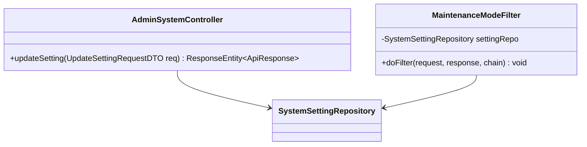

### 🔄 3. Sequence Diagram (UC-09.2)
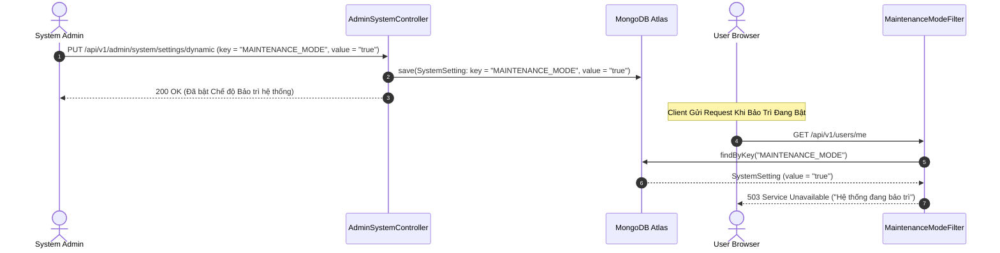

### 🧪 4. Testing & Verification (UC-09.2)
- **Unit Test Method:** `AdminSystemControllerTest.java` -> `updateSetting_maintenanceMode_updatesState()`
- **Assertions:** Key `MAINTENANCE_MODE` được cập nhật thành công thành `"true"`.

---

## 🛠️ UC-09.3: Tạm Khóa Tài Khoản Người Dùng Có Thời Hạn (Temporary Sanction)

### 📌 1. Mô tả Chi Tiết & Quy Tắc Nghiệp Vụ
- **Actor:** Admin.
- **Mục tiêu:** Khóa truy cập tài khoản vi phạm quy chuẩn theo số ngày (1, 3, 7, 30 ngày), thiết lập `isActive = false` và `suspendedUntil = now + N days`.
- **Endpoint:** `PUT /api/v1/admin/users/{id}/suspend-temporary`

### 📐 2. Class Diagram (UC-09.3)
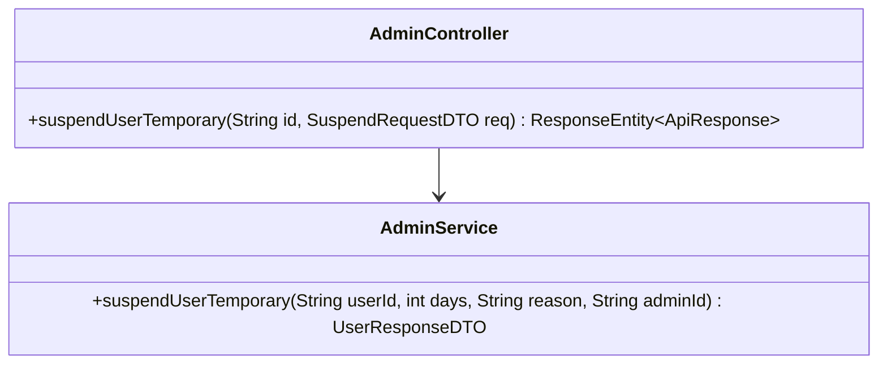

### 🔄 3. Sequence Diagram (UC-09.3)
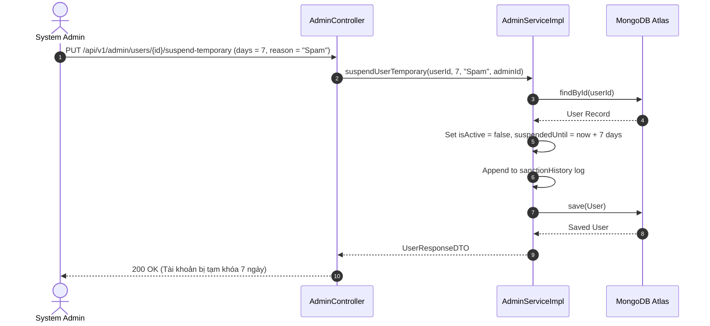

### 🧪 4. Testing & Verification (UC-09.3)
- **Unit Test Method:** `AdminControllerTest.java` -> `suspendTemporary_setsCorrectExpiration()`
- **Assertions:** `user.isActive == false`, `user.suspendedUntil` bằng 7 ngày tới.

---

## 🛠️ UC-09.4: Tự Động Mở Khóa Khi Hết Hạn Ban (Auto-Reactivation Scheduler)

### 📌 1. Mô tả Chi Tiết & Quy Tắc Nghiệp Vụ
- **Actor:** System Scheduler (Cron Job chạy 5 phút/lần).
- **Mục tiêu:** Quét các tài khoản có `isActive = false` và `suspendedUntil < now` để tự động mở khóa truy cập lại.
- **Endpoint:** `Scheduled Task (Every 5 mins)`

### 📐 2. Class Diagram (UC-09.4)
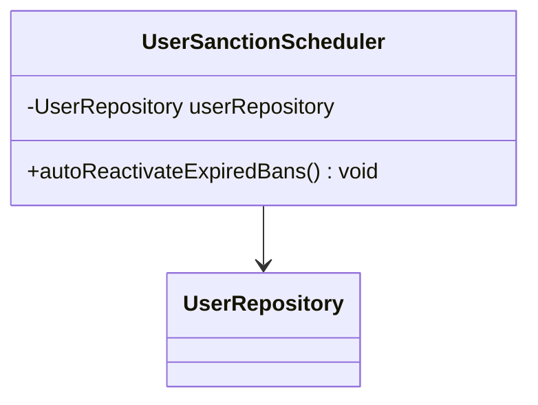

### 🔄 3. Sequence Diagram (UC-09.4)
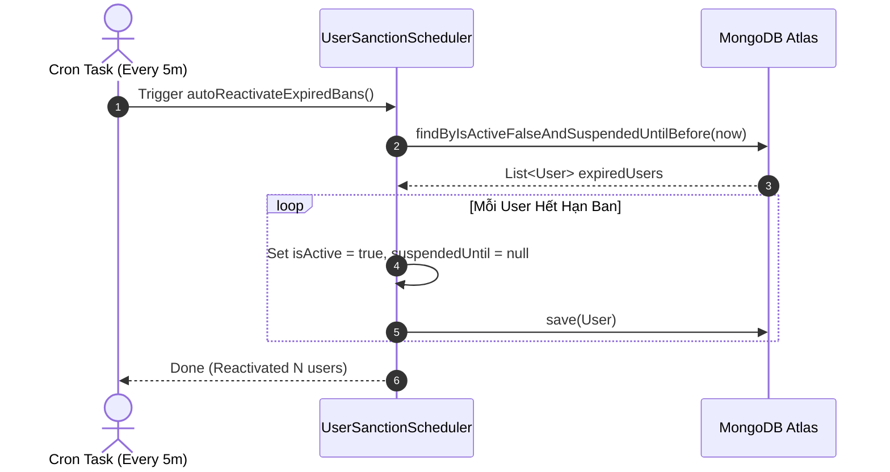

### 🧪 4. Testing & Verification (UC-09.4)
- **Unit Test Method:** `UserSanctionSchedulerTest.java` -> `autoReactivateExpiredBans_reactivatesEligibleUsers()`
- **Assertions:** User có `suspendedUntil` quá hạn chuyển sang `isActive = true`.

---

## 🛠️ UC-09.5: Mở Khóa Tài Khoản Thủ Công (Manual Unsuspend)

### 📌 1. Mô tả Chi Tiết & Quy Tắc Nghiệp Vụ
- **Actor:** Admin.
- **Mục tiêu:** Mở khóa truy cập ngay lập tức cho user đang bị ban trước khi hết hạn.
- **Endpoint:** `PUT /api/v1/admin/users/{id}/unsuspend`

### 📐 2. Class Diagram (UC-09.5)
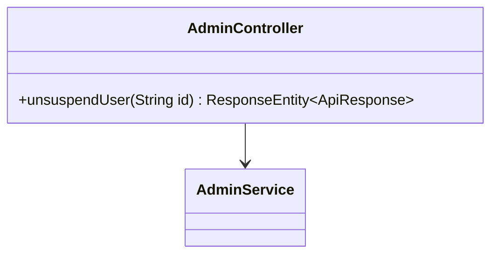

### 🔄 3. Sequence Diagram (UC-09.5)
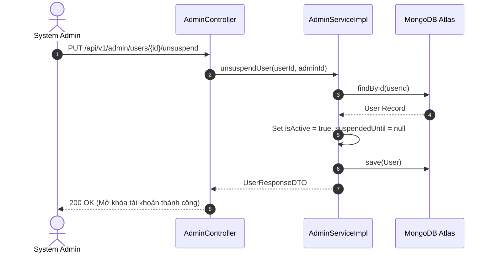

### 🧪 4. Testing & Verification (UC-09.5)
- **Unit Test Method:** `AdminServiceImplTest.java` -> `unsuspendUser_success()`
- **Assertions:** `user.isActive == true`, `suspendedUntil == null`.

---

## 🛠️ UC-09.6: Xuất File CSV Audit Log (Export Audit Log CSV)

### 📌 1. Mô tả Chi Tiết & Quy Tắc Nghiệp Vụ
- **Actor:** Admin.
- **Mục tiêu:** Tải xuống toàn bộ nhật ký an ninh kiểm toán hệ thống dưới dạng file CSV stream.
- **Endpoint:** `GET /api/v1/audit-logs/export-csv`

### 📐 2. Class Diagram (UC-09.6)
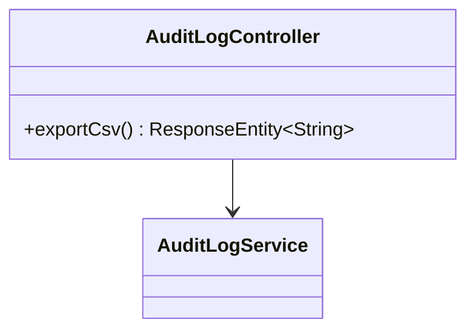

### 🔄 3. Sequence Diagram (UC-09.6)
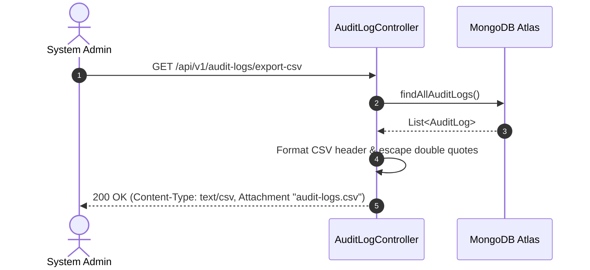

### 🧪 4. Testing & Verification (UC-09.6)
- **Unit Test Method:** `AuditLogControllerTest.java` -> `exportCsv_returnsValidCsvStream()`
- **Assertions:** Header chứa `ID,CreatedAt,UserId,Action,Resource`, Content-Type là `text/csv`.

---

## 🛠️ UC-09.7: Hoàn Tiền Giao Dịch Nâng Cấp VIP (Refund Transaction)

### 📌 1. Mô tả Chi Tiết & Quy Tắc Nghiệp Vụ
- **Actor:** Admin.
- **Mục tiêu:** Đánh dấu đơn hàng giao dịch thành `REFUNDED`, lưu lý do đền bù và số tiền hoàn trả.
- **Endpoint:** `POST /api/v1/admin/transactions/{id}/refund`

### 📐 2. Class Diagram (UC-09.7)
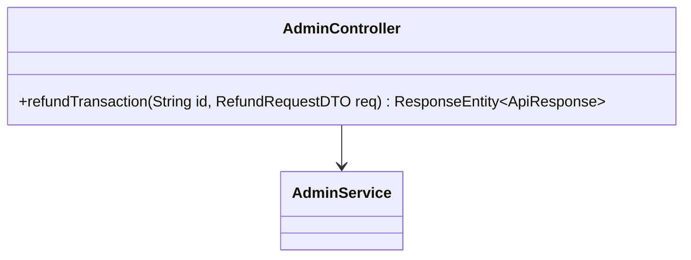

### 🔄 3. Sequence Diagram (UC-09.7)
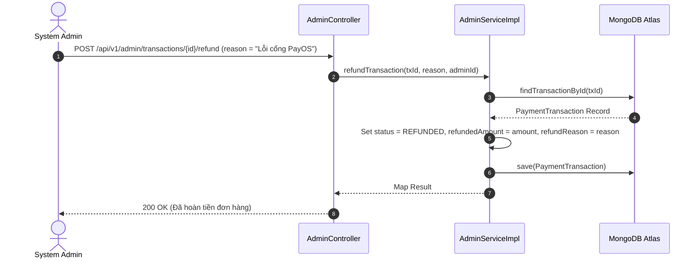

### 🧪 4. Testing & Verification (UC-09.7)
- **Unit Test Method:** `AdminServiceImplTest.java` -> `refundTransaction_success()`
- **Assertions:** Status chuyển sang `REFUNDED`, `refundReason` lưu đúng lý do.

---

## 🛠️ UC-09.8: Cấp Tặng Gói VIP Thủ Công (Manual Grant VIP Plan)

### 📌 1. Mô tả Chi Tiết & Quy Tắc Nghiệp Vụ
- **Actor:** Admin.
- **Mục tiêu:** Cộng thêm số ngày VIP (BASIC/FULL/ANNUAL) thủ công cho học viên kèm lý do đền bù.
- **Endpoint:** `POST /api/v1/admin/transactions/manual-grant`

### 📐 2. Class Diagram (UC-09.8)

### 🔄 3. Sequence Diagram (UC-09.8)
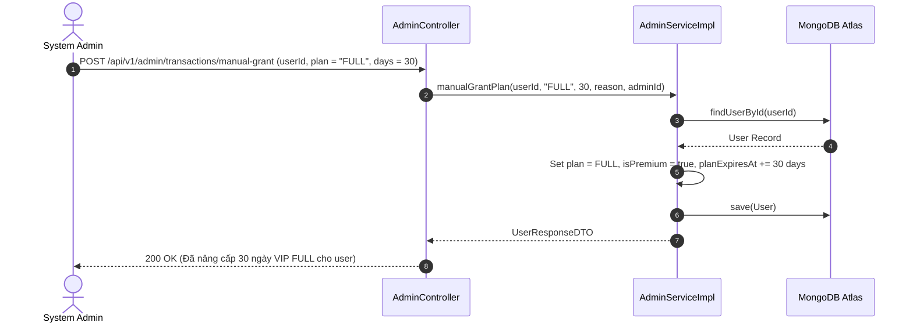

### 🧪 4. Testing & Verification (UC-09.8)
- **Unit Test Method:** `AdminServiceImplTest.java` -> `manualGrantPlan_success()`
- **Assertions:** `user.plan` chuyển thành `FULL`, `planExpiresAt` được gia hạn thêm 30 ngày.

---

## 🛠️ UC-09.9: Duyệt & Xử Lý Báo Cáo Vi Phạm Hàng Loạt (Bulk Resolve Reports)

### 📌 1. Mô tả Chi Tiết & Quy Tắc Nghiệp Vụ
- **Actor:** Admin.
- **Mục tiêu:** Duyệt (Resolve) hoặc Bỏ qua (Dismiss) nhiều báo cáo vi phạm cùng lúc.
- **Endpoint:** `PUT /api/v1/reports/bulk-resolve`

### 📐 2. Class Diagram (UC-09.9)
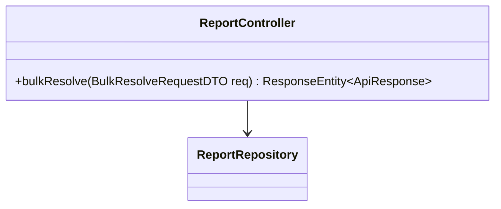

### 🔄 3. Sequence Diagram (UC-09.9)
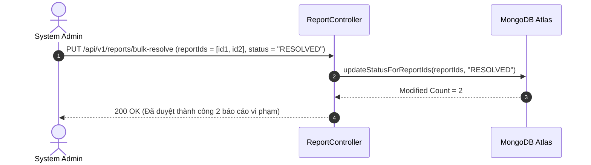

### 🧪 4. Testing & Verification (UC-09.9)
- **Unit Test Method:** `ReportControllerTest.java` -> `bulkResolve_validIds_updatesStatus()`
- **Assertions:** Tất cả report ID trong danh sách chuyển sang trạng thái `RESOLVED`.
