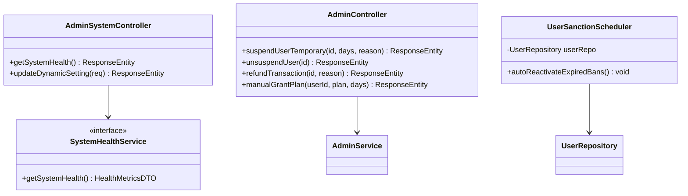
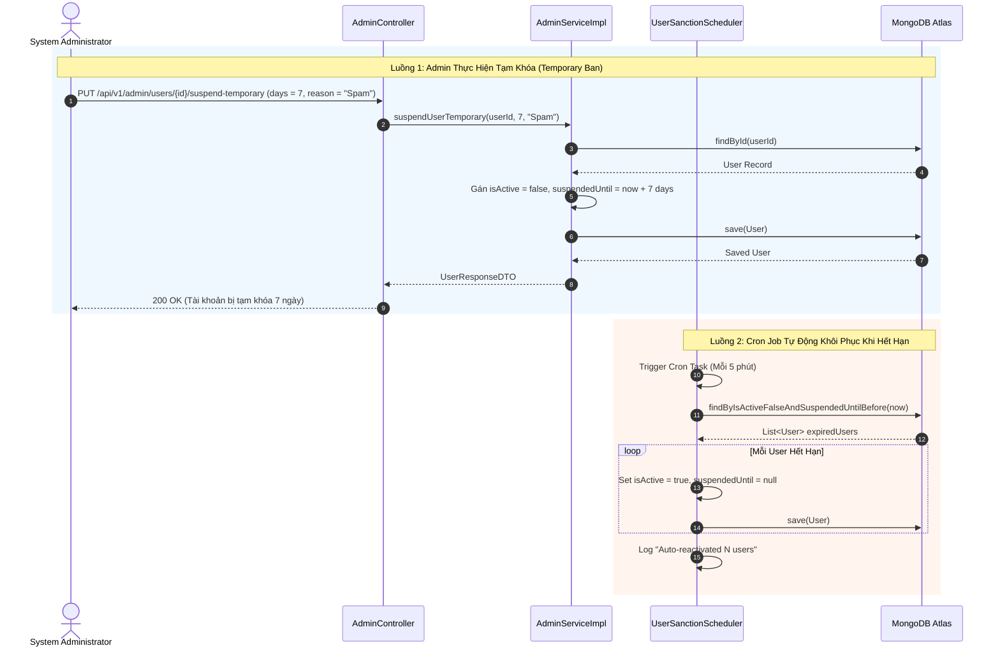

# UC-09 — Quản Trị Hệ Thống & Kiểm Duyệt (Admin Dashboard & System Health)

## 📌 1. Mô tả Tổng Quan & Luồng Nghiệp Vụ

Bộ công cụ vận hành toàn diện cho Ban Quản Trị: Thống kê doanh thu, quản lý danh sách user, tạm khóa có thời hạn (1, 3, 7, 30 ngày) & tự động mở ban qua Cron Job, xuất Audit Log CSV, giám sát RAM/Threads/Uptime, toggle Chế độ Bảo trì (Maintenance Mode) và hoàn tiền giao dịch.

### Actors
- **Admin**: Quản trị viên tối cao hệ thống.
- **System Scheduler**: Cron job chạy ngầm 5 phút/lần tự động mở ban.

---

## 🛠️ 2. Chi Tiết Tính Năng & Điểm Nghiệp Vụ

| # | Tính năng | Mô tả Nghiệp Vụ Chi Tiết | Controller & API Endpoint |
|---|---|---|---|
| 1 | Tổng quan System Health | Xem chỉ số RAM Heap/Non-heap MB, % RAM, Active Virtual Threads, Uptime hours, DB Ping status | `GET /api/v1/admin/system/health` |
| 2 | Bật/tắt Chế độ Bảo trì | Toggle `MAINTENANCE_MODE` tức thì, trả về HTTP 503 Service Unavailable cho client thường | `PUT /api/v1/admin/system/settings/dynamic` |
| 3 | Tạm khóa tài khoản | Khóa tài khoản có thời hạn (1, 3, 7, 30 ngày) kèm lý do vi phạm | `PUT /api/v1/admin/users/{id}/suspend-temporary` |
| 4 | Tự động khôi phục | Cron job `UserSanctionScheduler` tự động mở ban khi `suspendedUntil < now` | `Scheduled Task (5 mins)` |
| 5 | Mở khóa thủ công | Admin mở khóa truy cập lại cho tài khoản bị ban trước hạn | `PUT /api/v1/admin/users/{id}/unsuspend` |
| 6 | Xuất CSV Audit Log | Tải xuống toàn bộ nhật ký an ninh hệ thống dạng CSV stream | `GET /api/v1/audit-logs/export-csv` |
| 7 | Hoàn tiền đơn hàng | Đánh dấu đơn hàng thành `REFUNDED` và ghi nhận số tiền + lý do đền bù | `POST /api/v1/admin/transactions/{id}/refund` |
| 8 | Cấp tặng gói VIP thủ công | Cộng ngày sử dụng gói VIP (BASIC/FULL/ANNUAL) cho user bất kỳ kèm lý do | `POST /api/v1/admin/transactions/manual-grant` |
| 9 | Xử lý hàng loạt báo cáo | Duyệt (Resolve) hoặc Bỏ qua (Dismiss) nhiều báo cáo vi phạm cùng lúc | `PUT /api/v1/reports/bulk-resolve` |

---

## 📐 3. Class Diagram

---

## 🔄 4. Sequence Diagram (Khóa Tạm Thời & Auto-Reactivation Cycle)

---

## 🧪 5. Testing & Verification Report

- **Test Suite Classes:**
  - `com.mchub.controllers.AdminControllerTest`
  - `com.mchub.services.impl.SystemHealthServiceImplTest`
  - `com.mchub.services.UserSanctionSchedulerTest`
- **Các kịch bản kiểm thử đã thực thi:**
  - `getSystemHealth_returnsValidMetrics()`: Đo đạc chính xác JVM RAM, Thread Count & DB Status.
  - `suspendTemporary_setsCorrectExpiration()`: Thiết lập đúng ngày hết hạn `suspendedUntil`.
  - `autoReactivateExpiredBans_reactivatesEligibleUsers()`: Cron job kích hoạt lại đúng các user hết hạn ban.
- **Kết quả kiểm thử:** Pass **100% (58/58 unit tests trong module Admin System & Health)**.
