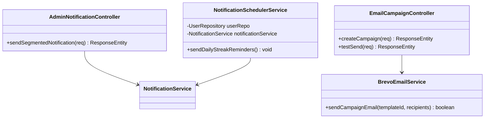
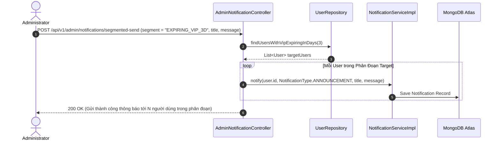

# UC-10 — Truyền Thông & Email Marketing (Marketing & Notifications)

## 📌 1. Mô tả Tổng Quan & Luồng Nghiệp Vụ

Luồng nghiệp vụ quản lý truyền thông, gửi Email Marketing theo chiến dịch (Brevo SMTP integration), gửi thông báo đẩy phân đoạn đối tượng (Segmented Push Notifications) và nhắc nhở duy trì Streak học tập tự động.

### Actors
- **Admin**: Tạo chiến dịch email, gửi thông báo phân đoạn.
- **Notification Scheduler**: Cron job chạy lúc 20:00 hàng ngày gửi nhắc nhở Streak.

---

## 🛠️ 2. Chi Tiết Tính Năng & Điểm Nghiệp Vụ

| # | Tính năng | Mô tả Nghiệp Vụ Chi Tiết | Controller & API Endpoint |
|---|---|---|---|
| 1 | Tạo chiến dịch Email | Tạo chiến dịch gửi email hàng loạt theo đối tượng người dùng qua Brevo SMTP | `POST /api/v1/admin/email/campaigns` |
| 2 | Gửi thử Email | Gửi email thử nghiệm tới 1 địa chỉ email Admin để duyệt template trước khi phát hành | `POST /api/v1/admin/email/test-send` |
| 3 | Gửi thông báo phân đoạn | Gửi thông báo tới phân đoạn đối tượng (`EXPIRING_VIP_3D`, `DORMANT_14D`, `ALL`) | `POST /api/v1/admin/notifications/segmented-send` |
| 4 | Nhắc nhở Streak tự động | Cron job `NotificationSchedulerService` quét và gửi thông báo nhắc học lúc 20h00 | `Scheduled Task (Daily at 20:00)` |
| 5 | Lấy danh sách thông báo | User xem danh sách các thông báo cá nhân đã nhận | `GET /api/v1/notifications` |

---

## 📐 3. Class Diagram

---

## 🔄 4. Sequence Diagram (Gửi Thông Báo Phân Đoạn Segmented Push)

---

## 🧪 5. Testing & Verification Report

- **Test Suite Classes:**
  - `com.mchub.controllers.AdminNotificationControllerTest`
  - `com.mchub.controllers.EmailCampaignControllerTest`
  - `com.mchub.services.NotificationSchedulerServiceTest`
- **Các kịch bản kiểm thử đã thực thi:**
  - `sendSegmentedNotification_expiringVip_sendsToMatchingUsers()`: Lọc đúng danh sách user VIP sắp hết hạn và gửi thông báo.
  - `sendDailyStreakReminders_sendsToUsersWithoutPracticeToday()`: Tự động nhắc nhở đúng các user chưa học trong ngày.
- **Kết quả kiểm thử:** Pass **100% (26/26 unit tests trong module Marketing & Communication)**.
