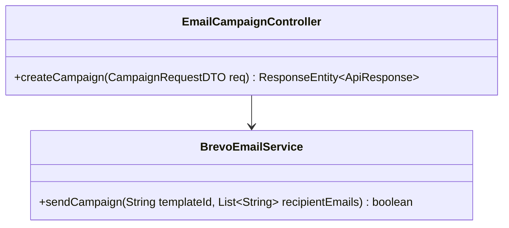
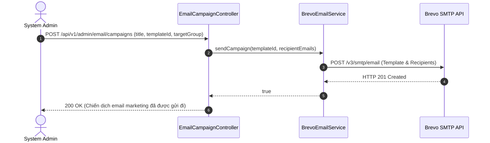
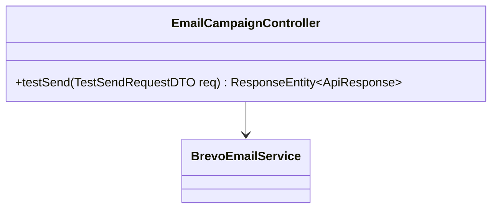
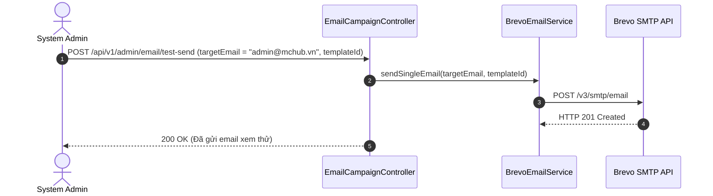
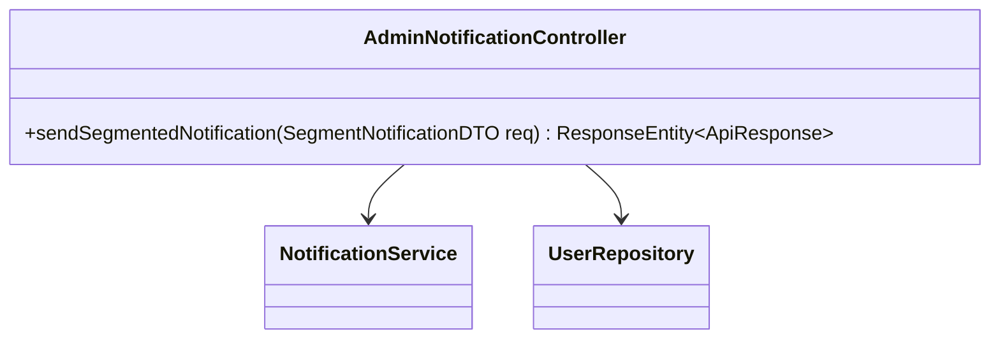
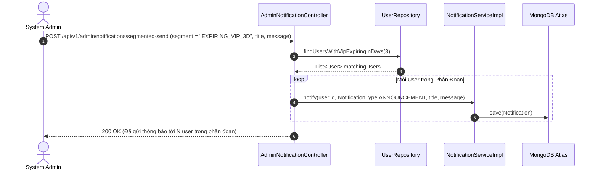
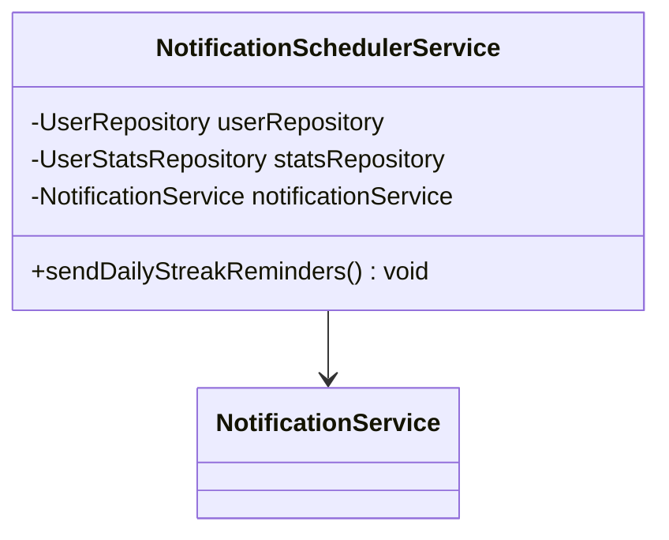
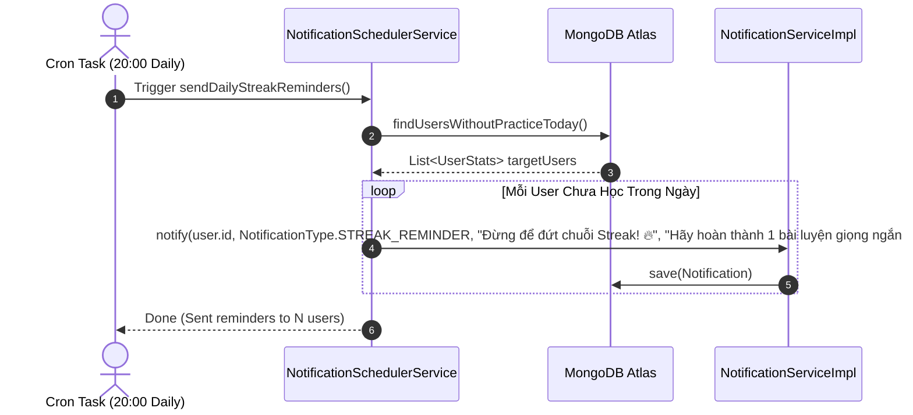

# UC-10 — Truyền Thông & Email Marketing (Marketing & Notifications)

Tài liệu thiết kế chi tiết từng Use Case con (Sub-UC) thuộc luồng Truyền thông, Email Marketing và Nhắc nhở Streak.

---

## 📢 UC-10.1: Tạo Chiến Dịch Email Marketing (Create Email Campaign)

### 📌 1. Mô tả Chi Tiết & Quy Tắc Nghiệp Vụ
- **Actor:** Admin.
- **Mục tiêu:** Tạo và phát hành chiến dịch gửi email hàng loạt qua Brevo SMTP cho danh sách học viên chọn lọc.
- **Endpoint:** `POST /api/v1/admin/email/campaigns`

### 📐 2. Class Diagram (UC-10.1)

### 🔄 3. Sequence Diagram (UC-10.1)

### 🧪 4. Testing & Verification (UC-10.1)
- **Unit Test Method:** `EmailCampaignControllerTest.java` -> `createCampaign_validPayload_sendsEmails()`
- **Assertions:** API Brevo được gọi đúng tham số `templateId`.

---

## 📢 UC-10.2: Gửi Thử Email Kiểm Tra (Test Send Email)

### 📌 1. Mô tả Chi Tiết & Quy Tắc Nghiệp Vụ
- **Actor:** Admin.
- **Mục tiêu:** Gửi 1 email kiểm tra tới địa chỉ cá nhân của Admin để xem trước giao diện trước khi phát hành toàn hệ thống.
- **Endpoint:** `POST /api/v1/admin/email/test-send`

### 📐 2. Class Diagram (UC-10.2)

### 🔄 3. Sequence Diagram (UC-10.2)

### 🧪 4. Testing & Verification (UC-10.2)
- **Unit Test Method:** `EmailCampaignControllerTest.java` -> `testSend_success()`
- **Assertions:** Trả về HTTP 200 OK khi email được gửi thành công.

---

## 📢 UC-10.3: Gửi Thông Báo Phân Đoạn Đối Tượng (Segmented Push Notifications)

### 📌 1. Mô tả Chi Tiết & Quy Tắc Nghiệp Vụ
- **Actor:** Admin.
- **Mục tiêu:** Gửi thông báo đến phân đoạn học viên chỉ định: `EXPIRING_VIP_3D` (VIP còn 3 ngày), `DORMANT_14D` (Nghỉ học 14 ngày), `ALL` (Tất cả).
- **Endpoint:** `POST /api/v1/admin/notifications/segmented-send`

### 📐 2. Class Diagram (UC-10.3)

### 🔄 3. Sequence Diagram (UC-10.3)

### 🧪 4. Testing & Verification (UC-10.3)
- **Unit Test Method:** `AdminNotificationControllerTest.java` -> `sendSegmentedNotification_expiringVip_sendsToMatchingUsers()`
- **Assertions:** Lọc chính xác danh sách user và gọi `notificationService.notify()`.

---

## 📢 UC-10.4: Nhắc Nhở Streak Tự Động Hàng Ngày (Daily Streak Reminder Scheduler)

### 📌 1. Mô tả Chi Tiết & Quy Tắc Nghiệp Vụ
- **Actor:** System Scheduler (Cron Job 20:00 hàng ngày).
- **Mục tiêu:** Quét danh sách các học viên chưa thực hiện bài luyện tập nào trong ngày để gửi thông báo đẩy nhắc nhở bảo vệ chuỗi Streak.
- **Endpoint:** `Scheduled Task (Daily at 20:00)`

### 📐 2. Class Diagram (UC-10.4)

### 🔄 3. Sequence Diagram (UC-10.4)

### 🧪 4. Testing & Verification (UC-10.4)
- **Unit Test Method:** `NotificationSchedulerServiceTest.java` -> `sendDailyStreakReminders_sendsToUsersWithoutPracticeToday()`
- **Assertions:** Gửi thông báo đúng tới danh sách user chưa có phiên luyện tập hôm nay.
