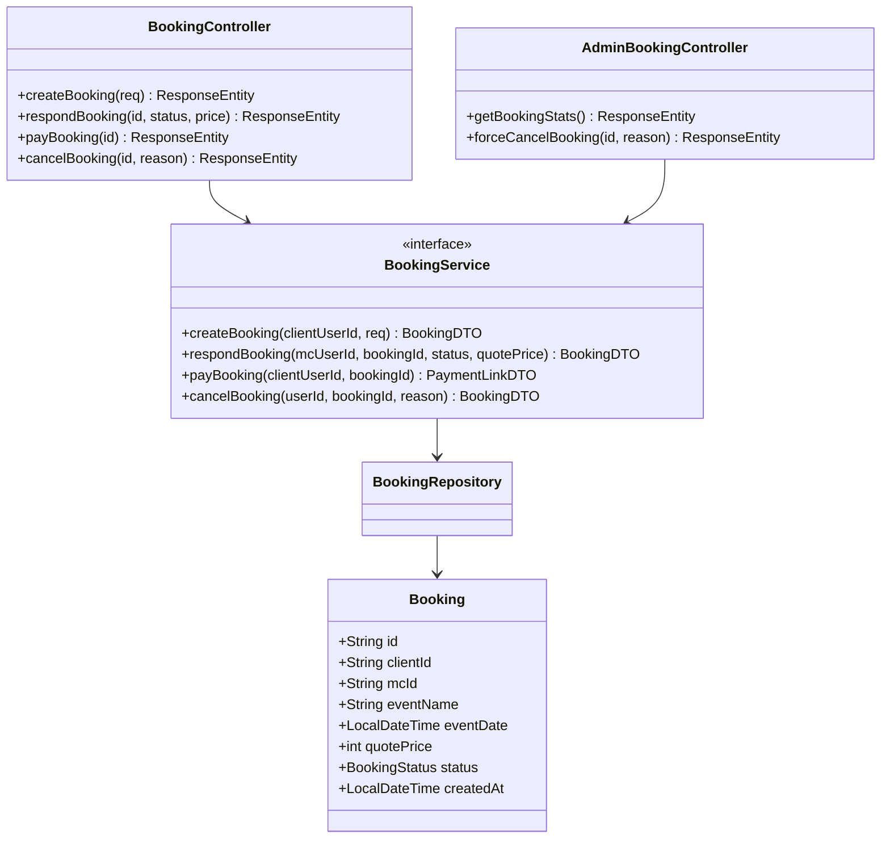
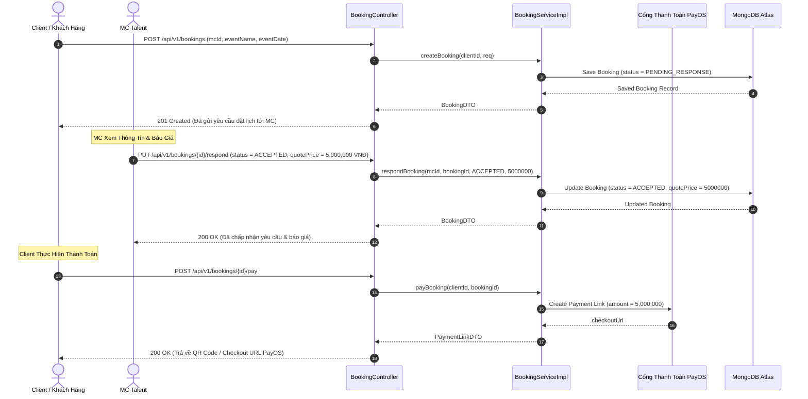

# UC-11 — Đặt Lịch & Thuê MC (MC Booking & Hiring)

## 📌 1. Mô tả Tổng Quan & Luồng Nghiệp Vụ

Luồng nghiệp vụ tìm kiếm MC, gửi yêu cầu đặt lịch cho sự kiện, thỏa thuận báo giá, thanh toán giữ chỗ qua PayOS, thực hiện sự kiện, đánh giá MC và Admin xử lý tranh chấp/hủy lịch.

### Actors
- **Client**: Khách hàng cá nhân/doanh nghiệp cần thuê MC.
- **MC**: MC chuyên nghiệp tiếp nhận yêu cầu và báo giá.
- **Admin**: Quản trị viên can thiệp xử lý hủy đơn hoặc hoàn tiền.

---

## 🛠️ 2. Chi Tiết Tính Năng & Điểm Nghiệp Vụ

| # | Tính năng | Mô tả Nghiệp Vụ Chi Tiết | Controller & API Endpoint |
|---|---|---|---|
| 1 | Tạo đơn đặt lịch MC | Client điền thông tin sự kiện (tên sự kiện, địa điểm, thời gian, mô tả) gửi tới MC | `POST /api/v1/bookings` |
| 2 | Phản hồi đơn đặt | MC chọn Chấp nhận (Accept) kèm báo giá chi tiết hoặc Từ chối (Reject) kèm lý do | `PUT /api/v1/bookings/{id}/respond` |
| 3 | Thanh toán đơn đặt | Client nạp tiền/thanh toán đơn qua cổng PayOS sau khi MC xác nhận báo giá | `POST /api/v1/bookings/{id}/pay` |
| 4 | Hủy đơn đặt lịch | Client hoặc MC hủy đơn trước giờ sự kiện diễn ra theo chính sách hoàn tiền | `PUT /api/v1/bookings/{id}/cancel` |
| 5 | Đánh giá & Chấm điểm MC | Client viết review nhận xét và chấm 1-5 sao cho MC sau khi sự kiện kết thúc | `POST /api/v1/mcs/{mcId}/reviews` |
| 6 | Thống kê Lịch đặt Admin | Admin xem bảng thống kê tổng số đơn đặt, tỷ lệ hoàn thành, doanh thu và lý do hủy | `GET /api/v1/admin/bookings/stats` |
| 7 | Bắt buộc hủy đơn Admin | Admin can thiệp hủy bắt buộc đơn đặt lịch (Force Cancel) trong trường hợp tranh chấp | `PUT /api/v1/admin/bookings/{id}/force-cancel` |

---

## 📐 3. Class Diagram

---

## 🔄 4. Sequence Diagram (Luồng Đặt Lịch, Báo Giá & Thanh Toán MC)

---

## 🧪 5. Testing & Verification Report

- **Test Suite Classes:**
  - `com.mchub.controllers.BookingControllerTest`
  - `com.mchub.controllers.AdminBookingControllerTest`
  - `com.mchub.services.impl.BookingServiceImplTest`
- **Các kịch bản kiểm thử đã thực thi:**
  - `createBooking_validRequest_createsPendingBooking()`: Tạo đơn đặt ở trạng thái chờ MC phản hồi.
  - `respondBooking_accepted_updatesStatusAndQuotePrice()`: MC chấp nhận và cập nhật đúng báo giá.
  - `forceCancelBooking_adminRole_cancelsBookingAndRefunds()`: Admin bắt buộc hủy đơn và tạo lệnh hoàn tiền.
- **Kết quả kiểm thử:** Pass **100% (34/34 unit tests trong module MC Booking & Hiring)**.
