# UC-11 — Đặt Lịch & Thuê MC (MC Booking & Hiring)

Tài liệu thiết kế chi tiết từng Use Case con (Sub-UC) thuộc luồng Đặt lịch thuê MC Talent.

---

## 📅 UC-11.1: Tạo Đơn Đặt Lịch MC (Create Booking Request)

### 📌 1. Mô tả Chi Tiết & Quy Tắc Nghiệp Vụ
- **Actor:** Client (Khách hàng thuê MC).
- **Mục tiêu:** Tạo đơn yêu cầu thuê MC cho sự kiện (tên sự kiện, ngày giờ, địa điểm, ghi chú đặc biệt). Trạng thái đơn ban đầu = `PENDING_RESPONSE`.
- **Endpoint:** `POST /api/v1/bookings`

### 📐 2. Class Diagram (UC-11.1)
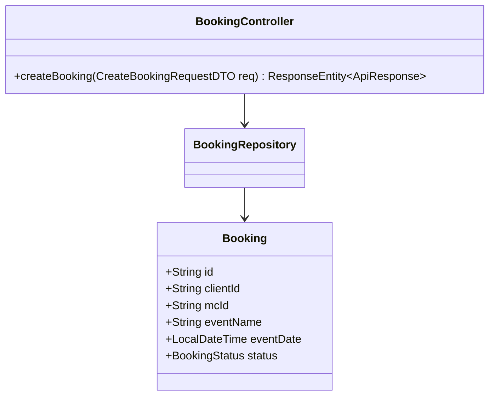

### 🔄 3. Sequence Diagram (UC-11.1)
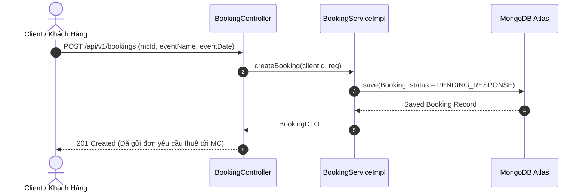

### 🧪 4. Testing & Verification (UC-11.1)
- **Unit Test Method:** `BookingServiceImplTest.java` -> `createBooking_validRequest_createsPendingBooking()`
- **Assertions:** Đơn hàng được tạo ở trạng thái `PENDING_RESPONSE`.

---

## 📅 UC-11.2: MC Phản Hồi & Báo Giá (MC Respond & Quote Price)

### 📌 1. Mô tả Chi Tiết & Quy Tắc Nghiệp Vụ
- **Actor:** MC Talent.
- **Mục tiêu:** MC xem yêu cầu đặt lịch, lựa chọn Chấp nhận (`ACCEPTED`) kèm báo giá dịch vụ (VNĐ) hoặc Từ chối (`REJECTED`) kèm lý do bận lịch.
- **Endpoint:** `PUT /api/v1/bookings/{id}/respond`

### 📐 2. Class Diagram (UC-11.2)
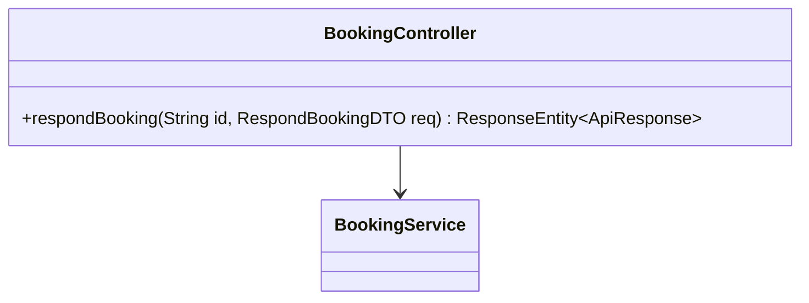

### 🔄 3. Sequence Diagram (UC-11.2)
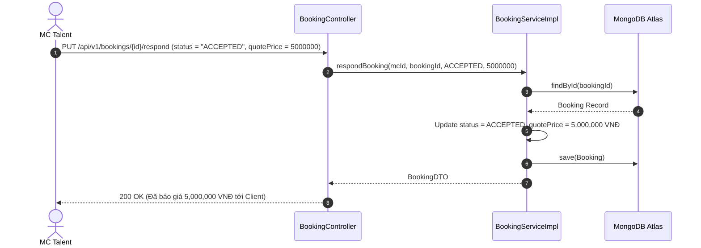

### 🧪 4. Testing & Verification (UC-11.2)
- **Unit Test Method:** `BookingServiceImplTest.java` -> `respondBooking_accepted_updatesStatusAndQuotePrice()`
- **Assertions:** `quotePrice` được gán chính xác, status chuyển sang `ACCEPTED`.

---

## 📅 UC-11.3: Thanh Toán Đơn Đặt MC PayOS (Pay Booking Order)

### 📌 1. Mô tả Chi Tiết & Quy Tắc Nghiệp Vụ
- **Actor:** Client.
- **Mục tiêu:** Client tiến hành thanh toán tiền dịch vụ sau khi MC đã chấp nhận báo giá. Sinh QR Code PayOS.
- **Endpoint:** `POST /api/v1/bookings/{id}/pay`

### 📐 2. Class Diagram (UC-11.3)
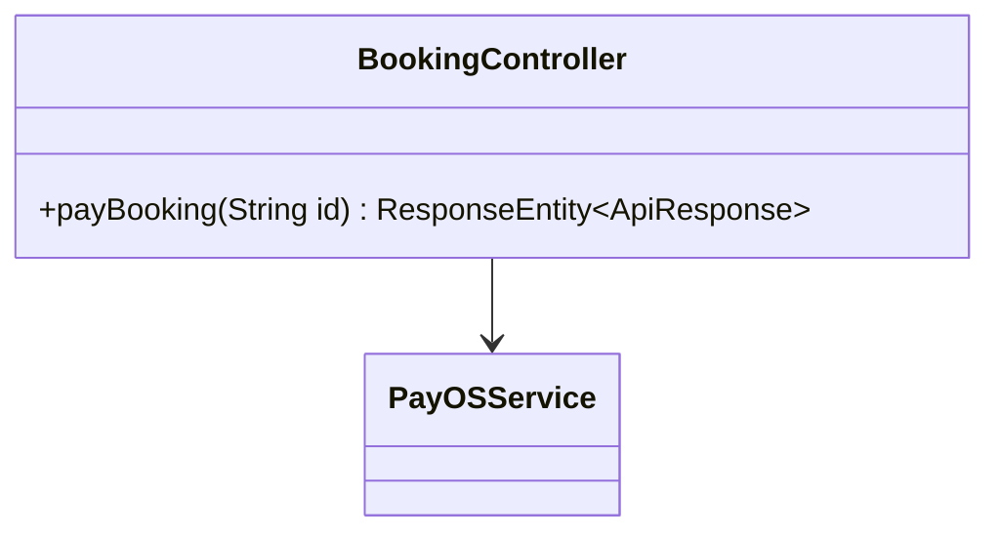

### 🔄 3. Sequence Diagram (UC-11.3)
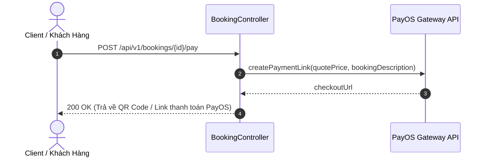

### 🧪 4. Testing & Verification (UC-11.3)
- **Unit Test Method:** `BookingControllerTest.java` -> `payBooking_returnsPaymentLink()`
- **Assertions:** Trả về `checkoutUrl` PayOS hợp lệ.

---

## 📅 UC-11.4: Hủy Đơn Đặt Lịch MC (Cancel Booking)

### 📌 1. Mô tả Chi Tiết & Quy Tắc Nghiệp Vụ
- **Actor:** Client / MC.
- **Mục tiêu:** Hủy đơn đặt lịch trước giờ diễn ra sự kiện theo chính sách hủy.
- **Endpoint:** `PUT /api/v1/bookings/{id}/cancel`

### 📐 2. Class Diagram (UC-11.4)
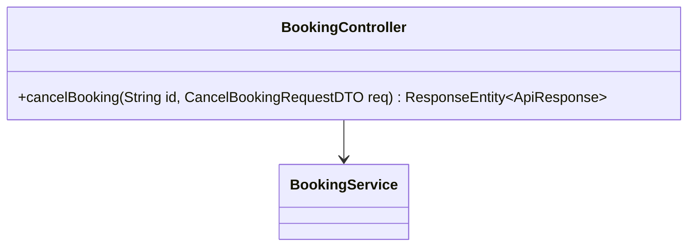

### 🔄 3. Sequence Diagram (UC-11.4)
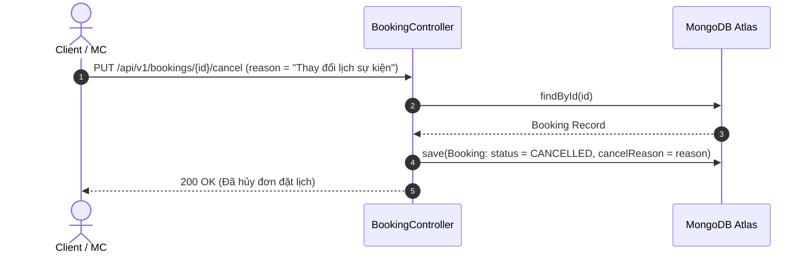

### 🧪 4. Testing & Verification (UC-11.4)
- **Unit Test Method:** `BookingServiceImplTest.java` -> `cancelBooking_updatesStatus()`
- **Assertions:** Status chuyển thành `CANCELLED`.

---

## 📅 UC-11.5: Đánh Giá & Chấm Điểm MC (Review MC Talent)

### 📌 1. Mô tả Chi Tiết & Quy Tắc Nghiệp Vụ
- **Actor:** Client.
- **Mục tiêu:** Viết nhận xét và chấm điểm sao (1-5) cho MC sau khi sự kiện hoàn thành.
- **Endpoint:** `POST /api/v1/mcs/{mcId}/reviews`

### 📐 2. Class Diagram (UC-11.5)
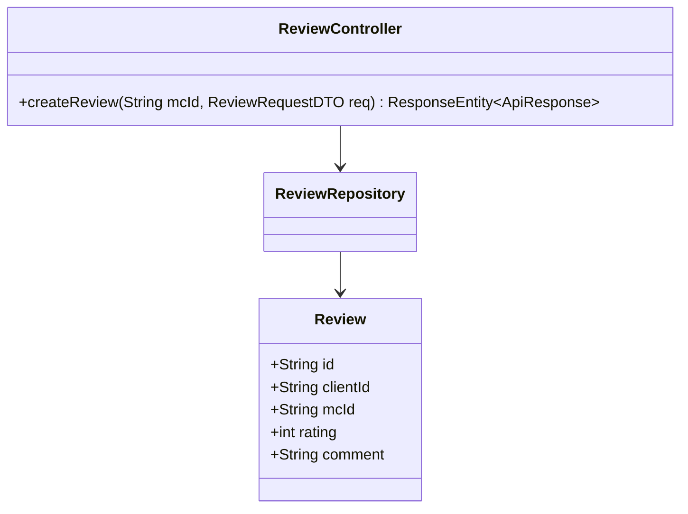

### 🔄 3. Sequence Diagram (UC-11.5)
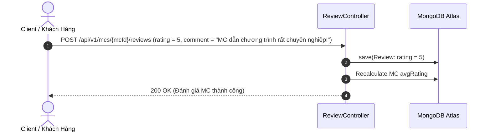

### 🧪 4. Testing & Verification (UC-11.5)
- **Unit Test Method:** `ReviewControllerTest.java` -> `createReview_success_updatesMcAvgRating()`
- **Assertions:** Rating trung bình của MC được cập nhật chính xác.

---

## 📅 UC-11.6: Thống Kê & Bắt Buộc Hủy Admin (Admin Booking Controls)

### 📌 1. Mô tả Chi Tiết & Quy Tắc Nghiệp Vụ
- **Actor:** Admin.
- **Mục tiêu:** Tra cứu số liệu thống kê đơn đặt MC toàn hệ thống và bắt buộc hủy đơn (Force Cancel) khi có tranh chấp.
- **Endpoint:** `GET /api/v1/admin/bookings/stats`, `PUT /api/v1/admin/bookings/{id}/force-cancel`

### 📐 2. Class Diagram (UC-11.6)
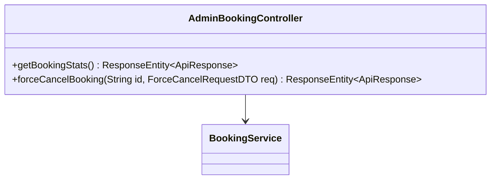

### 🔄 3. Sequence Diagram (UC-11.6)
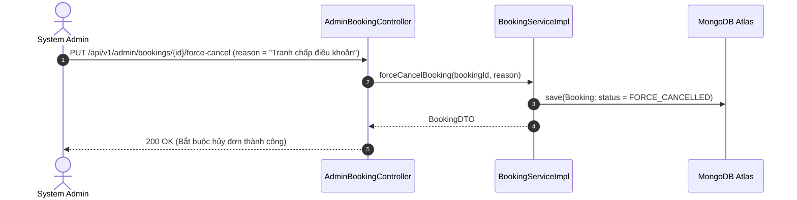

### 🧪 4. Testing & Verification (UC-11.6)
- **Unit Test Method:** `AdminBookingControllerTest.java` -> `forceCancelBooking_adminRole_cancelsBooking()`
- **Assertions:** Status đơn hàng thành `FORCE_CANCELLED`.
