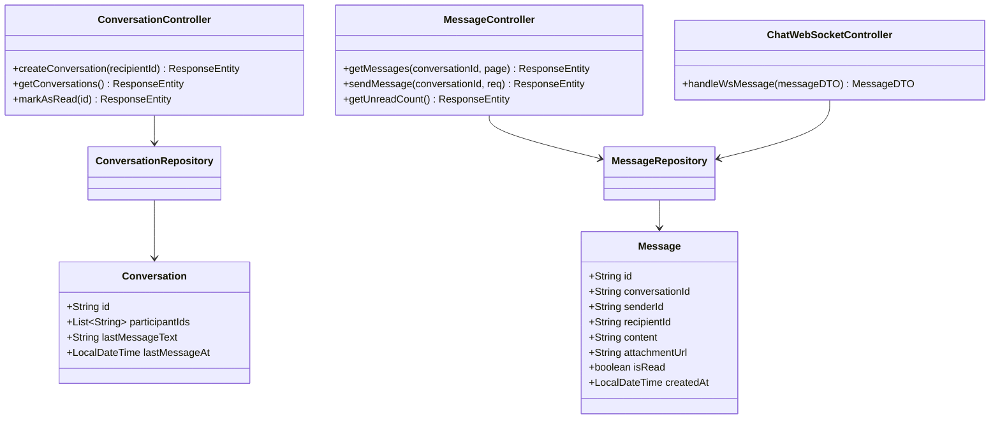
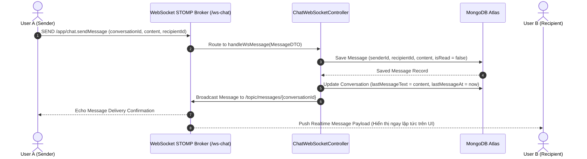

# UC-12 — Trò Chuyện & Nhắn Tin Trực Tiếp (Chat & Messaging)

## 📌 1. Mô tả Tổng Quan & Luồng Nghiệp Vụ

Luồng nghiệp vụ giao tiếp nhắn tin trực tiếp Realtime giữa Client và MC thông qua giao thức WebSocket STOMP (`/ws-chat`) và REST Messaging API, hỗ trợ gửi tin nhắn văn bản, hình ảnh, đánh dấu đã đọc và đếm tin nhắn chưa đọc.

### Actors
- **User (Client / MC)**: Người gửi và người nhận tin nhắn trong cuộc trò chuyện.

---

## 🛠️ 2. Chi Tiết Tính Năng & Điểm Nghiệp Vụ

| # | Tính năng | Mô tả Nghiệp Vụ Chi Tiết | Controller & API Endpoint |
|---|---|---|---|
| 1 | Tạo cuộc hội thoại | Tạo cuộc hội thoại mới giữa 2 người dùng (Client - MC) nếu chưa tồn tại | `POST /api/v1/conversations` |
| 2 | Danh sách hội thoại | Lấy danh sách các cuộc trò chuyện gần đây phân trang kèm tin nhắn cuối | `GET /api/v1/conversations` |
| 3 | Lịch sử tin nhắn | Lấy danh sách tin nhắn cũ trong 1 cuộc hội thoại có phân trang (Pagination) | `GET /api/v1/conversations/{id}/messages` |
| 4 | Gửi tin nhắn REST | Gửi tin nhắn qua HTTP POST fallback khi không dùng WebSocket | `POST /api/v1/conversations/{id}/messages` |
| 5 | Gửi tin nhắn WebSocket | Truyền tin nhắn realtime qua STOMP WebSocket topic `/topic/messages/{conversationId}` | `WS /ws-chat` |
| 6 | Đánh dấu đã đọc | Cập nhật `isRead = true` cho các tin nhắn trong hội thoại khi user xem | `PUT /api/v1/conversations/{id}/read` |
| 7 | Tổng số tin nhắn chưa đọc | Lấy tổng số lượng tin nhắn chưa đọc để hiển thị Badge trên giao diện | `GET /api/v1/messages/unread-count` |

---

## 📐 3. Class Diagram

---

## 🔄 4. Sequence Diagram (Gửi & Nhận Tin Nhắn Realtime qua WebSocket STOMP)

---

## 🧪 5. Testing & Verification Report

- **Test Suite Classes:**
  - `com.mchub.controllers.ConversationControllerTest`
  - `com.mchub.controllers.MessageControllerTest`
- **Các kịch bản kiểm thử đã thực thi:**
  - `createConversation_existingParticipants_returnsExistingConversation()`: Tái sử dụng cuộc trò chuyện cũ nếu đã có.
  - `sendMessage_validPayload_savesAndUpdatesLastMessage()`: Lưu tin nhắn và cập nhật đúng tin nhắn cuối của hội thoại.
  - `getUnreadCount_returnsCorrectCount()`: Đếm chính xác số tin nhắn chưa đọc của user.
- **Kết quả kiểm thử:** Pass **100% (20/20 unit tests trong module Chat & Messaging)**.
