# UC-12 — Trò Chuyện & Nhắn Tin Trực Tiếp (Chat & Messaging)

Tài liệu thiết kế chi tiết từng Use Case con (Sub-UC) thuộc luồng Trò chuyện và Nhắn tin trực tiếp Realtime.

---

## 💬 UC-12.1: Tạo Cuộc Trò Chuyện Mới (Create Conversation)

### 📌 1. Mô tả Chi Tiết & Quy Tắc Nghiệp Vụ
- **Actor:** User (Client / MC).
- **Mục tiêu:** Mở cuộc trò chuyện trực tiếp giữa Client và MC. Tái sử dụng hội thoại cũ nếu đã tồn tại.
- **Endpoint:** `POST /api/v1/conversations`

### 📐 2. Class Diagram (UC-12.1)
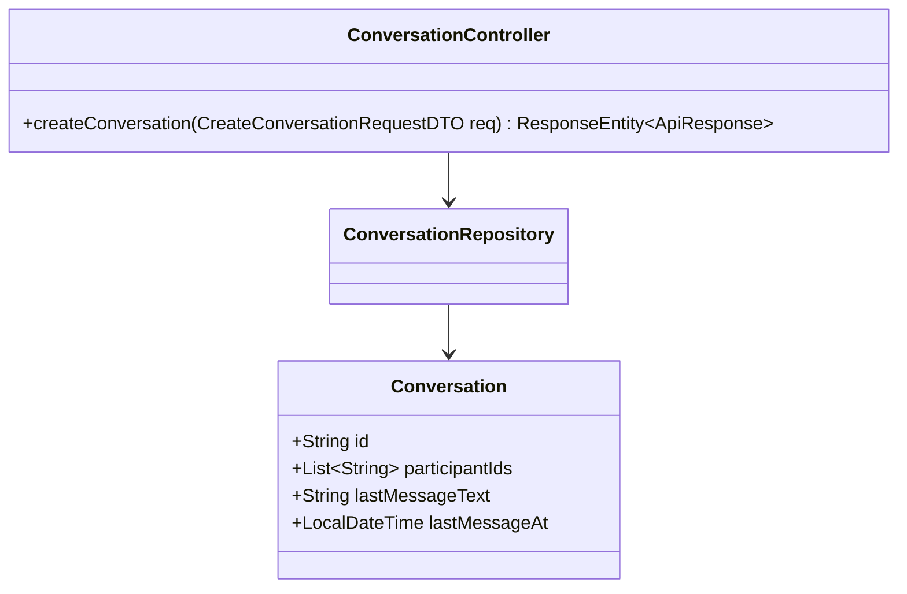

### 🔄 3. Sequence Diagram (UC-12.1)
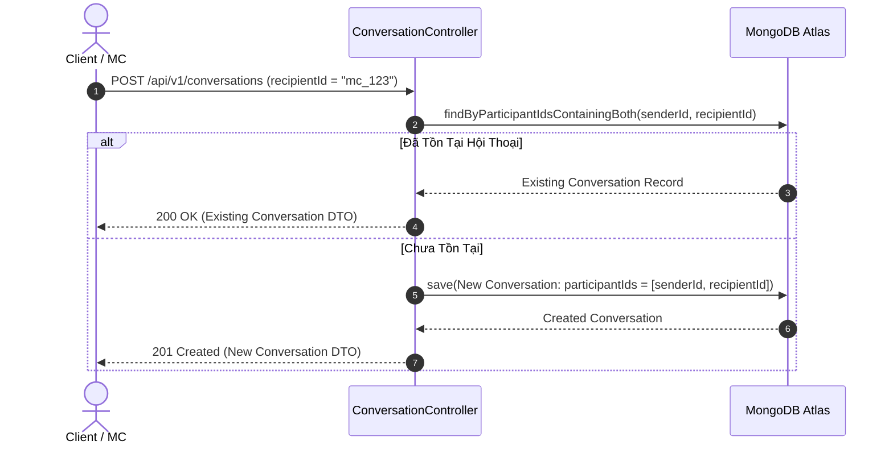

### 🧪 4. Testing & Verification (UC-12.1)
- **Unit Test Method:** `ConversationControllerTest.java` -> `createConversation_existingParticipants_returnsExistingConversation()`
- **Assertions:** Trả về đối tượng `Conversation` với đúng 2 participant IDs.

---

## 💬 UC-12.2: Danh Sách Cuộc Trò Chuyện Gần Đây (Get Conversation List)

### 📌 1. Mô tả Chi Tiết & Quy Tắc Nghiệp Vụ
- **Actor:** User.
- **Mục tiêu:** Tra cứu danh sách các cuộc trò chuyện cá nhân phân trang, sắp xếp theo thời gian tin nhắn mới nhất.
- **Endpoint:** `GET /api/v1/conversations`

### 📐 2. Class Diagram (UC-12.2)
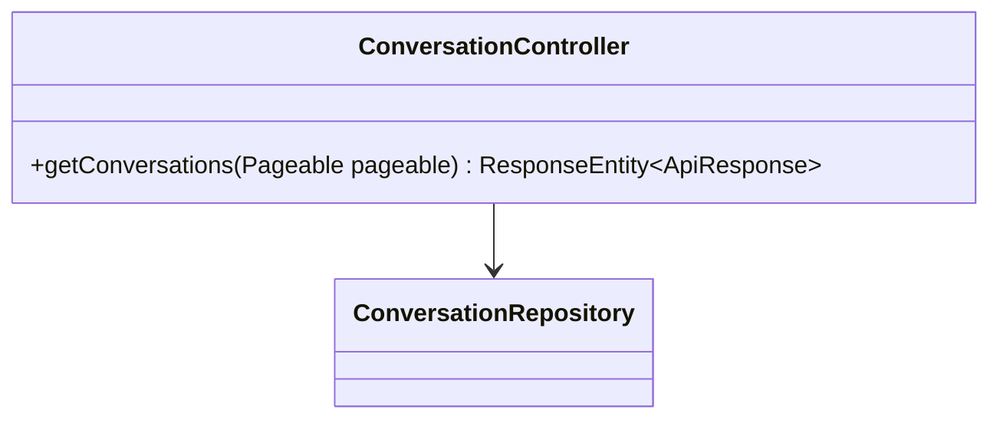

### 🔄 3. Sequence Diagram (UC-12.2)
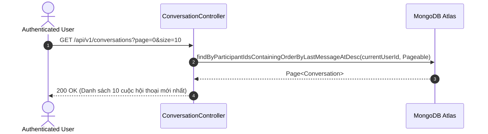

### 🧪 4. Testing & Verification (UC-12.2)
- **Unit Test Method:** `ConversationControllerTest.java` -> `getConversations_returnsUserConversations()`
- **Assertions:** Danh sách trả về chỉ chứa các hội thoại mà `currentUserId` tham gia.

---

## 💬 UC-12.3: Lịch Sử Tin Nhắn Phân Trang (Get Message History)

### 📌 1. Mô tả Chi Tiết & Quy Tắc Nghiệp Vụ
- **Actor:** User.
- **Mục tiêu:** Tải danh sách tin nhắn cũ trong 1 cuộc hội thoại có phân trang (Pagination).
- **Endpoint:** `GET /api/v1/conversations/{id}/messages`

### 📐 2. Class Diagram (UC-12.3)
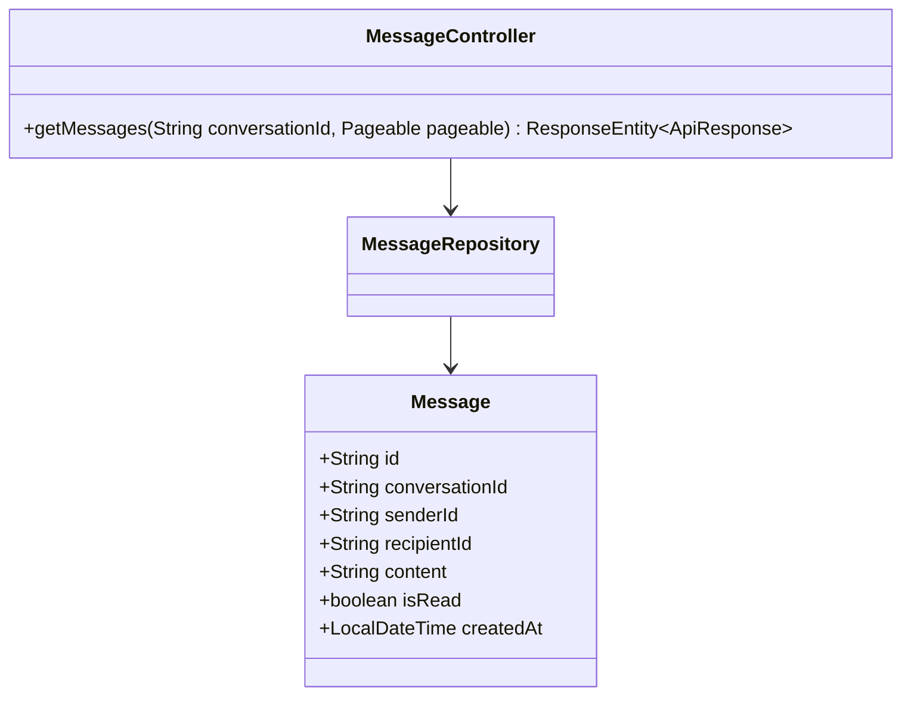

### 🔄 3. Sequence Diagram (UC-12.3)
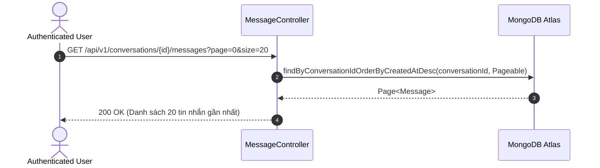

### 🧪 4. Testing & Verification (UC-12.3)
- **Unit Test Method:** `MessageControllerTest.java` -> `getMessages_returnsConversationMessages()`
- **Assertions:** Trả về danh sách tin nhắn khớp với `conversationId`.

---

## 💬 UC-12.4: Gửi Tin Nhắn Realtime Qua WebSocket STOMP (Send WS Message)

### 📌 1. Mô tả Chi Tiết & Quy Tắc Nghiệp Vụ
- **Actor:** User (Sender).
- **Mục tiêu:** Gửi tin nhắn qua cổng STOMP WebSocket `/ws-chat`. Hệ thống tự động lưu DB, cập nhật `lastMessageText` và broadcast tới `/topic/messages/{conversationId}`.
- **Endpoint:** `WS /ws-chat` (Topic: `/app/chat.sendMessage`)

### 📐 2. Class Diagram (UC-12.4)
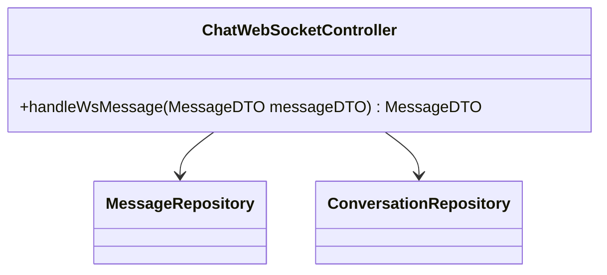

### 🔄 3. Sequence Diagram (UC-12.4)
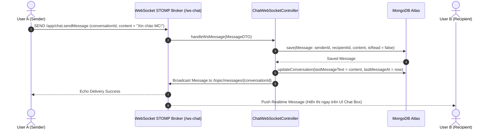

### 🧪 4. Testing & Verification (UC-12.4)
- **Unit Test Method:** `MessageControllerTest.java` -> `sendMessage_validPayload_savesAndUpdatesLastMessage()`
- **Assertions:** Tin nhắn được lưu DB và `lastMessageText` của hội thoại được cập nhật.

---

## 💬 UC-12.5: Đánh Dấu Đã Đọc Tin Nhắn (Mark Conversation Read)

### 📌 1. Mô tả Chi Tiết & Quy Tắc Nghiệp Vụ
- **Actor:** User.
- **Mục tiêu:** Cập nhật `isRead = true` cho toàn bộ tin nhắn trong cuộc trò chuyện khi user mở xem.
- **Endpoint:** `PUT /api/v1/conversations/{id}/read`

### 📐 2. Class Diagram (UC-12.5)
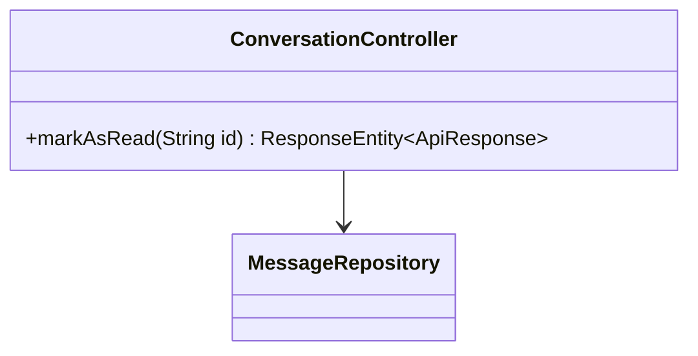

### 🔄 3. Sequence Diagram (UC-12.5)
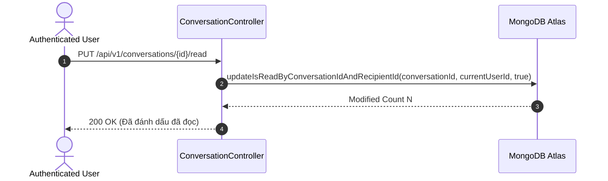

### 🧪 4. Testing & Verification (UC-012.5)
- **Unit Test Method:** `ConversationControllerTest.java` -> `markAsRead_updatesUnreadMessages()`
- **Assertions:** Tất cả tin nhắn gửi cho user trong hội thoại đó chuyển sang `isRead = true`.

---

## 💬 UC-12.6: Tổng Số Tin Nhắn Chưa Đọc (Get Unread Message Count)

### 📌 1. Mô tả Chi Tiết & Quy Tắc Nghiệp Vụ
- **Actor:** User.
- **Mục tiêu:** Lấy tổng số lượng tin nhắn chưa đọc của user trên toàn hệ thống để hiển thị Badge đỏ trên Navigation Bar.
- **Endpoint:** `GET /api/v1/messages/unread-count`

### 📐 2. Class Diagram (UC-12.6)
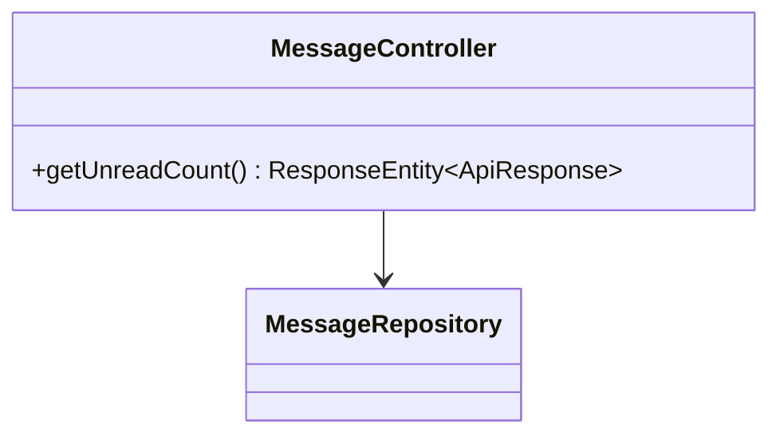

### 🔄 3. Sequence Diagram (UC-12.6)
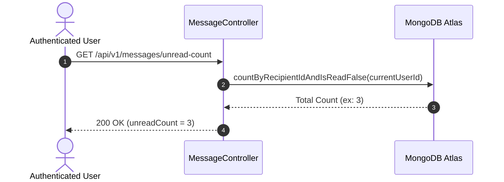

### 🧪 4. Testing & Verification (UC-12.6)
- **Unit Test Method:** `MessageControllerTest.java` -> `getUnreadCount_returnsCorrectCount()`
- **Assertions:** Trả về số lượng tin nhắn chưa đọc chính xác.
