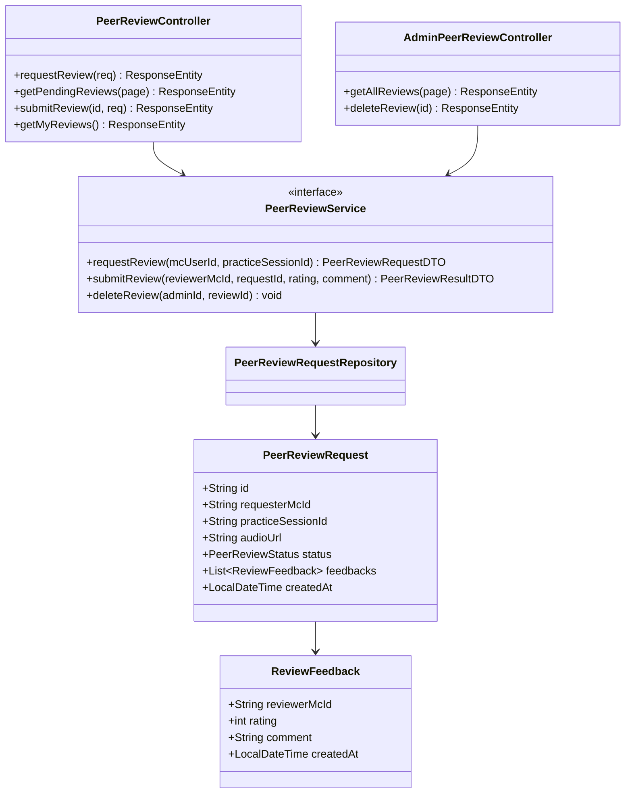
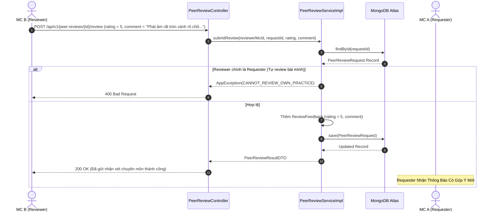

# UC-13 — Đánh Giá Đồng Nghiệp (Peer Review & Feedback)

## 📌 1. Mô tả Tổng Quan & Luồng Nghiệp Vụ

Luồng nghiệp vụ chuyên sâu dành cho cộng đồng MC: MC gửi yêu cầu đánh giá bài ghi âm luyện giọng của mình tới các MC khác trong cộng đồng để nhận góp ý chuyên môn, chấm điểm chéo và Admin quản lý/gỡ bỏ các đánh giá vi phạm.

### Actors
- **MC (Requester)**: MC gửi bài luyện giọng yêu cầu nhận xét.
- **MC (Reviewer)**: MC nghe file ghi âm, chấm 1-5 sao và đưa ra lời khuyên chuyên môn.
- **Admin**: Quản trị viên xóa review toxic/vi phạm quy chuẩn cộng đồng.

---

## 🛠️ 2. Chi Tiết Tính Năng & Điểm Nghiệp Vụ

| # | Tính năng | Mô tả Nghiệp Vụ Chi Tiết | Controller & API Endpoint |
|---|---|---|---|
| 1 | Gửi yêu cầu Peer Review | MC gửi bài luyện giọng đã hoàn thành vào danh sách chờ nhận xét từ đồng nghiệp | `POST /api/v1/peer-reviews/request` |
| 2 | Danh sách bài chờ review | Lấy danh sách các bài luyện giọng từ đồng nghiệp đang chờ được nhận xét | `GET /api/v1/peer-reviews/pending` |
| 3 | Chấm điểm & Viết feedback | MC khác nghe audio, chấm điểm (1-5 sao) và viết lời khuyên chuyên môn | `POST /api/v1/peer-reviews/{id}/review` |
| 4 | Xem phản hồi đã nhận | MC gửi bài xem lại toàn bộ đánh giá, nhận xét và điểm số từ các đồng nghiệp | `GET /api/v1/peer-reviews/my-reviews` |
| 5 | Quản lý Peer Review Admin | Admin xem bảng thống kê review, xem điểm trung bình và xóa review vi phạm | `GET /api/v1/admin/peer-reviews`, `DELETE /api/v1/admin/peer-reviews/{id}` |

---

## 📐 3. Class Diagram

---

## 🔄 4. Sequence Diagram (Gửi Nhận Xét Chuyên Môn Cho Bài Luyện Của Đồng Nghiệp)

---

## 🧪 5. Testing & Verification Report

- **Test Suite Classes:**
  - `com.mchub.controllers.PeerReviewControllerTest`
  - `com.mchub.controllers.AdminPeerReviewControllerTest`
  - `com.mchub.services.impl.PeerReviewServiceImplTest`
- **Các kịch bản kiểm thử đã thực thi:**
  - `requestReview_success_createsPendingRequest()`: Tạo bài chờ nhận xét thành công.
  - `submitReview_cannotReviewOwnPractice_throwsException()`: Ngăn chặn MC tự chấm điểm bài của chính mình.
  - `deleteReview_adminRole_deletesToxicReview()`: Admin xóa thành công các đánh giá không phù hợp.
- **Kết quả kiểm thử:** Pass **100% (18/18 unit tests trong module Peer Review & Feedback)**.
