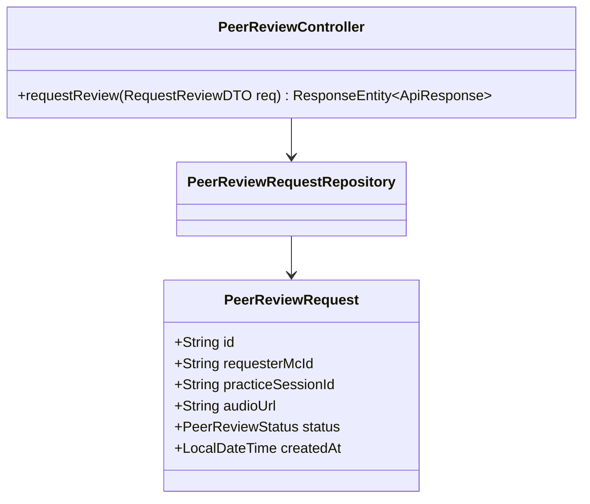
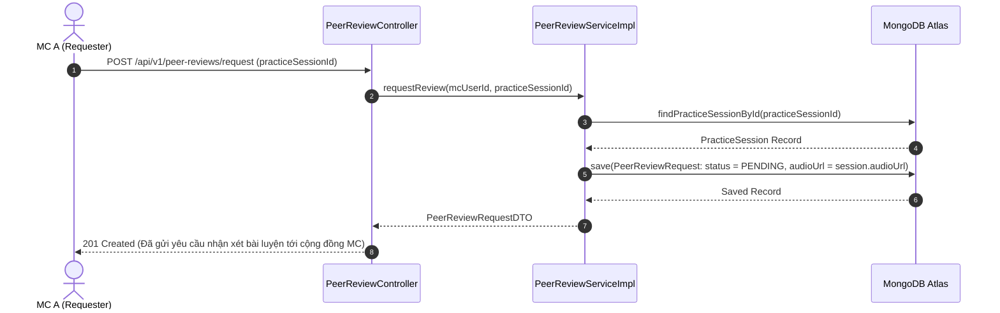
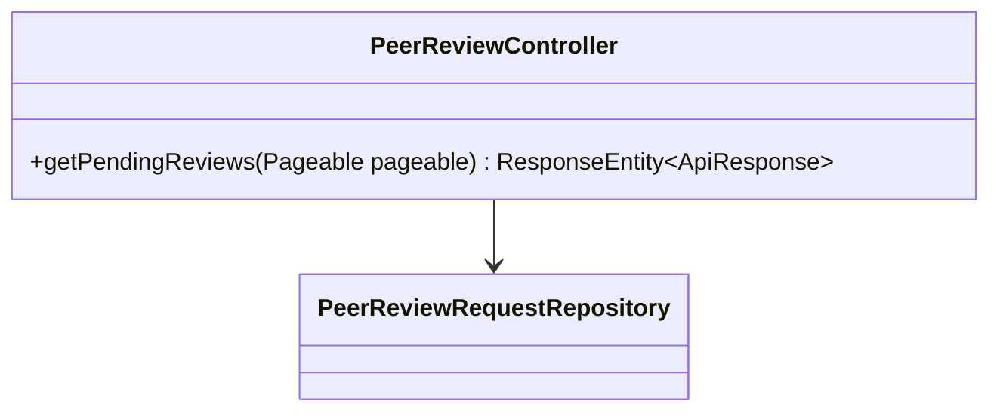
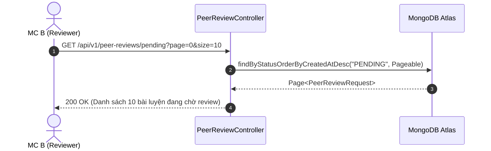
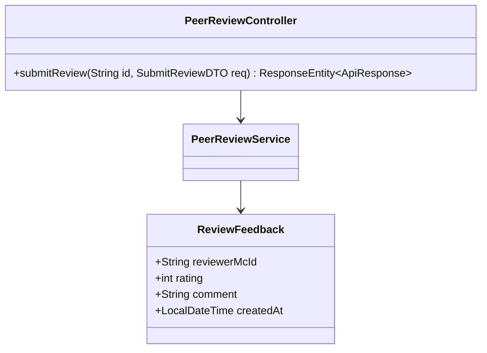
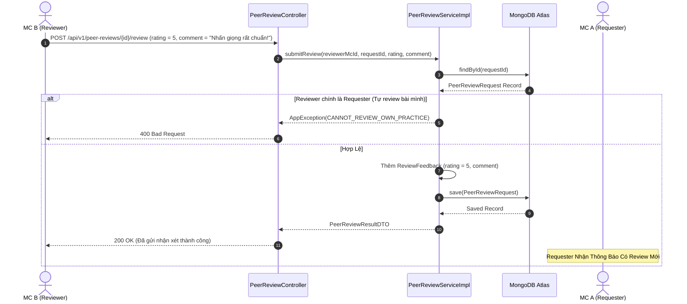
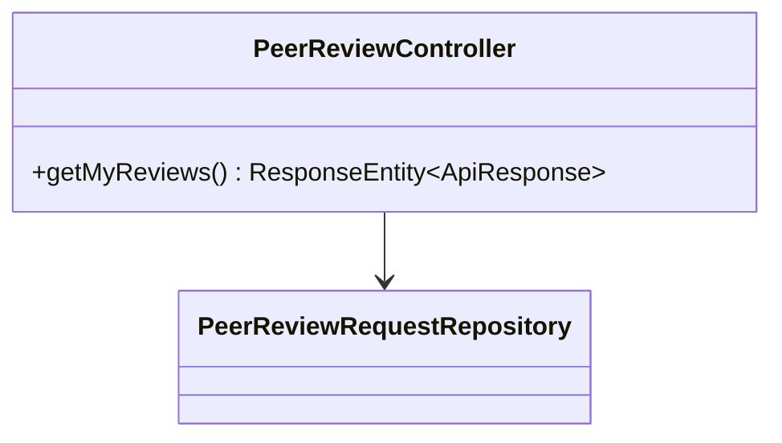
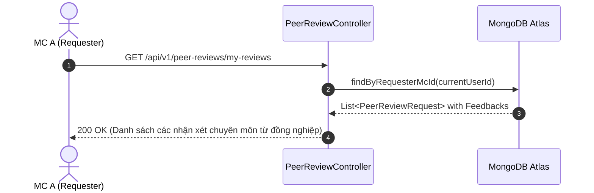
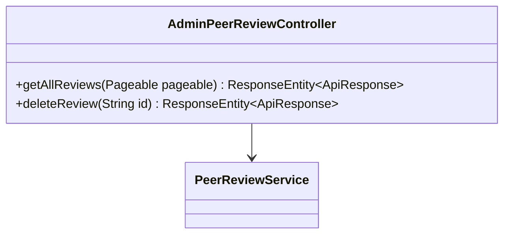
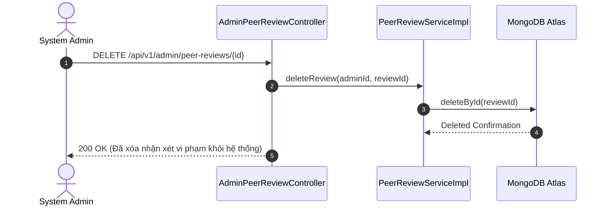

# UC-13 — Đánh Giá Đồng Nghiệp (Peer Review & Feedback)

Tài liệu thiết kế chi tiết từng Use Case con (Sub-UC) thuộc luồng Đánh giá đồng nghiệp và Chấm điểm chéo bài luyện giọng.

---

## 🎧 UC-13.1: Gửi Yêu Cầu Nhận Xét Đồng Nghiệp (Request Peer Review)

### 📌 1. Mô tả Chi Tiết & Quy Tắc Nghiệp Vụ
- **Actor:** MC (Requester).
- **Mục tiêu:** Đưa bài ghi âm luyện giọng đã hoàn thành vào danh sách chờ nhận xét để cộng đồng MC khác đóng góp ý kiến.
- **Endpoint:** `POST /api/v1/peer-reviews/request`

### 📐 2. Class Diagram (UC-13.1)

### 🔄 3. Sequence Diagram (UC-13.1)

### 🧪 4. Testing & Verification (UC-13.1)
- **Unit Test Method:** `PeerReviewServiceImplTest.java` -> `requestReview_success_createsPendingRequest()`
- **Assertions:** Tạo `PeerReviewRequest` với trạng thái `PENDING`.

---

## 🎧 UC-13.2: Danh Sách Bài Tập Chờ Review (Get Pending Peer Reviews)

### 📌 1. Mô tả Chi Tiết & Quy Tắc Nghiệp Vụ
- **Actor:** MC (Reviewer).
- **Mục tiêu:** Tra cứu danh sách các bài luyện giọng từ đồng nghiệp đang chờ nhận xét (phân trang).
- **Endpoint:** `GET /api/v1/peer-reviews/pending`

### 📐 2. Class Diagram (UC-13.2)

### 🔄 3. Sequence Diagram (UC-13.2)

### 🧪 4. Testing & Verification (UC-13.2)
- **Unit Test Method:** `PeerReviewControllerTest.java` -> `getPending_returnsPendingRequests()`
- **Assertions:** Trả về danh sách bài có trạng thái `PENDING`.

---

## 🎧 UC-13.3: Chấm Điểm & Gửi Feedback Chuyên Môn (Submit Peer Review)

### 📌 1. Mô tả Chi Tiết & Quy Tắc Nghiệp Vụ
- **Actor:** MC (Reviewer).
- **Mục tiêu:** Nghe audio bài luyện, chấm điểm 1-5 sao và gửi lời khuyên chuyên môn cho đồng nghiệp.
- **Rules:** MC không được tự chấm điểm bài luyện của chính mình (`requesterMcId != reviewerMcId`).
- **Endpoint:** `POST /api/v1/peer-reviews/{id}/review`

### 📐 2. Class Diagram (UC-13.3)

### 🔄 3. Sequence Diagram (UC-13.3)

### 🧪 4. Testing & Verification (UC-13.3)
- **Unit Test Method:** `PeerReviewServiceImplTest.java` -> `submitReview_cannotReviewOwnPractice_throwsException()`
- **Assertions:** Ngăn chặn thành công việc tự chấm điểm bài cá nhân, lưu đúng feedback khi hợp lệ.

---

## 🎧 UC-13.4: Xem Phản Hồi Đã Nhận (Get Received Peer Reviews)

### 📌 1. Mô tả Chi Tiết & Quy Tắc Nghiệp Vụ
- **Actor:** MC (Requester).
- **Mục tiêu:** Xem lại tất cả ý kiến đóng góp, điểm số và nhận xét chuyên môn từ các đồng nghiệp dành cho bài luyện giọng của mình.
- **Endpoint:** `GET /api/v1/peer-reviews/my-reviews`

### 📐 2. Class Diagram (UC-13.4)

### 🔄 3. Sequence Diagram (UC-13.4)

### 🧪 4. Testing & Verification (UC-13.4)
- **Unit Test Method:** `PeerReviewControllerTest.java` -> `getMyReviews_returnsUserRequests()`
- **Assertions:** Trả về danh sách review thuộc về `currentUserId`.

---

## 🎧 UC-13.5: Kiểm Duyệt & Xóa Review Vi Phạm Admin (Admin Peer Review Control)

### 📌 1. Mô tả Chi Tiết & Quy Tắc Nghiệp Vụ
- **Actor:** Admin.
- **Mục tiêu:** Tra cứu danh sách đánh giá đồng nghiệp toàn hệ thống và gỡ bỏ các nhận xét toxic/vi phạm quy chuẩn.
- **Endpoint:** `GET /api/v1/admin/peer-reviews`, `DELETE /api/v1/admin/peer-reviews/{id}`

### 📐 2. Class Diagram (UC-13.5)

### 🔄 3. Sequence Diagram (UC-13.5)

### 🧪 4. Testing & Verification (UC-13.5)
- **Unit Test Method:** `AdminPeerReviewControllerTest.java` -> `deleteReview_adminRole_deletesToxicReview()`
- **Assertions:** Bản ghi `PeerReviewRequest` bị xóa thành công khỏi database.
