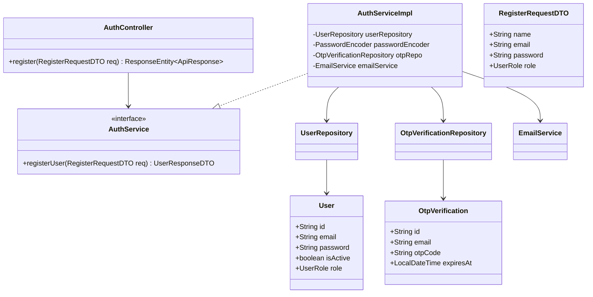
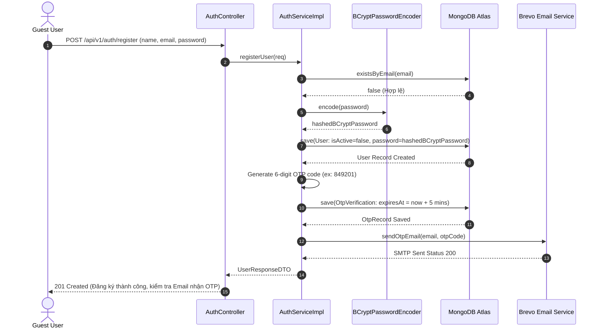

# UC-01.1 — Đăng Ký Tài Khoản (User Registration)

## 📋 1. Bảng Mô Tả Nghiệp Vụ (Business Description Table)

| Mục | Chi Tiết Nghiệp Vụ |
|---|---|
| **Mã Use Case** | `UC-01.1` |
| **Tên Tính Năng** | Đăng ký tài khoản người dùng mới (User Registration) |
| **Actor Chính** | Guest (Người dùng khách chưa đăng nhập) |
| **Mục Tiêu** | Tạo tài khoản người dùng ở trạng thái chờ kích hoạt (`isActive=false`) và tự động gửi mã OTP xác minh qua Email |
| **API Endpoint** | `POST /api/v1/auth/register` |
| **Tiền Điều Kiện** | Email chưa tồn tại trong hệ thống |
| **Hậu Điều Kiện** | Lưu bản ghi `User` (Mật khẩu BCrypt hash) và bản ghi `OtpVerification` (Hạn 5 phút). Email chứa OTP 6 chữ số được gửi đi |
| **Quy Tắc Nghiệp Vụ** | Mật khẩu tối thiểu 8 ký tự, định dạng email chuẩn. Không lưu mật khẩu thô |
| **Các Mã Lỗi Có Thể Gặp** | `VALIDATION_FAILED` (400), `EMAIL_ALREADY_EXISTS` (400) |

---

## 📐 2. Class Diagram

---

## 🔄 3. Sequence Diagram

---

## 🧪 4. Testing & Verification Report

- **Test Suite Class:** `com.mchub.services.impl.AuthServiceImplTest`
- **Method Kiểm Thử:** `register_success()`
- **Assertions:** `userRepository.save()` được gọi 1 lần, `emailService.sendOtpEmail()` gửi đúng email.
