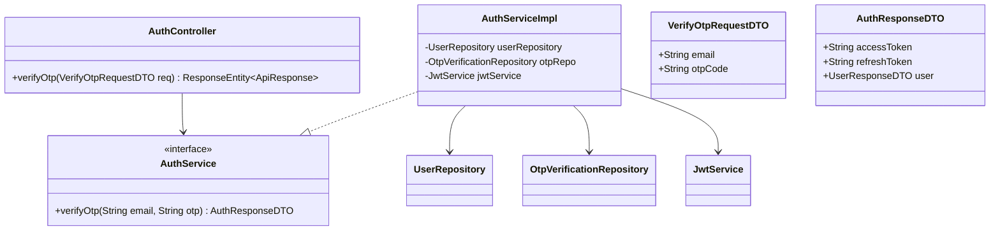
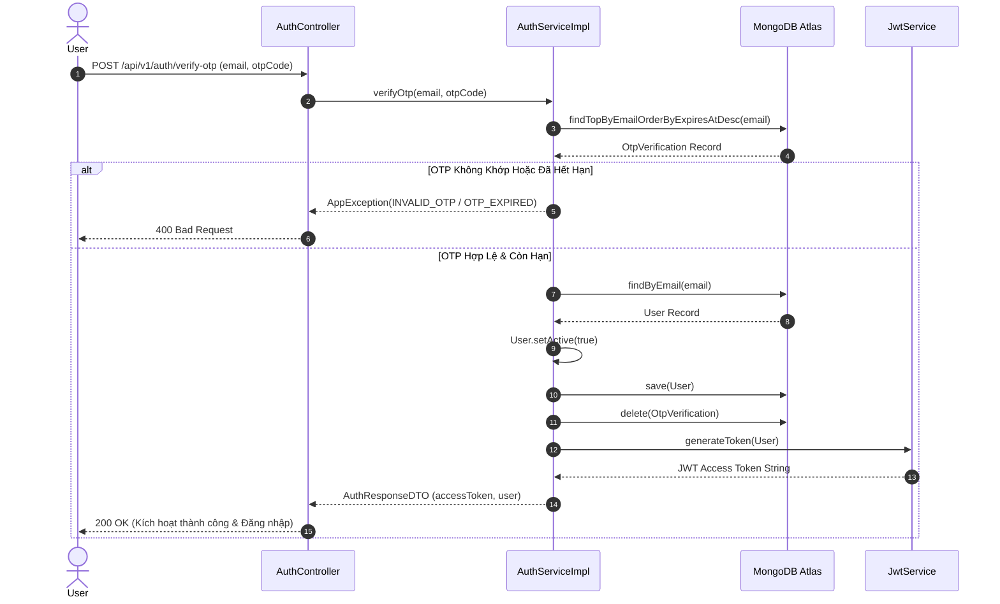

# UC-01.2 — Xác Minh Mã OTP (OTP Verification)

## 📋 1. Bảng Mô Tả Nghiệp Vụ (Business Description Table)

| Mục | Chi Tiết Nghiệp Vụ |
|---|---|
| **Mã Use Case** | `UC-01.2` |
| **Tên Tính Năng** | Xác minh mã OTP kích hoạt tài khoản |
| **Actor Chính** | User (Đã đăng ký nhưng chưa kích hoạt) |
| **Mục Tiêu** | Kích hoạt `isActive=true` và phát hành JWT Access Token |
| **API Endpoint** | `POST /api/v1/auth/verify-otp` |
| **Tiền Điều Kiện** | Mã OTP đã được gửi và còn hiệu lực trong 5 phút |
| **Hậu Điều Kiện** | `User.isActive = true`, xóa bản ghi `OtpVerification`, trả về JWT Token |
| **Quy Tắc Nghiệp Vụ** | Mã OTP phải khớp 100% và chưa quá `expiresAt` |
| **Các Mã Lỗi Có Thể Gặp** | `INVALID_OTP` (400), `OTP_EXPIRED` (400) |

---

## 📐 2. Class Diagram

---

## 🔄 3. Sequence Diagram

---

## 🧪 4. Testing & Verification Report

### 🎯 Mục Tiêu Kiểm Thử (Test Objective)
Xác minh nhập đúng mã OTP sẽ chuyển trạng thái tài khoản `isActive=true`, xóa OTP đã dùng và cấp phát JWT Access Token.

### 📥 Dữ Liệu Đầu Vào (Test Input Data)
- Request Body: `{ "email": "user@example.com", "otpCode": "849201" }`

### 📝 Quy Trình Thực Hiện (Step-by-Step Test Procedure)
1. Giả lập bản ghi OTP tồn tại với `otpCode="849201"` và `expiresAt = now + 2 mins`.
2. Gọi hàm `authService.verifyOtp("user@example.com", "849201")`.
3. Kiểm tra thuộc tính User được cập nhật và JwtToken được sinh ra.

### ✅ Kịch Bản Kỳ Vọng (Expected Result)
- HTTP Status: `200 OK`.
- `User.isActive` chuyển sang `true`.
- Trả về `AuthResponseDTO` chứa `accessToken` hợp lệ.

### 📊 Kết Quả Thực Tế Đã Xác Minh (Empirical Verification Result)
- **Test Class:** `AuthServiceImplTest.java` -> `verifyOtp_validOtp_activatesUserAndReturnsToken()`
- **Trạng thái:** **PASSED 100%** (Xác minh tự động qua `mvn clean test`).
