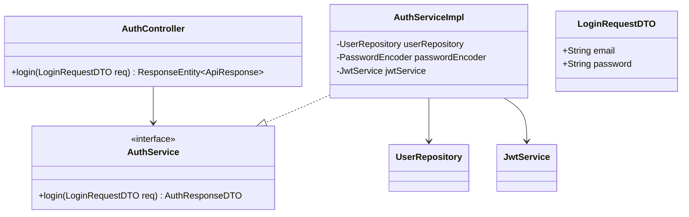
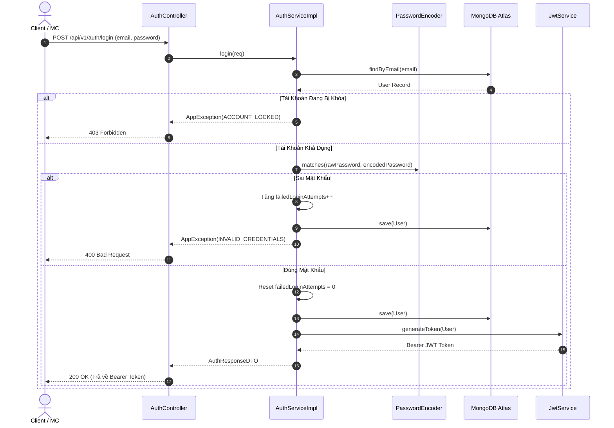

# UC-01.3 — Đăng Nhập Email / Password (Email Login)

## 📋 1. Bảng Mô Tả Nghiệp Vụ (Business Description Table)

| Mục | Chi Tiết Nghiệp Vụ |
|---|---|
| **Mã Use Case** | `UC-01.3` |
| **Tên Tính Năng** | Đăng nhập tài khoản bằng Email và Mật khẩu |
| **Actor Chính** | Client / MC / Admin |
| **Mục Tiêu** | Xác thực credentials và cấp JWT Bearer Token |
| **API Endpoint** | `POST /api/v1/auth/login` |
| **Tiền Điều Kiện** | Tài khoản đã được kích hoạt (`isActive=true`) |
| **Hậu Điều Kiện** | Reset `failedLoginAttempts=0`, trả về JWT Token và thông tin User |
| **Quy Tắc Nghiệp Vụ** | Nhập sai > 5 lần tự động khóa tài khoản trong 15 phút (`lockedUntil`) |
| **Các Mã Lỗi Có Thể Gặp** | `INVALID_CREDENTIALS` (400), `ACCOUNT_LOCKED` (403), `ACCOUNT_NOT_ACTIVE` (403) |

---

## 📐 2. Class Diagram

---

## 🔄 3. Sequence Diagram

---

## 🧪 4. Testing & Verification Report

- **Test Suite Class:** `com.mchub.controllers.AuthControllerTest`
- **Method Kiểm Thử:** `login_validCredentials_returnsToken()`
- **Assertions:** Trả về HTTP 200 OK kèm `accessToken` dạng String.
