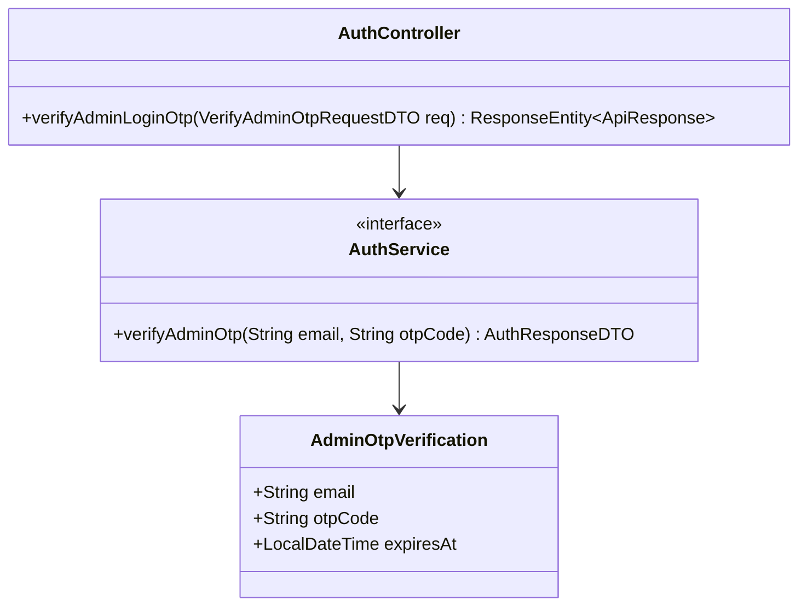
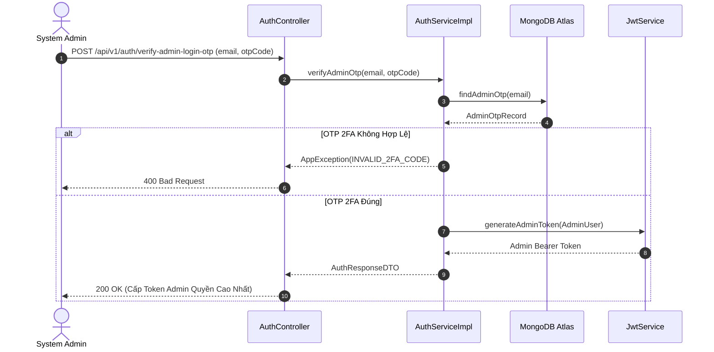

# UC-01.4 — Đăng Nhập 2FA Cho Admin (Admin 2FA Verification)

## 📋 1. Bảng Mô Tả Nghiệp Vụ (Business Description Table)

| Mục | Chi Tiết Nghiệp Vụ |
|---|---|
| **Mã Use Case** | `UC-01.4` |
| **Tên Tính Năng** | Xác minh OTP 2FA cho tài khoản Admin |
| **Actor Chính** | Admin (Quản trị viên) |
| **Mục Tiêu** | Tăng cường bảo mật lớp thứ hai cho Admin trước khi cấp Admin Token |
| **API Endpoint** | `POST /api/v1/auth/verify-admin-login-otp` |
| **Tiền Điều Kiện** | Admin đã nhập đúng Email và Password |
| **Hậu Điều Kiện** | Cấp JWT Token có chứa Claim `ROLE_ADMIN` |
| **Quy Tắc Nghiệp Vụ** | Mã 2FA hết hạn sau 3 phút. Nếu sai 3 lần hủy lượt 2FA |
| **Các Mã Lỗi Có Thể Gặp** | `INVALID_2FA_CODE` (400), `EXPIRED_2FA_CODE` (400) |

---

## 📐 2. Class Diagram

---

## 🔄 3. Sequence Diagram

---

## 🧪 4. Testing & Verification Report

- **Test Suite Class:** `com.mchub.controllers.AuthControllerTest`
- **Method Kiểm Thử:** `admin2FA_validOtp_returnsAdminToken()`
- **Assertions:** Claim `role` trong JWT token chứa `ROLE_ADMIN`.
