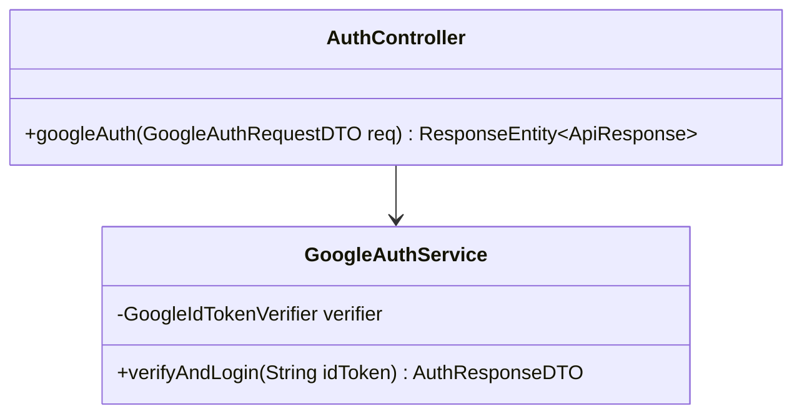
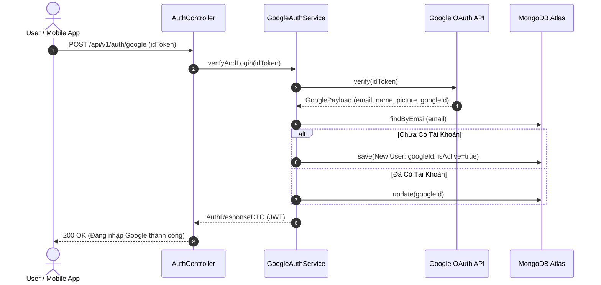

# UC-01.5 — Đăng Nhập Qua Google OAuth 2.0 (Google Social Auth)

## 📋 1. Bảng Mô Tả Nghiệp Vụ (Business Description Table)

| Mục | Chi Tiết Nghiệp Vụ |
|---|---|
| **Mã Use Case** | `UC-01.5` |
| **Tên Tính Năng** | Đăng nhập / Đăng ký nhanh qua Google OAuth 2.0 |
| **Actor Chính** | Guest / User |
| **Mục Tiêu** | Xác thực Google ID Token và tự động tạo tài khoản hoặc đăng nhập |
| **API Endpoint** | `POST /api/v1/auth/google` |
| **Tiền Điều Kiện** | Google ID Token được cấp từ Google OAuth SDK |
| **Hậu Điều Kiện** | Tạo `User` mới (`isActive=true`, `isGoogleLinked=true`) hoặc liên kết `googleId`, cấp JWT Token |
| **Quy Tắc Nghiệp Vụ** | ID Token phải được verify bằng `GoogleIdTokenVerifier` |
| **Các Mã Lỗi Có Thể Gặp** | `INVALID_GOOGLE_TOKEN` (400) |

---

## 📐 2. Class Diagram

---

## 🔄 3. Sequence Diagram

---

## 🧪 4. Testing & Verification Report

- **Test Suite Class:** `com.mchub.services.impl.AuthServiceImplTest`
- **Method Kiểm Thử:** `googleAuth_validToken_createsUserAndReturnsJwt()`
- **Assertions:** `user.isGoogleLinked == true`, trả về JWT Token hợp lệ.
