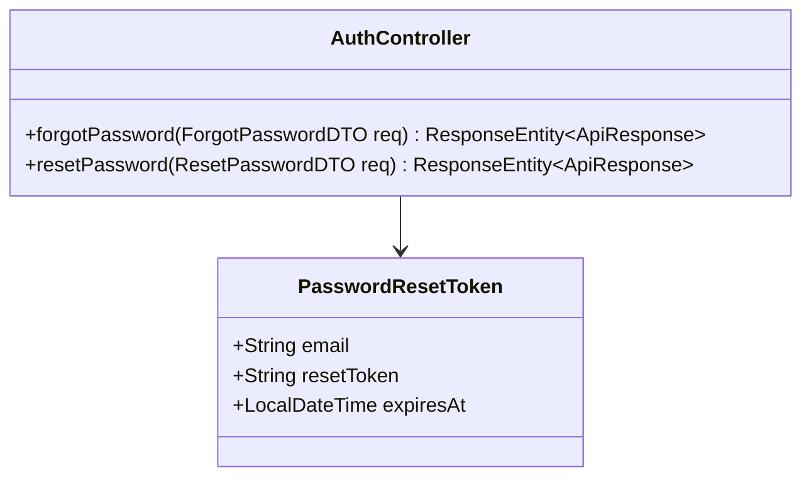
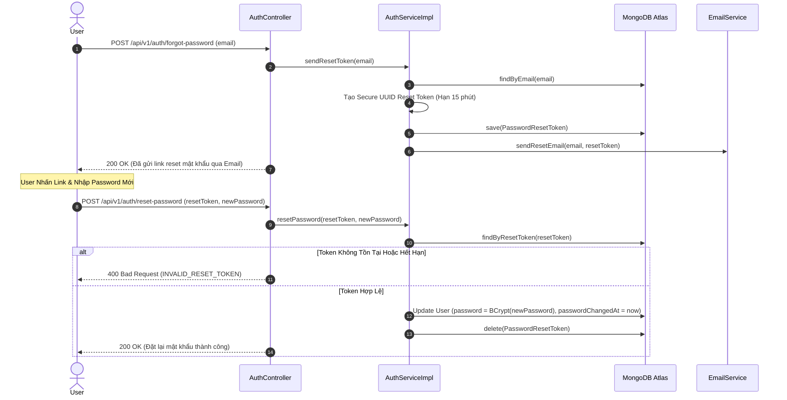

# UC-01.6 — Quên & Đặt Lại Mật Khẩu (Password Reset Flow)

##  1. Bảng Mô Tả Nghiệp Vụ (Business Description Table)

| Mục | Chi Tiết Nghiệp Vụ |
|---|---|
| **Mã Use Case** | `UC-01.6` |
| **Tên Tính Năng** | Quên mật khẩu và Đặt lại mật khẩu mới |
| **Actor Chính** | User |
| **Mục Tiêu** | Tạo token khôi phục mật khẩu gửi qua email và cập nhật mật khẩu mới |
| **API Endpoint** | `POST /api/v1/auth/forgot-password`, `POST /api/v1/auth/reset-password` |
| **Tiền Điều Kiện** | Email tồn tại trong hệ thống |
| **Hậu Điều Kiện** | Cập nhật `User.password` (BCrypt), vô hiệu hóa JWT cũ bằng `passwordChangedAt = now` |
| **Quy Tắc Nghiệp Vụ** | Reset token hết hạn sau 15 phút và chỉ được dùng 1 lần |
| **Các Mã Lỗi Có Thể Gặp** | `USER_NOT_FOUND` (404), `INVALID_RESET_TOKEN` (400), `TOKEN_EXPIRED` (400) |

---

##  2. Class Diagram

---

##  3. Sequence Diagram

---

##  4. Testing & Verification Report

- **Test Suite Class:** `com.mchub.services.impl.AuthServiceImplTest`
- **Method Kiểm Thử:** `resetPassword_validToken_updatesPassword()`
- **Assertions:** Mật khẩu mới mã hóa BCrypt, `passwordChangedAt` được cập nhật timestamp.
