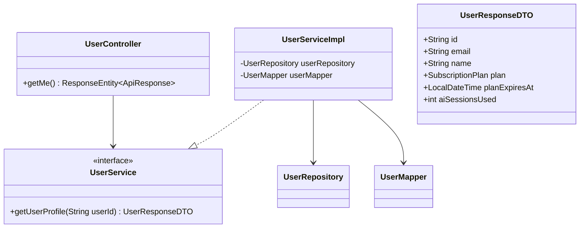
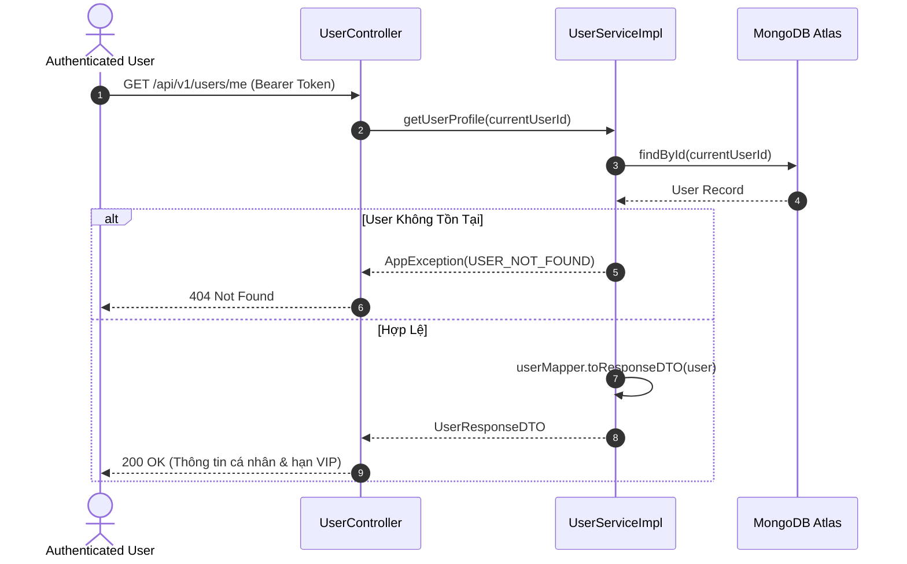

# UC-02.1 — Xem Thông Tin Hồ Sơ Cá Nhân (Get User Profile)

## 📋 1. Bảng Mô Tả Nghiệp Vụ (Business Description Table)

| Mục | Chi Tiết Nghiệp Vụ |
|---|---|
| **Mã Use Case** | `UC-02.1` |
| **Tên Tính Năng** | Xem thông tin chi tiết hồ sơ cá nhân |
| **Actor Chính** | Authenticated User (Client / MC / Admin) |
| **Mục Tiêu** | Trả về profile cá nhân, gói VIP hiện tại (`plan`), hạn VIP, lượt AI sessions đã dùng |
| **API Endpoint** | `GET /api/v1/users/me` |
| **Tiền Điều Kiện** | User đã đăng nhập và gửi kèm Header `Authorization: Bearer <token>` |
| **Hậu Điều Kiện** | Trả về DTO thông tin người dùng |
| **Quy Tắc Nghiệp Vụ** | Chỉ được xem thông tin chính chủ đăng nhập |
| **Các Mã Lỗi Có Thể Gặp** | `UNAUTHORIZED` (401), `USER_NOT_FOUND` (404) |

---

## 📐 2. Class Diagram

---

## 🔄 3. Sequence Diagram

---

## 🧪 4. Testing & Verification Report

- **Test Suite Class:** `com.mchub.services.impl.UserServiceImplTest`
- **Method Kiểm Thử:** `getUserProfile_validId_returnsDto()`
- **Assertions:** Trả về `UserResponseDTO` không null, thông tin `plan` khớp với DB.
