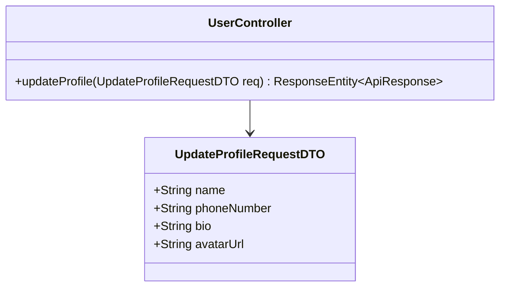
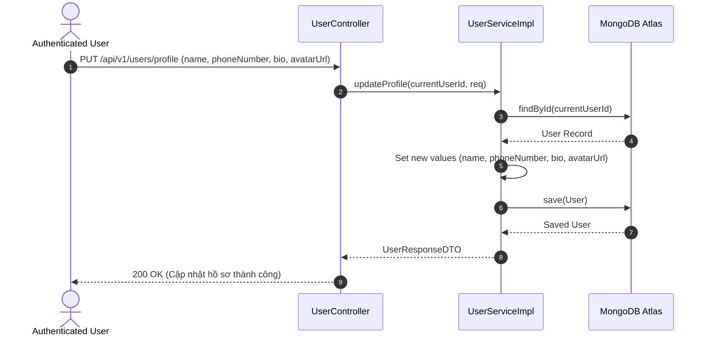

# UC-02.2 — Cập Nhật Thông Tin Profile (Update Profile)

## 📋 1. Bảng Mô Tả Nghiệp Vụ (Business Description Table)

| Mục | Chi Tiết Nghiệp Vụ |
|---|---|
| **Mã Use Case** | `UC-02.2` |
| **Tên Tính Năng** | Cập nhật thông tin profile cá nhân |
| **Actor Chính** | Authenticated User |
| **Mục Tiêu** | Cho phép sửa `name`, `phoneNumber`, `bio`, `avatarUrl` |
| **API Endpoint** | `PUT /api/v1/users/profile` |
| **Tiền Điều Kiện** | User đã đăng nhập |
| **Hậu Điều Kiện** | Cập nhật thông tin trong DB và trả về DTO mới |
| **Quy Tắc Nghiệp Vụ** | Tên không được rỗng, SĐT chuẩn 10 chữ số |
| **Các Mã Lỗi Có Thể Gặp** | `VALIDATION_FAILED` (400), `UNAUTHORIZED` (401) |

---

## 📐 2. Class Diagram

---

## 🔄 3. Sequence Diagram

---

## 🧪 4. Testing & Verification Report

- **Test Suite Class:** `com.mchub.services.impl.UserServiceImplTest`
- **Method Kiểm Thử:** `updateProfile_validData_updatesFields()`
- **Assertions:** `user.getName()` và `user.getBio()` được lưu thay đổi thành công.
