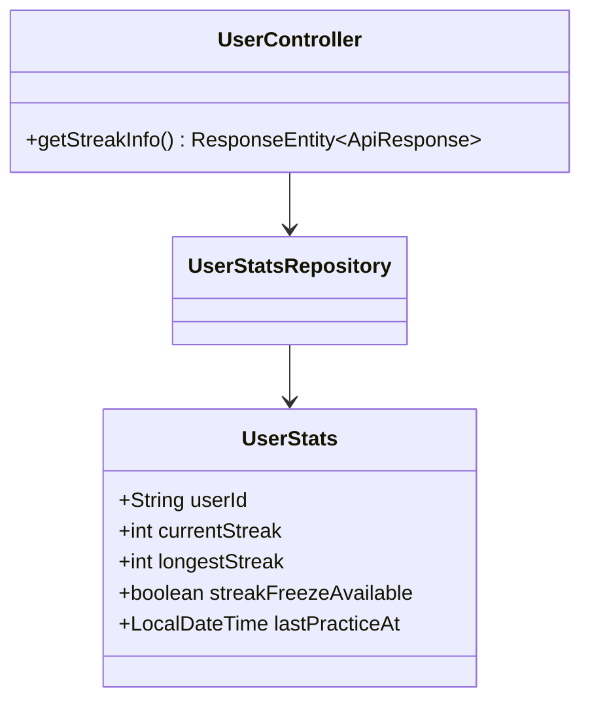
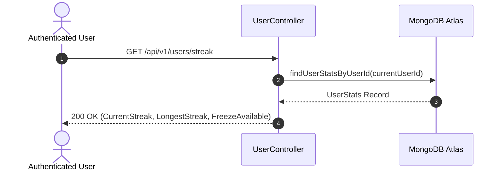

# UC-02.3 — Xem Chuỗi Ngày Luyện Tập Streak (Get Streak Info)

##  1. Bảng Mô Tả Nghiệp Vụ (Business Description Table)

| Mục | Chi Tiết Nghiệp Vụ |
|---|---|
| **Mã Use Case** | `UC-02.3` |
| **Tên Tính Năng** | Tra cứu thông tin chuỗi ngày luyện tập (Streak) |
| **Actor Chính** | Authenticated User |
| **Mục Tiêu** | Lấy chỉ số `currentStreak`, `longestStreak`, và `streakFreezeAvailable` |
| **API Endpoint** | `GET /api/v1/users/streak` |
| **Tiền Điều Kiện** | User đã đăng nhập |
| **Hậu Điều Kiện** | Trả về DTO thông tin streak |
| **Quy Tắc Nghiệp Vụ** | Chuỗi streak tăng lên 1 khi hoàn thành ít nhất 1 bài tập trong ngày |
| **Các Mã Lỗi Có Thể Gặp** | `UNAUTHORIZED` (401) |

---

##  2. Class Diagram

---

##  3. Sequence Diagram

---

##  4. Testing & Verification Report

- **Test Suite Class:** `com.mchub.controllers.UserControllerTest`
- **Method Kiểm Thử:** `getStreak_returnsUserStreakInfo()`
- **Assertions:** Trả về số ngày streak hợp lệ >= 0.
