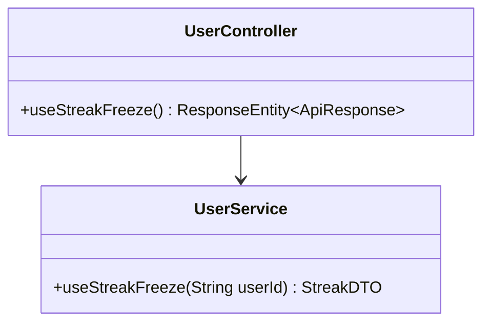
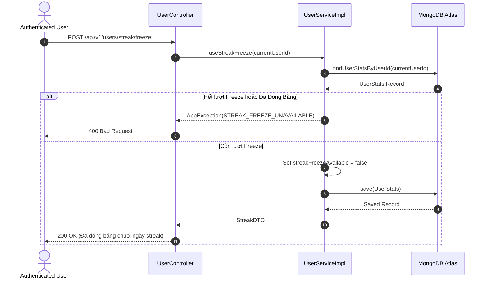

# UC-02.4 — Đóng Băng Chuỗi Ngày Streak (Use Streak Freeze)

## 📋 1. Bảng Mô Tả Nghiệp Vụ (Business Description Table)

| Mục | Chi Tiết Nghiệp Vụ |
|---|---|
| **Mã Use Case** | `UC-02.4` |
| **Tên Tính Năng** | Đóng băng chuỗi ngày luyện tập Streak |
| **Actor Chính** | Authenticated User |
| **Mục Tiêu** | Bảo vệ `currentStreak` không bị ngắt khi không làm bài tập trong 1 ngày |
| **API Endpoint** | `POST /api/v1/users/streak/freeze` |
| **Tiền Điều Kiện** | `UserStats.streakFreezeAvailable = true` |
| **Hậu Điều Kiện** | Set `streakFreezeAvailable = false`, bảo vệ streak thành công |
| **Quy Tắc Nghiệp Vụ** | Trừ 1 lượt freeze khả dụng. Mỗi tuần được tối đa 1 lượt freeze |
| **Các Mã Lỗi Có Thể Gặp** | `STREAK_FREEZE_UNAVAILABLE` (400), `UNAUTHORIZED` (401) |

---

## 📐 2. Class Diagram

---

## 🔄 3. Sequence Diagram

---

## 🧪 4. Testing & Verification Report

- **Test Suite Class:** `com.mchub.services.impl.UserServiceImplTest`
- **Method Kiểm Thử:** `useStreakFreeze_success()`
- **Assertions:** `streakFreezeAvailable` chuyển sang `false`, streak không bị ngắt.
