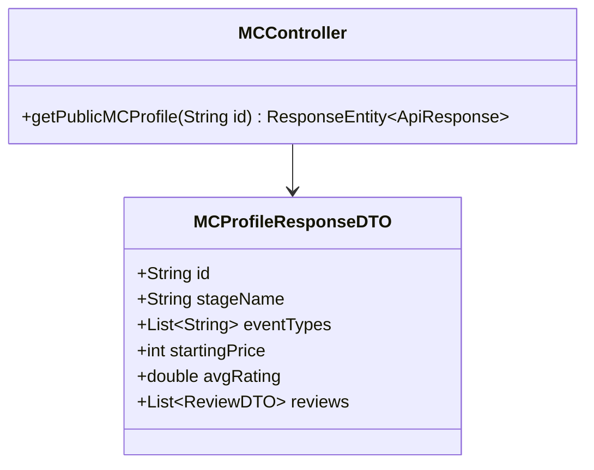
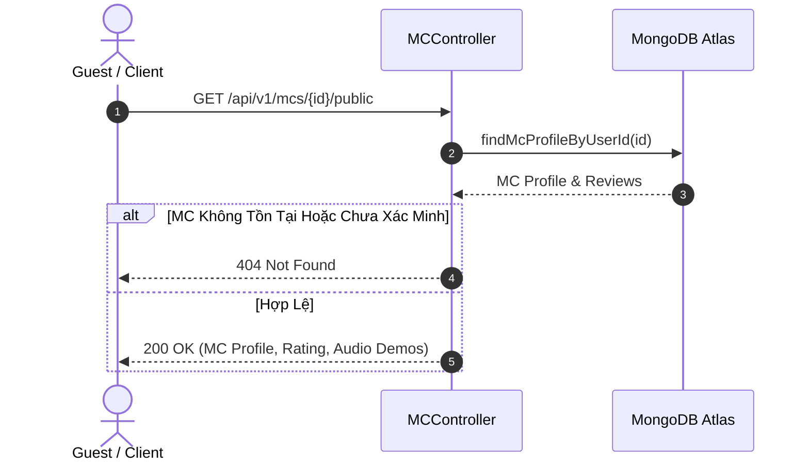

# UC-02.5 — Xem Hồ Sơ MC Công Khai (Public MC Talent Profile)

## 📋 1. Bảng Mô Tả Nghiệp Vụ (Business Description Table)

| Mục | Chi Tiết Nghiệp Vụ |
|---|---|
| **Mã Use Case** | `UC-02.5` |
| **Tên Tính Năng** | Xem hồ sơ truyền thông công khai của MC Talent |
| **Actor Chính** | Guest / Public / Client |
| **Mục Tiêu** | Hiển thị thông tin MC, giá dịch vụ, kinh nghiệm, audio đọc mẫu và đánh giá từ khách hàng |
| **API Endpoint** | `GET /api/v1/mcs/{id}/public` |
| **Tiền Điều Kiện** | Tài khoản MC đã được xác minh (`isVerified=true`) |
| **Hậu Điều Kiện** | Trả về DTO thông tin MC công khai |
| **Quy Tắc Nghiệp Vụ** | Public API không yêu cầu token xác thực |
| **Các Mã Lỗi Có Thể Gặp** | `MC_NOT_FOUND` (404) |

---

## 📐 2. Class Diagram

---

## 🔄 3. Sequence Diagram

---

## 🧪 4. Testing & Verification Report

- **Test Suite Class:** `com.mchub.controllers.MCControllerTest`
- **Method Kiểm Thử:** `getPublicProfile_validId_returnsMcDetails()`
- **Assertions:** Status Code 200, giá dịch vụ và rating hiển thị đầy đủ.
