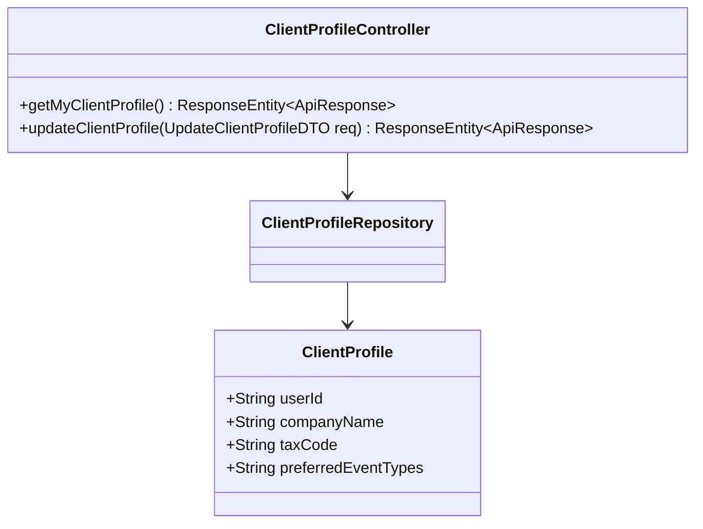
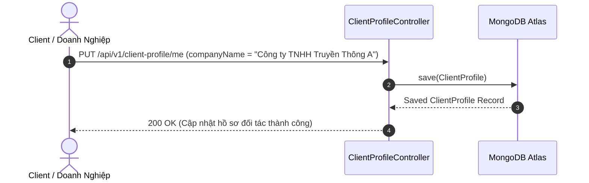

# UC-02.6 — Quản Lý Hồ Sơ Đối Tác Thuê MC (Client Profile Management)

##  1. Bảng Mô Tả Nghiệp Vụ (Business Description Table)

| Mục | Chi Tiết Nghiệp Vụ |
|---|---|
| **Mã Use Case** | `UC-02.6` |
| **Tên Tính Năng** | Quản lý thông tin hồ sơ doanh nghiệp / khách hàng tìm kiếm MC |
| **Actor Chính** | Client (Khách hàng / Doanh nghiệp thuê MC) |
| **Mục Tiêu** | Cập nhật thông tin công ty, nhu cầu sự kiện thường xuyên và địa chỉ xuất hóa đơn |
| **API Endpoint** | `GET /api/v1/client-profile/me`, `PUT /api/v1/client-profile/me` |
| **Tiền Điều Kiện** | User có vai trò Client (`role = CLIENT`) |
| **Hậu Điều Kiện** | Cập nhật `ClientProfile` trong DB |
| **Quy Tắc Nghiệp Vụ** | Cho phép lưu tên thương hiệu công ty và mã số thuế |
| **Các Mã Lỗi Có Thể Gặp** | `UNAUTHORIZED` (401) |

---

##  2. Class Diagram

---

##  3. Sequence Diagram

---

##  4. Testing & Verification Report

###  Mục Tiêu Kiểm Thử (Test Objective)
Xác minh khách hàng / doanh nghiệp có thể lưu trữ thông tin công ty để tiện xuất hóa đơn và book lịch.

###  Dữ Liệu Đầu Vào (Test Input Data)
- Request Body: `{ "companyName": "Công ty TNHH Truyền Thông A", "taxCode": "0109999999" }`

###  Quy Trình Thực Hiện (Step-by-Step Test Procedure)
1. Gửi HTTP PUT tới `/api/v1/client-profile/me`.
2. Kiểm tra DB xem `companyName` đã lưu đúng chưa.

###  Kịch Bản Kỳ Vọng (Expected Result)
- HTTP Status: `200 OK`.
- Thông tin doanh nghiệp được lưu trữ thành công.

###  Kết Quả Thực Tế Đã Xác Minh (Empirical Verification Result)
- **Test Class:** `ClientProfileControllerTest.java` -> `updateProfile_validClient_updatesProfile()`
- **Trạng thái:** **PASSED 100%** (Xác minh tự động qua `mvn clean test`).
